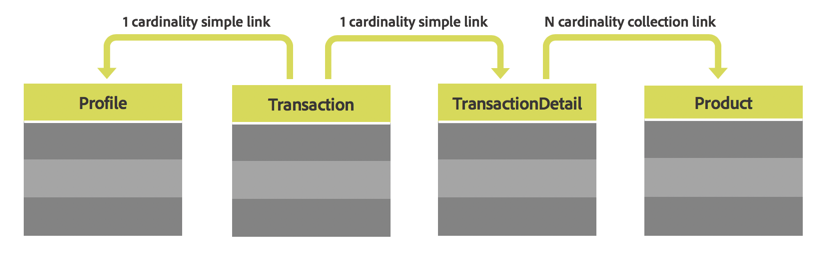

# Risorse personalizzate {#custom-resources}

Adobe Campaign viene fornito con un modello dati predefinito, in cui i dati vengono definiti tramite risorse diverse. Puoi arricchire il modello dati fornito estendendo le risorse per aggiungere campi personalizzati o tabelle personalizzate, ad esempio tabelle di acquisto o di prodotti.

Le risorse personalizzate sono accessibili tramite API utilizzando l&#39;endpoint **/profileAndServicesExt** e il nome della risorsa personalizzata.

`https://mc.adobe.io/<ORGANIZATION>/campaign/profileAndServicesExt/<resourceName>/`

>[!NOTE]
>
>Per le risorse che non sono pronte all&#39;uso, utilizza sempre il prefisso <b>&quot;cus&quot;</b> prima del nome della risorsa.

Puoi eseguire qualsiasi operazione con risorse personalizzate, purché siano collegate alla tabella Profilo. Ad esempio, consideriamo la struttura delle tabelle seguente:



In tal caso, tutte le risorse delle tabelle **Transaction**, **TransactionDetails** e **Product** sono disponibili purché siano collegate alla tabella **Profile**.

<br/>

***Richiesta di esempio***

Richiesta GET di esempio per accedere alla risorsa profileAndServicesExt estesa.

```
-X GET https://mc.adobe.io/<ORGANIZATION>/campaign/profileAndServicesExt/\
-H 'Content-Type: application/json' \
-H 'Authorization: Bearer <ACCESS_TOKEN>' \
-H 'Cache-Control: no-cache' \
-H 'X-Api-Key: <API_KEY>' \
```

Restituisce l’elenco di tutte le risorse personalizzate collegate. Puoi quindi utilizzare gli URL delle risorse per eseguire qualsiasi attività API descritta in questa documentazione.

```
{
"apiName": "resourceType",
"cusProduct": {
        "content": ...,
        "data": "/profileAndServicesExt/cusProduct/",
        "help": "Product",
        "href": "https://mc.adobe.io/<ORGANIZATION>/campaign/profileAndServicesExt/cusProduct/metadata",
        "name": "cusProduct",
        "type": "collection"
    },
"cusTransaction": {
        "content": ...,
        "data": "/profileAndServicesExt/cusTransaction/",
        "help": "Product",
        "href": "https://mc.adobe.io/<ORGANIZATION>/campaign/profileAndServicesExt/cusTransaction/metadata",
        "name": "cusProduct",
        "type": "collection"
    },
    ...
}
```
