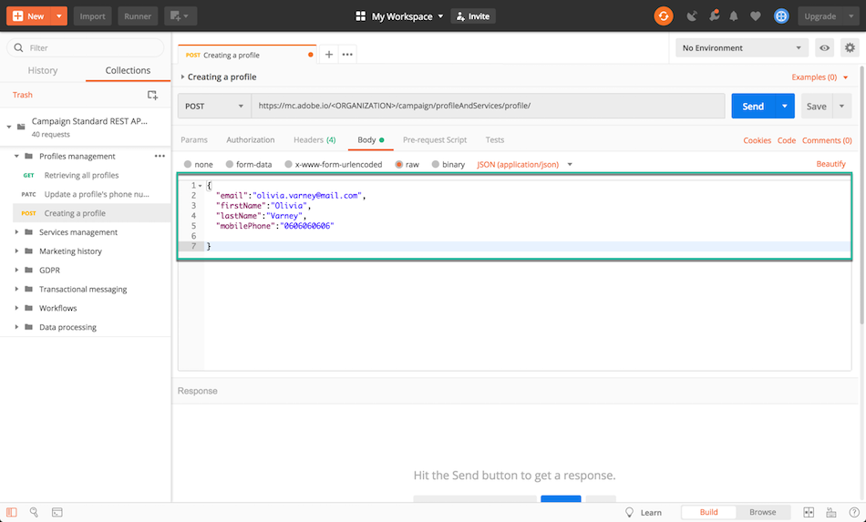

# Perché utilizzare le API di Campaign Standard {#why-using-campaign-standard-apis}

Adobe Campaign Standard fornisce API che consentono l’integrazione dei sistemi esistenti con la piattaforma Campaign per risolvere problemi del mondo reale in tempo reale.

I siti web pubblici come la pagina di registrazione o rinuncia devono connettersi ai sistemi back-end per memorizzare le informazioni del profilo. I sistemi back-end come Adobe Campaign offrono la flessibilità e la potenza necessarie per acquisire i dati del profilo ed eseguirvi operazioni personalizzate.

Di seguito sono riportati alcuni esempi:

* È possibile effettuare la registrazione online.
* Gestione del profilo cliente esistente e delle preferenze di comunicazione marketing.
* Attivazione della comunicazione transazionale basata su eventi: conferma dell’ordine, prenotazione dell’itinerario, reimpostazione della password, ecc.
* Persino la comunicazione via e-mail di abbandono del carrello.

Le pagine di destinazione per la registrazione consentono ai clienti attuali o potenziali di registrare il proprio nome e indirizzo e-mail. Una volta acquisite le informazioni e le preferenze del profilo, Campaign Standard può inviare messaggi personalizzati in base agli interessi della persona.

Sono costruiti con gli elementi seguenti:

1. Modulo di registrazione con i listener API di Campaign.

   

1. Azioni personalizzate da eseguire in base alle caselle di controllo. Se un cliente seleziona &quot;Email Special Offers&quot; (Offerte speciali e-mail), riceverà un&#39;e-mail personalizzata diversa con un buono regalo rispetto al normale processo di registrazione.

   

1. Un profilo può modificare i propri dettagli dopo aver fatto clic sul collegamento &quot;Aggiorna dettagli&quot; nell’e-mail. Questo porta il profilo alla pagina &quot;Aggiorna il profilo e i dettagli delle preferenze&quot;. Per eseguire l’operazione, i dettagli del profilo (Pkey) vengono passati al server Campaign e il profilo viene recuperato e rappresentato. Una volta che il profilo fa clic sul pulsante &quot;Aggiorna&quot;, le informazioni vengono aggiornate nel sistema (tramite un comando PATCH).

   

È disponibile una raccolta di richieste per acquisire familiarità con le richieste API di Campaign Standard. Questa raccolta in formato JSON fornisce richieste API preconfigurate che rappresentano casi d’uso comuni.

I passaggi seguenti descrivono un caso d’uso dettagliato per importare e utilizzare la raccolta per creare un profilo nel database di Campaign Standard.

>[!NOTE]
>
>Il nostro esempio utilizza Postman. Tuttavia, sentiti libero di utilizzare il tuo client REST preferito.

1. Scaricare la raccolta JSON facendo clic su [qui](https://helpx.adobe.com/content/dam/help/en/campaign/kb/working-with-acs-api/_jcr_content/main-pars/download_section/download-1/KB_postman_collection.json.zip).

1. Apri Postman, quindi seleziona la **File** / **Importa** menu.

1. Trascina e rilascia il file scaricato nella finestra. Vengono visualizzate le richieste API preconfigurate, pronte per l’uso.

   

1. Seleziona la **Creazione di un profilo** , quindi aggiorna la richiesta POST e la **Intestazioni** scheda con informazioni personalizzate (&lt;organization>, &lt;api_key>, &lt;access_token>). Per ulteriori informazioni al riguardo, consulta [questa sezione](setting-up-api-access.md).

   

1. Compila il **Corpo** con le informazioni che desideri aggiungere al nuovo profilo, quindi fai clic su **Invia** per eseguire la richiesta.

   

1. Dopo la creazione di un oggetto, a esso viene associata una chiave primaria (PKey). È visibile nella risposta della richiesta, così come in altri attributi.

   

1. Apri l’istanza di Campaign Standard, quindi verifica che il profilo sia stato creato, con tutte le informazioni del payload.

   
