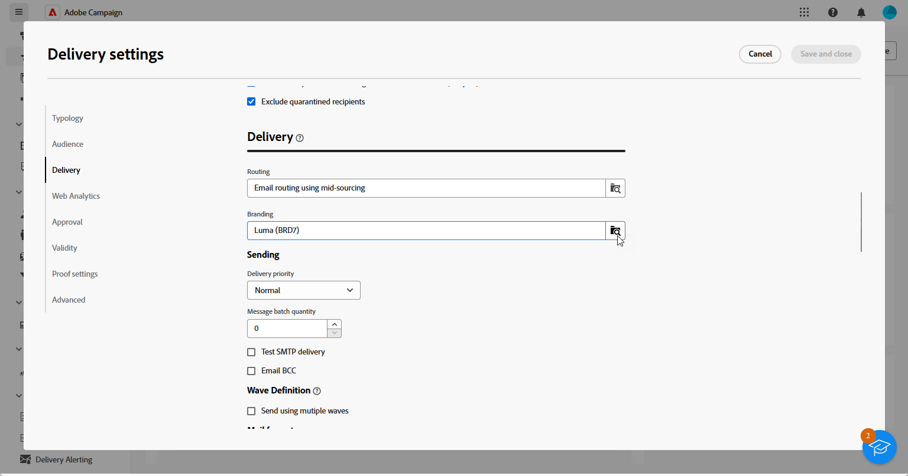
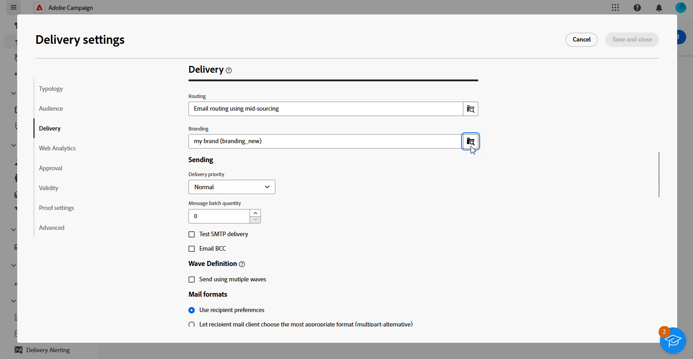

# Assegnare il brand {#branding-assign}

>[!IMPORTANT]
>
>Le opzioni di branding sono attualmente limitate alle consegne e-mail e push.

## Collegare un brand a un modello {#linking-a-brand-to-a-template}

Per utilizzare i parametri definiti per un brand, questo deve essere collegato a un modello di consegna. A tal fine, devi creare o modificare un modello.

Il modello verrà collegato al brand. Nell’editor e-mail, gli elementi come l’**Email address of default sender**, **Default sender name** o **Logo** utilizzeranno i dati del brand configurato.

>[!BEGINTABS]

>[!TAB Adobe Campaign V8]

Per creare un modello di consegna, puoi duplicare un modello incorporato, convertire una consegna esistente in un modello o creare un modello di consegna da zero. [Ulteriori informazioni](https://experienceleague.adobe.com/en/docs/campaign/campaign-v8/send/create-templates)

Una volta creato il modello, puoi collegarlo a un brand. Per eseguire questa operazione:

1. Sfoglia per **[!UICONTROL Risorse]** `>` **[!UICONTROL Modelli]** `>` **[!UICONTROL Modelli di consegna]** in Adobe Campaign explorer.

1. Seleziona un modello di consegna o duplicane uno esistente.

   

1. Accedere a **[!UICONTROL Proprietà]** del modello di consegna selezionato.

   

1. Dalla sezione **[!UICONTROL Generale]** , seleziona il tuo marchio dalla scheda **[!UICONTROL Marchio]** a discesa.

   

1. Una volta configurata, seleziona **OK**.

Ora puoi utilizzare questo modello per inviare le consegne.

>[!TAB Adobe Campaign Web]

Per creare un modello di consegna, puoi duplicare un modello incorporato, convertire una consegna esistente in un modello o creare un modello di consegna da zero. [Ulteriori informazioni](https://experienceleague.adobe.com/en/docs/campaign-web/v8/msg/delivery-template)

Una volta creato il modello, puoi collegarlo a un brand. Per eseguire questa operazione:

1. Accedi a **[!UICONTROL Modelli]** , dalla scheda **[!UICONTROL Consegne]** e seleziona un modello di consegna.

   

1. Clic **[!UICONTROL Impostazioni]**.

   

1. Dalla sezione **[!UICONTROL Consegna]** , accedere alla scheda **[!UICONTROL Marchio]** e seleziona il brand da collegare al modello.

   

1. Conferma la selezione e salva il modello.

Ora puoi utilizzare questo modello per inviare le consegne.

>[!ENDTABS]

## Assegnare un brand alla consegna {#assigning-a-brand-to-an-email}

>[!BEGINTABS]

>[!TAB Adobe Campaign V8]

Per creare una nuova consegna autonoma, segui i passaggi indicati di seguito.

1. Per creare una nuova consegna, passa a **[!UICONTROL Campagne]** scheda.

1. Clic **[!UICONTROL Consegne]** e fai clic su **[!UICONTROL Crea]** sopra l’elenco delle consegne esistenti.

   

1. Seleziona un modello di consegna.

1. Accedere a **[!UICONTROL Proprietà]** del modello di consegna selezionato.

   

1. Dalla sezione **[!UICONTROL Generale]** , seleziona il tuo marchio dalla scheda **[!UICONTROL Marchio]** a discesa.

   

1. Una volta configurata, seleziona **OK**.

1. Personalizza ulteriormente le consegne. Per ulteriori informazioni sulla creazione di un’e-mail, consulta [Progettare e inviare e-mail](https://experienceleague.adobe.com/en/docs/campaign-web/v8/msg/email/create-email) sezione.

>[!TAB Adobe Campaign Web]

Per creare una nuova consegna autonoma, segui i passaggi indicati di seguito.

1. Accedi a **[!UICONTROL Consegne]** nella barra a sinistra, quindi fai clic su **[!UICONTROL Creare una consegna]** pulsante.

   

1. Seleziona E-mail o notifica push come canale e scegli un modello di consegna dall’elenco.

1. Fai clic sul pulsante **[!UICONTROL Crea una consegna]** per confermare.

1. Dalla sezione **[!UICONTROL Proprietà]** pagina, fai clic su **[!UICONTROL Impostazioni]**.

   

1. Dalla sezione **[!UICONTROL Consegna]** , accedere alla scheda **[!UICONTROL Marchio]** campo.

   

1. Seleziona il brand da collegare al modello.

   

1. Personalizza ulteriormente le consegne. Per ulteriori informazioni sulla creazione di un’e-mail, consulta [Creare la prima e-mail](https://experienceleague.adobe.com/en/docs/campaign-web/v8/msg/email/create-email) sezione.

>[!ENDTABS]
