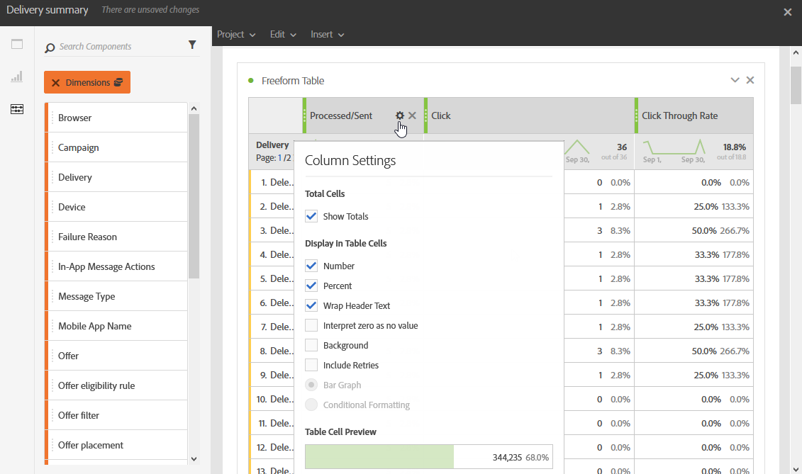

# Aggiunta di pannelli{#adding-panels}

## Aggiunta di un pannello vuoto {#adding-a-blank-panel}

Per avviare il rapporto, puoi aggiungere un set di pannelli a un rapporto predefinito o personalizzato. Ogni pannello contiene set di dati diversi ed è composto da tabelle e visualizzazioni a forma libera.

Questo pannello consente di creare i rapporti in base alle esigenze. Puoi aggiungere nei rapporti tutti i pannelli desiderati per filtrare i dati in base a diversi periodi di tempo.

1. Fai clic su **Pannelli** icona. Puoi anche aggiungere un pannello facendo clic sul pulsante **Scheda Inserisci** e selezione **Nuovo pannello vuoto**.

   

1. Trascina la **Pannello vuoto** nel dashboard.

   

Ora puoi aggiungere una tabella a forma libera al pannello per iniziare a eseguire il targeting dei dati.

## Aggiunta di una tabella a forma libera {#adding-a-freeform-table}

Le tabelle a forma libera ti consentono di creare una tabella per analizzare i dati utilizzando le diverse metriche e dimensioni disponibili in **Componente** tabella.

Ogni tabella e visualizzazione è ridimensionabile e può essere spostata per personalizzare meglio il rapporto.

1. Fai clic su **[!UICONTROL Pannelli]** icona.

   

1. Trascina la **[!UICONTROL Figura a mano libera]** nel dashboard.

   È inoltre possibile aggiungere una tabella facendo clic sul pulsante **[!UICONTROL Inserisci]** e selezionando **[!UICONTROL Nuova forma libera]** o facendo clic su **[!UICONTROL Aggiungere una tabella a forma libera]** in un pannello vuoto.

   

1. In **[!UICONTROL Rilascia qui un segmento]** , aggiungi un **[!UICONTROL Segmento]** dal **[!UICONTROL Componenti]** nella barra superiore.

   

1. Trascina e rilascia gli elementi da **[!UICONTROL Componenti]** nelle colonne e nelle righe per generare la tabella.

   

1. Fai clic su **[!UICONTROL Impostazioni]** per modificare la modalità di visualizzazione dei dati nelle colonne.

   

   Il **[!UICONTROL Impostazioni colonna]** è composto da:

   * **[!UICONTROL Numero]**: ti consente di mostrare o nascondere i numeri di riepilogo nella colonna.
   * **[!UICONTROL Percentuale]**: consente di mostrare o nascondere la percentuale nella colonna.
   * **[!UICONTROL Interpreta zero come nessun valore]**: ti consente di mostrare o nascondere quando il valore è uguale a zero.
   * **[!UICONTROL Sfondo]**: consente di mostrare o nascondere la barra di avanzamento orizzontale nelle celle.
   * **[!UICONTROL Includi nuovi tentativi]**: consente di includere i nuovi tentativi nel risultato. Questa opzione è disponibile solo per **[!UICONTROL Inviato]** e **[!UICONTROL Mancati recapiti + errori]**.

1. Seleziona una o più righe e fai clic su **[!UICONTROL Visualizza]** icona. Viene aggiunta una visualizzazione per riflettere le righe selezionate.

   

Ora puoi aggiungere tutti i componenti necessari e anche visualizzazioni per fornire rappresentazioni grafiche dei dati.
