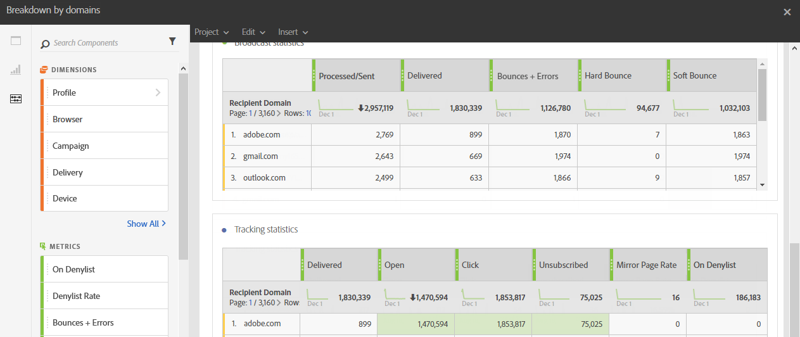

# Raggruppamento per domini{#breakdown-by-domains}

Questo rapporto contiene i dati sulle prestazioni per ogni dominio rappresentato nel pubblico per una consegna e-mail. Se si tratta di un rapporto di una campagna o di un programma, i dati sulle prestazioni sono disponibili per più tipi di pubblico. Questi dati ti consentono di analizzare il comportamento di ciascun dominio in reazione a eventi specifici. Ad esempio, visualizzazione di collegamenti, URL nella inserisce nell&#39;elenco Bloccati di accesso a un sito web (informazioni in lingua inglese), ecc.

La tabella **Statistiche trasmissione** contiene i dati disponibili per i possibili errori riscontrati in ciascun dominio, ad esempio:

* **Elaborati/inviati**: numero di messaggi di posta elettronica inviati.
* **Recapitato**: numero di e-mail consegnate.
* **Messaggi non recapitati + Errori**: numero di messaggi che non è stato possibile recapitare.
* **Notifica di mancato recapito**: numero totale di errori permanenti, ad esempio un indirizzo e-mail errato.
* **Mancato recapito non permanente**: numero totale di errori temporanei, ad esempio una casella in entrata completa.

La seconda tabella, **Statistiche di tracciamento**, contiene i dati disponibili per la reattività del destinatario alla consegna, ad esempio:

* **Recapitato**: numero di e-mail consegnate
* **Apri**: il numero di volte in cui un messaggio è stato aperto in una consegna.
* **Clic**: il numero di volte in cui è stato fatto clic sul contenuto in una consegna.
* **Annullamento dell&#39;abbonamento**: numero di clic sul collegamento dell&#39;abbonamento.
* **Pagina mirror**: numero di clic sul collegamento della pagina mirror.
* **In caso di inserita nell&#39;elenco Bloccati di un&#39;e-mail in corso**: numero di destinatari che hanno dichiarato un&#39;e-mail come posta indesiderata o indesiderata.
