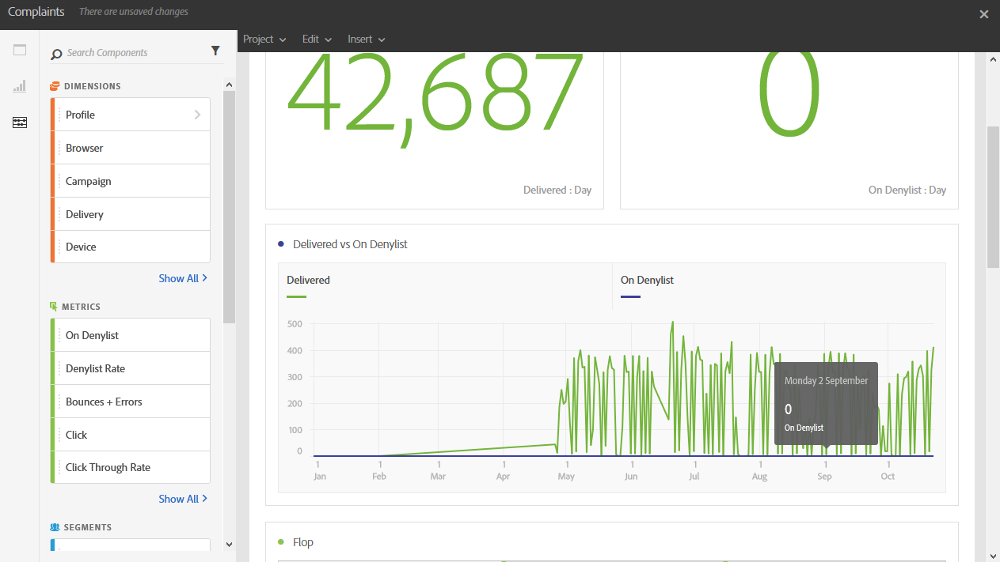

# Reclami{#complaints}

Il rapporto **[!UICONTROL Complaints]** individua le consegne che hanno ricevuto il maggior numero di segnalazioni come spam.

Nella tabella **Flop**, ordinata per dominio del destinatario, viene visualizzato il numero di destinatari che hanno dichiarato un messaggio e-mail o posta indesiderata. I risultati della tabella sono disponibili anche in un grafico e in numeri di riepilogo.

Nella tabella **Consegne e Al momento dell&#39;Inserisco nell&#39;elenco Bloccati** è elencato il numero di destinatari che hanno dichiarato un&#39;e-mail come spam o posta indesiderata. La tabella è ordinata per consegna.
