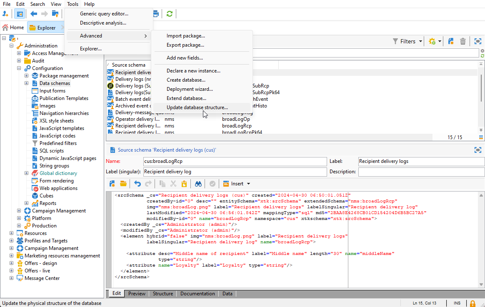

# Creazione di una dimensione di profilo{#creating-a-custom-profile-dimension}

I rapporti possono anche essere creati e gestiti in base ai dati di profilo creati durante l’estensione dello schema del destinatario.

* [Passaggio 1: estendere lo schema dei destinatari](##extend-schema)
* [Passaggio 2: collega il nuovo campo personalizzato](#link-custom)
* [Passaggio 3: creare un rapporto dinamico per filtrare i destinatari con la dimensione di profilo](#create-report)

## Passaggio 1: estendere lo schema dei destinatari {#extend-schema}

Per aggiungere un nuovo campo del profilo, devi estendere lo schema, segui i passaggi seguenti:

1. Passare alla cartella **[!UICONTROL Amministrazione]** > **[!UICONTROL Configurazione]** > **[!UICONTROL Schemi di dati]** in Esplora risorse.

   

1. Identifica lo schema destinatario personalizzato e selezionalo. Se non hai ancora esteso lo schema predefinito nms:recipient, fai riferimento a [questa procedura](https://experienceleague.adobe.com/it/docs/campaign/campaign-v8/developer/shemas-forms/extend-schema).

1. Aggiungi il campo personalizzato all’editor schema.

   Ad esempio, per aggiungere un campo personalizzato Fedeltà nello schema del destinatario:

   ```
   <attribute label="Loyalty" name="loyalty" type="string"/>
   ```

   

1. Fai clic su **[!UICONTROL Salva]**.

1. Quindi, identifica lo schema broadLogRcp personalizzato e selezionalo. Se non hai ancora esteso lo schema del registro di consegna integrato, fai riferimento a [questa procedura](https://experienceleague.adobe.com/it/docs/campaign/campaign-v8/developer/shemas-forms/extend-schema).

1. Aggiungi lo stesso campo personalizzato dello schema Destinatario all’editor schema.

   

1. Fai clic su **[!UICONTROL Salva]**.

1. Per applicare le modifiche apportate agli schemi, avviare la procedura guidata di aggiornamento del database tramite **[!UICONTROL Strumenti]** > **[!UICONTROL Avanzate]** > **[!UICONTROL Aggiorna struttura database]** ed eseguire Aggiorna struttura database. [Ulteriori informazioni](https://experienceleague.adobe.com/it/docs/campaign/campaign-v8/developer/shemas-forms/update-database-structure)

   

Il nuovo campo del profilo è ora pronto per essere utilizzato e selezionato dai destinatari.

## Passaggio 2: collega il nuovo campo personalizzato {#link-custom}

>[!NOTE]
>
> Puoi aggiungere al rapporto dinamico solo un massimo di 20 campi personalizzati.

Ora che il campo del profilo è stato creato, è necessario collegarlo alla dimensione di reporting dinamico corrispondente.

Prima di estendere il registro con il campo del profilo, assicurati che la finestra PII sia stata accettata per poter inviare dati PII al rapporto dinamico. Per ulteriori informazioni, consulta questa [pagina](pii-agreement.md).

1. Passare alla cartella **[!UICONTROL Amministrazione]** > **[!UICONTROL Configurazione]** > **[!UICONTROL Schemi di dati]** > **[!UICONTROL Campo di reporting aggiuntivo]** in Esplora risorse.

   

1. Fai clic su **[!UICONTROL Nuovo]** per creare la dimensione di reporting dinamico corrispondente.

1. Seleziona **[!UICONTROL Modifica espressione]** e sfoglia lo schema Destinatario per trovare il campo del profilo creato in precedenza.

   

1. Fai clic su **[!UICONTROL Fine]**.

1. Digita la dimensione **[!UICONTROL Label]**, visibile nel reporting dinamico, quindi fai clic su **[!UICONTROL Salva]**.

   

Il campo del profilo è ora disponibile come dimensione di profilo nei rapporti. Per eliminare la dimensione del profilo, selezionala e fai clic sull&#39;icona **[!UICONTROL Elimina]**.

Ora che lo schema del destinatario è stato esteso con questo campo del profilo e che è stata creata la dimensione personalizzata, puoi iniziare a eseguire il targeting dei destinatari nelle consegne.

## Passaggio 3: creare un rapporto dinamico per filtrare i destinatari con la dimensione di profilo {#create-report}

Dopo aver inviato la consegna, puoi suddividere i rapporti utilizzando la dimensione del profilo.

1. Dalla scheda **[!UICONTROL Rapporti]**, seleziona un rapporto predefinito o fai clic sul pulsante **[!UICONTROL Crea]** per avviarne uno da zero.

   

1. Nella categoria **[!UICONTROL Dimension]**, fai clic su **[!UICONTROL Profilo]**, quindi trascina la dimensione del profilo nella tabella a forma libera.

   

1. Trascina e rilascia qualsiasi metrica per iniziare a filtrare i dati.

1. Se necessario, trascina e rilascia una visualizzazione nell’area di lavoro.

