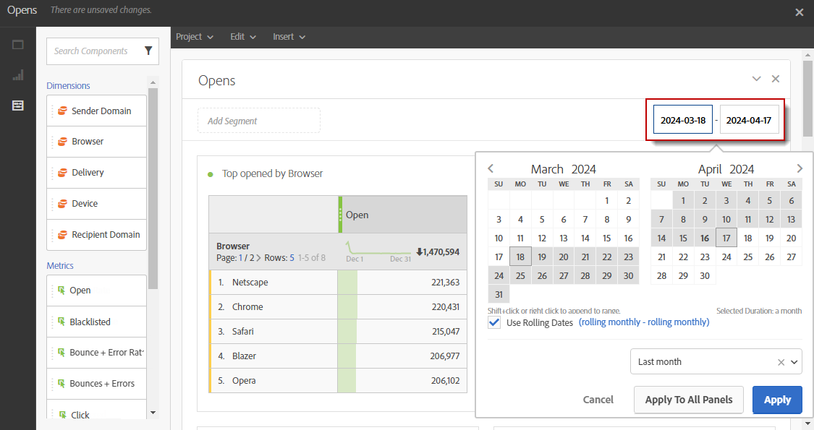

# Definizione del periodo del rapporto{#defining-the-report-period}

Prima di iniziare o accedere a un rapporto, è necessario applicare un periodo di tempo. Il periodo specificato è accessibile in alto a destra nel rapporto.

Per impostazione predefinita, per una campagna o un programma, il periodo di filtro è impostato sulla data di inizio e di fine del programma o della campagna. Per una consegna, la data di inizio corrisponde alla data di invio e la data di fine alla data di invio più 7 giorni.

Per modificare il filtro, seleziona una data di inizio e un periodo o utilizza il periodo di tempo predefinito, ad esempio ultima settimana, due mesi fa e così via.

Il rapporto viene aggiornato automaticamente quando viene applicato o modificato un filtro. Il periodo del rapporto selezionato regolerà gli eventi che si sono verificati nel periodo, non l’intero set di dati delle consegne create nell’intervallo. Ad esempio, se una consegna è stata eseguita dal 1° al 5 gennaio e il periodo del rapporto è dal 1° al 2 gennaio, è possibile che vengano visualizzati dati parziali. Questo può influenzare i conteggi di apertura/clic, poiché l’apertura o il clic possono verificarsi anche un mese dopo l’invio della consegna.

