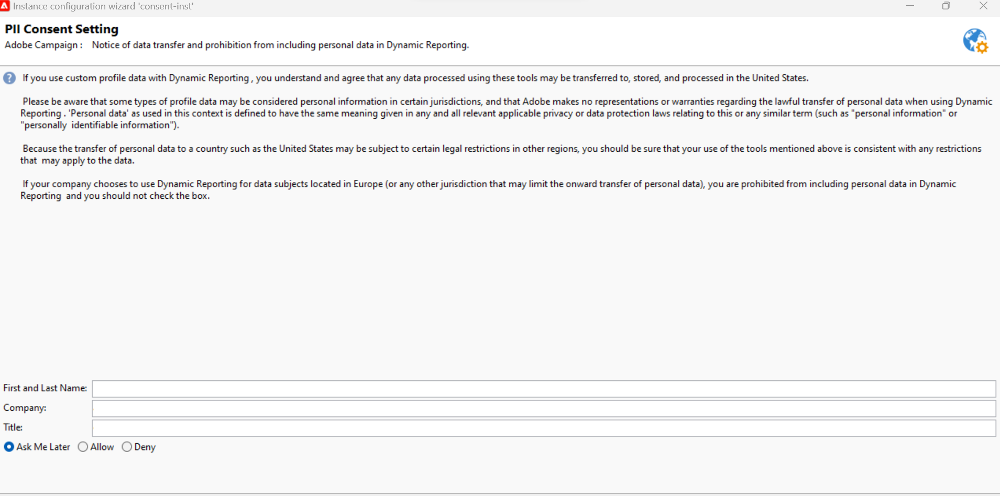

# Accordo di utilizzo del reporting dinamico {#pii-agreement}

Lo scopo del Dynamic Reporting Usage Agreement è quello di funzionare come consenso pop-up per l’elaborazione dei dati. Per impostazione predefinita, l&#39;accordo è visibile solo e può essere accettato o rifiutato solo dagli utenti a cui sono stati assegnati diritti di amministrazione.

Per accedere al Contratto di utilizzo di Reporting dinamico, selezionare **[!UICONTROL Strumenti]** > **[!UICONTROL Avanzate]** > **[!UICONTROL Distribuzione guidata]**.

Sono disponibili tre opzioni:

* **[!UICONTROL Chiedi più tardi]**: finché non accetti o rifiuti il contratto, le dimensioni del profilo non verranno visualizzate nei rapporti e le informazioni di identificazione personale dei clienti non verranno raccolte o inviate.
* **[!UICONTROL Accetta]**: accettando questo contratto, autorizzi Adobe Campaign a raccogliere le informazioni di identificazione personale dei tuoi clienti e a trasferirle al centro dati o reportistica.
* **[!UICONTROL Rifiuto]**: rifiutando il contratto, le dimensioni del profilo non verranno visualizzate nei report e le informazioni di identificazione personale dei clienti non verranno raccolte o inviate. In questo caso externalID verrà comunque raccolto e utilizzato per identificare gli utenti finali.

Nella tabella seguente viene illustrato ciò che accade dopo l&#39;accettazione del contratto, a seconda dell&#39;area geografica.

|  | Reporting dinamico | Connettore Microsoft Dynamics 365 |
|---|---|---|
| Americhe e APAC (Asia Pacifico) | **Funzionalità disponibile**.  Tutte le informazioni predefinite (ad esempio città, paese, stato, genere e segmenti in base all&#39;età) e i profili personalizzati sono stati inviati al centro rapporti negli Stati Uniti. | **Funzionalità disponibile**.  Tutti i campi predefiniti e personalizzati dei profili e i campi degli eventi di Adobe Campaign vengono elaborati nel centro dati degli Stati Uniti. |
| EMEA (Europa, Medio Oriente e Africa) | **Funzionalità disponibile**.  Tutte le informazioni predefinite (ovvero città, paese, stato, genere e segmenti in base all&#39;età) e i profili personalizzati inviati al centro rapporti dell&#39;area EMEA. | **Funzionalità disponibile.**  Tutti i campi predefiniti e personalizzati dei profili e i campi degli eventi di Adobe Campaign vengono elaborati nel data center dell&#39;area EMEA.  **[!UICONTROL Dati di controllo &#x200B;]**&#x200B;che contengono i dati di registrazione di Adobe I/O e gli ID degli eventi dell&#39;utente finale del cliente inviati e archiviati nel data center statunitense. |

La tabella seguente mostra cosa accade dopo aver rifiutato il contratto, a seconda della regione. Anche se si rifiuta questo contratto, saranno comunque disponibili rapporti sulle consegne e sull’integrazione di Microsoft Dynamics 365.

| Area geografica | Reporting dinamico | Connettore Microsoft Dynamics 365 |
|---|---|---|
| Americhe e APAC (Asia Pacifico) | **Funzionalità disponibile**.   Non sono state inviate informazioni predefinite e personalizzate sui profili al centro rapporti degli Stati Uniti ad eccezione di ExternalID. | **Funzionalità disponibile**.  Nessun campo di profilo predefinito o personalizzato inviato al centro dati degli Stati Uniti ad eccezione dell&#39;ID esterno e dell&#39;ID destinatario.  Tutti i campi evento di Adobe Campaign vengono elaborati nel data center statunitense ad eccezione dell&#39;ID pagina mirror. |
| EMEA (Europa, Medio Oriente e Africa) | **Funzionalità disponibile**.  Nessuna informazione preconfigurata e personalizzata inviata al centro rapporti EMEA ad eccezione di ExternalID. | **Funzionalità disponibile.**  Nessun campo di profilo predefinito o personalizzato inviato al data center dell&#39;area EMEA, ad eccezione dell&#39;ID esterno e dell&#39;ID destinatario.  Tutti i campi evento di Adobe Campaign elaborati nel data center dell&#39;area EMEA ad eccezione dell&#39;ID pagina mirror. |

Questa scelta non è definitiva, è sempre possibile modificarla selezionando l&#39;opzione **[!UICONTROL realtimeReporting_collectPII]** in **[!UICONTROL Amministrazione]** > **[!UICONTROL Piattaforma]** > **[!UICONTROL Opzioni]**.

Il valore può essere modificato in qualsiasi momento. Il valore 1 corrisponde a **[!UICONTROL Chiedi più tardi]**, 2 **[!UICONTROL Rifiuta]** e 3 **[!UICONTROL Accetta]**.
