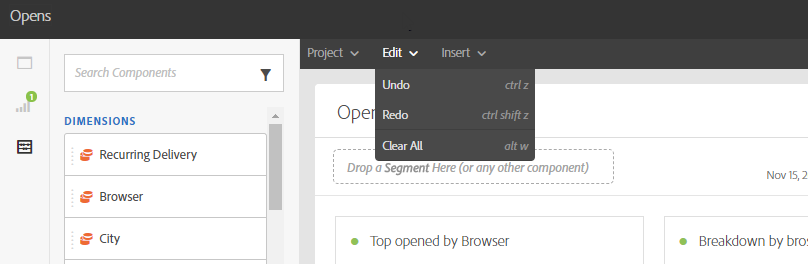

# Interfaccia di generazione rapporti{#reporting-interface}

La barra degli strumenti superiore consente, ad esempio, di modificare, salvare o stampare il report.

Utilizza la scheda **Progetto** per:

* **Apri...**: apre un report o un modello creato in precedenza.
* **Salva con nome...**: i modelli duplicati possono essere modificati.
* **Aggiorna progetto**: aggiorna il report in base ai nuovi dati e alle modifiche apportate ai filtri.
* **Scarica CSV**: esporta i rapporti in un file CSV.

La scheda **Modifica** consente di:

* **Annulla**: annulla l&#39;ultima azione eseguita nel dashboard.
* **Cancella tutto**: elimina tutti i pannelli nel dashboard.

La tabella **Inserisci** consente di personalizzare i report aggiungendo grafici e tabelle al dashboard:

* **Nuovo pannello vuoto**: aggiunge un nuovo pannello vuoto al dashboard.
* **Nuova forma libera**: aggiunge una nuova tabella a forma libera alla dashboard.
* **Nuova riga**: aggiunge un nuovo grafico a linee al dashboard.
* **Nuova barra**: aggiunge un nuovo grafico a barre al dashboard.

**Argomenti correlati:**

* [Aggiunta di pannelli](adding-panels.md)
* [Aggiunta di visualizzazioni](adding-visualizations.md)
* [Aggiunta di componenti](adding-components.md)

## Schede {#tabs}

Le schede a sinistra ti consentono di creare il rapporto e filtrare i dati in base alle esigenze.

Queste schede consentono di accedere ai seguenti elementi:

* **[!UICONTROL Pannelli]**: aggiungi un pannello vuoto o una figura a mano libera al report per iniziare a filtrare i dati. Per ulteriori informazioni, consulta la sezione Aggiunta di pannelli
* **[!UICONTROL Visualizzazioni]**: trascina una selezione di elementi di visualizzazione per conferire al rapporto una dimensione grafica. Per ulteriori informazioni, consulta la sezione Aggiunta di visualizzazioni.
* **[!UICONTROL Componenti]**: personalizza i tuoi report con dimensioni, metriche, segmenti e periodi di tempo diversi.

## Barra degli strumenti {#toolbar}

La barra degli strumenti si trova sopra l’area di lavoro. Composto da schede diverse, consente ad esempio di modificare, salvare, condividere o stampare il report.

**Argomenti correlati:**

* [Aggiunta di pannelli](adding-panels.md)
* [Aggiunta di visualizzazioni](adding-visualizations.md)
* [Aggiunta di componenti](adding-components.md)

### Scheda Progetto {#project-tab}

Utilizza la scheda **Progetto** per:

* **Apri...**: apre un report o un modello creato in precedenza.
* **Salva con nome...**: i modelli duplicati possono essere modificati.
* **Aggiorna progetto**: aggiorna il report in base ai nuovi dati e alle modifiche apportate ai filtri.
* **Scarica CSV**: esporta i rapporti in un file CSV.
* **[!UICONTROL Stampa]**: stampa il report.

### Scheda Modifica {#edit-tab}

La scheda **Modifica** consente di:

* **Annulla**: annulla l&#39;ultima azione eseguita nel dashboard.
* **Cancella tutto**: elimina tutti i pannelli nel dashboard.

### Scheda Inserisci {#insert-tab}

La scheda **Inserisci** ti consente di personalizzare i rapporti aggiungendo grafici e tabelle al dashboard:

* **Nuovo pannello vuoto**: aggiunge un nuovo pannello vuoto al dashboard.
* **Nuova forma libera**: aggiunge una nuova tabella a forma libera alla dashboard.
* **Nuova riga**: aggiunge un nuovo grafico a linee al dashboard.
* **Nuova barra**: aggiunge un nuovo grafico a barre al dashboard.
