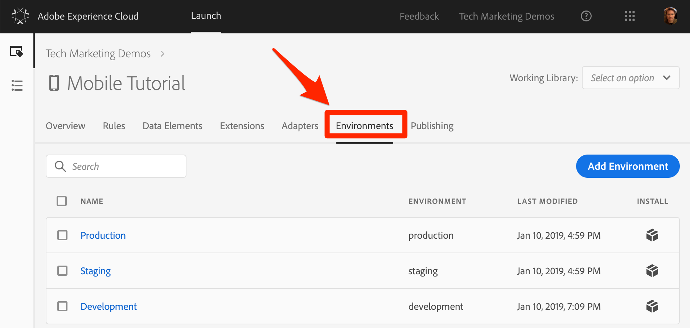
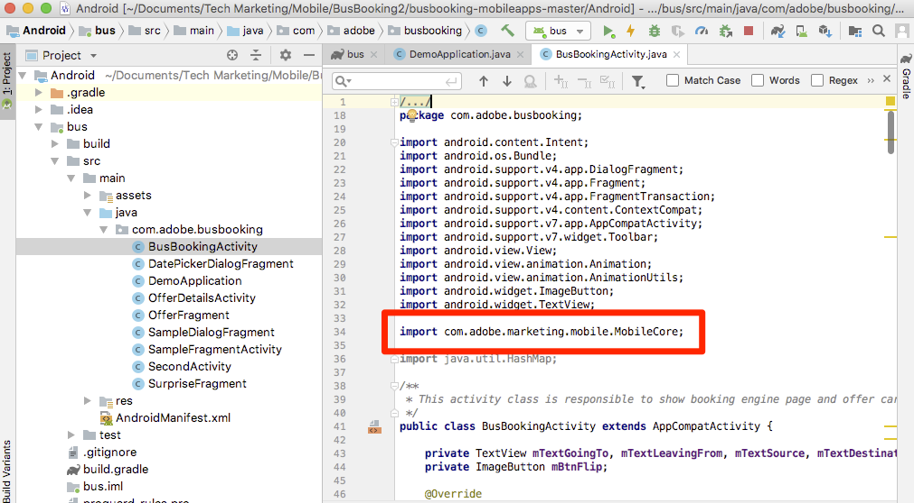
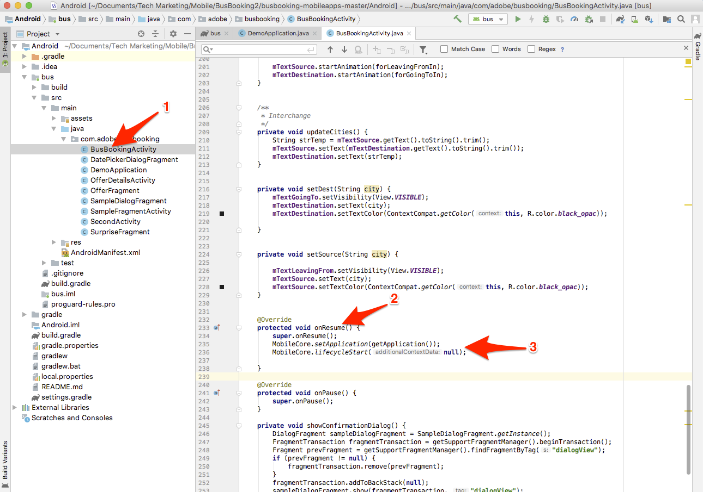

# Installare l’SDK di Mobile

In questa lezione implementerai l’SDK Mobile con le estensioni e le impostazioni corrispondenti all’ambiente di sviluppo della proprietà Launch.

## Prerequisiti 

In questa lezione inizieremo ad aggiungere codice all'app di prenotazione bus, quindi se non lo avete già fatto:

1. Download e installazione di [Android Studio](https://developer.android.com/studio)
1. Scarica l'app [Bus Booking](https://github.com/Adobe-Marketing-Cloud/busbooking-mobileapps)

## Obiettivi di apprendimento

Alla fine di questa lezione, potrai:

* Ottenere le istruzioni di installazione per la proprietà Lancio mobile
* Comprendi la differenza tra ambiente di sviluppo, ambiente di gestione temporanea e ambiente di produzione
* Aggiornare il `build.gradle` file per aggiungere l'SDK di Mobile
* Importa l’SDK di Mobile nell’app
* Verifica che l’SDK sia stato implementato correttamente
* Abilitare le metriche del ciclo di vita nell'app

## Ottenere le istruzioni di installazione

Le istruzioni di installazione per le proprietà di avvio per dispositivi mobili sono una raccolta di snippet di codice che puoi aggiungere a posizioni specifiche nell’app mobile.

Fare clic sulla `Environments` scheda nella navigazione superiore per passare alla pagina degli ambienti. Gli ambienti di sviluppo, gestione delle risorse e produzione sono già stati creati per voi. Questi corrispondono agli ambienti tipici nel processo di sviluppo e rilascio del codice. Il codice viene scritto innanzitutto dallo sviluppatore in un ambiente di sviluppo. Una volta completato il lavoro, l'utente lo invierà a un ambiente di gestione temporanea per il QA e ad altri team per la revisione. Una volta soddisfatti i requisiti di qualità e gli altri team, il codice viene pubblicato nell'ambiente di produzione, che è l'ambiente rivolto al pubblico a cui i visitatori possono accedere quando scaricano l'app.

Launch consente ulteriori ambienti di sviluppo, utili nelle grandi organizzazioni in cui più sviluppatori lavorano contemporaneamente su progetti diversi.

Sviluppo, Staging e Produzione sono gli unici ambienti necessari per completare l'esercitazione.



Nella riga **[!UICONTROL Sviluppo]** , fate clic sull'icona  diinstallazione del codice da incorporare.


Passiamo alle istruzioni passo-passo.

## Aggiornare il file build.gradle

Se in precedenza hai utilizzato Launch in siti Web, una delle prime cose che noterai è che ci sono molte più istruzioni di installazione per le app mobili che per i siti web.

L’SDK di Adobe Mobile per Android utilizza Gradle per gestire le dipendenze tra i vari componenti. Una delle prime cose che faremo è aggiungere le dipendenze dell'SDK Adobe Mobile al file build.gradle dell'app Booking Bus.

**Per aggiornare il file build.gradle**

1. Apri Android Studio
1. Selezionate "Apri un progetto Android Studio esistente"

   

1. Aprite il file build.gradle nella directory principale della cartella Bus Booking Android:

   

1. Aprite il menu a discesa e passate alla vista Progetto

   

1. Apri il file **Android &gt; bus &gt; build.gradle**

   

1. Nell'interfaccia Launch, assicurarsi che il sistema operativo sia impostato su `Android`

1. Copiare le dipendenze negli Appunti facendo clic sull'icona 

   

1. In Android Studio, incollate le dipendenze dagli Appunti subito dopo le dipendenze esistenti (ma prima della chiusura `}`)
1. Inoltre, se state installando l'estensione Adobe Target VEC, dovete aggiungere anche le seguenti dipendenze:

   ```java
   implementation 'com.google.code.gson:gson:2.8.2'
   implementation 'android.arch.lifecycle:extensions:1.1.1'
   implementation 'io.github.sac:SocketclusterClientJava:1.7.5'
   implementation 'com.android.support:support-annotations:28.0.0'
   implementation 'com.android.support:support-compat:28.0.0'
   implementation 'com.android.support:design:28.0.0'
   ```

1. Fate clic sul collegamento "Sincronizza ora" per sincronizzare il progetto

   

## Aggiornare l'applicazione

Ora è il momento di aggiornare l'app per importare l'SDK

**Per importare l’SDK**

1. Aprite il file dell'applicazione principale nell'app Bus Booking, che si trova in **Android &gt; bus &gt; src &gt; main &gt; java &gt; com.adobe.busbooking &gt; DemoApplication**

   

1. Nell’interfaccia di Launch, scorri fino alla sezione **[!UICONTROL Aggiungi codice]** di inizializzazione.
1. Copiate le istruzioni di importazione facendo clic sulla prima icona  nella sezione **[!UICONTROL Aggiungi codice]** di inizializzazione:

   

1. In Android Studio, incollare queste istruzioni di importazione *prima* delle importazioni esistenti nel `DemoApplication` file. L’estensione Core include librerie per il supporto di callback, il servizio identità, le metriche del ciclo di vita e la registrazione della console tra le altre funzioni.

   

1. Nell'interfaccia Launch, copiare le due righe relative all'estensione Core, facendo clic sulla seconda icona  nella sezione **[!UICONTROL Aggiungi codice]** di inizializzazione. La seconda riga attiva le istruzioni di registrazione della console (le opzioni disponibili sono "DEBUG", "VERBOSE", "WARNING" e "ERROR").

   

1. In Android Studio, incollate queste istruzioni Core nel `DemoApplication` file subito dopo `super.onCreate()`
1. Rimuovere i `//` commenti prima delle `try` righe e `catch`

   

1. Nell'interfaccia Launch, copiare le istruzioni di estensione facendo clic sulla terza icona  nella sezione [!UICONTROL Aggiungi codice] di inizializzazione.

   

1. In Android Studio, incollate queste istruzioni di estensione nella `try` sezione . Si noti che `MobileCore.configureWithAppID` contiene l'identificatore dell'ambiente di sviluppo Launch della proprietà. Questo è importante, in quanto sarà necessario aggiornare questo valore quando saremo pronti per distribuire l'app nell'ambiente di produzione.

   

>[!NOTE] Le istruzioni di installazione mobile fornite nell'interfaccia Launch includono le istruzioni di importazione e registrazione per le estensioni Identità, Ciclo di vita e Segnale, nonché l'inizializzazione delle metriche Lifeyle. Queste estensioni sono considerate parte dell'estensione Mobile Core. Se non si desidera utilizzare queste estensioni nell'app, non è necessario importare, registrare o implementare altri codici associati a queste estensioni.
>
> Inoltre, vi sono opzioni di implementazione aggiuntive che dovrebbero essere prese in considerazione quando si utilizzano queste estensioni (ad esempio, potete mettere in pausa/riavviare la raccolta del ciclo di vita quando l'utente sfondi/rintraccia l'app). Per maggiori informazioni, consulta [la documentazione relativa alle estensioni di base per dispositivi mobili](https://aep-sdks.gitbook.io/docs/using-mobile-extensions/mobile-core)

## Verificare l'implementazione

1. Salva il progetto Android Studio
1. Eseguite l'app e avviatela nell'emulatore. Se non disponete di dispositivi emulatore configurati, configuratene uno ora, avendo cura di configurare un dispositivo con Android 4.1 (API 16) o versione successiva.

   

1. Attendi che l'emulatore venga avviato e apra completamente l'app alla schermata di prenotazione (l'operazione potrebbe richiedere alcuni minuti)

   

1. Conferma che le chiamate vengono effettuate ai server Adobe nel Logcat di Android Studio

   

Di seguito sono riportati alcuni esempi di chiamate specifiche che potete cercare:

1. **Chiamate per recuperare la configurazione** di Launch (filtro Logcat a `adobedtm.com`). Prendete nota delle configurazioni di estensione immesse nella lezione precedente. Quando l'aggiunta dell'estensione richiede un aggiornamento dell'app, queste impostazioni possono essere gestite esternamente in Launch e modificate in qualsiasi momento:

   ```java
   03-14 16:30:29.484 24869-24930/com.adobe.busbooking D/ADBMobile: ConfigurationExtension - Cached configuration loaded.
    {"target.propertyToken":"","target.timeout":5,"global.privacy":"optedin","analytics.backdatePreviousSessionInfo":true,"analytics.offlineEnabled":true,"build.environment":"dev","rules.url":"https://assets.adobedtm.com/launch-EN360aefc739b04410816f751a95861744-development-rules.zip","experienceCloud.org":"7ABB3E6A5A7491460A495D61@AdobeOrg","target.clientCode":"techmarketingdemos","target.autoFetch":true,"target.fetchBackground":false,"lifecycle.sessionTimeout":300,"target.environmentId":"busbookingapp","analytics.server":"tmd.sc.omtrdc.net","analytics.rsids":"tmd-mobile-dev1","analytics.batchLimit":0,"property.id":"PRb4881271498b4f2cbaf67d38a8f3891a","global.ssl":true,"analytics.aamForwardingEnabled":true}
   ```

1. **Richiesta al servizio** identità (filtro Logcat a `IdentityExtension`) In questo esempio, l’ID (`d_mid`) è già stato impostato e viene ora nuovamente segnalato)

   ```java
   03-14 17:01:18.526 7743-7803/com.adobe.busbooking D/ADBMobile: IdentityExtension - Sending request (https://dpm.demdex.net/id?d_mid=59651426340521082405908216148091920022&d_ver=2&d_orgid=7ABB3E6A5A7491460A495D61%40AdobeOrg)
   ```

1. **Richiesta** Analytics (filtro Logcat a `AnalyticsExtension`)

   ```java
   03-14 17:01:18.509 7743-7777/com.adobe.busbooking D/ADBMobile: AnalyticsExtension - Sending Analytics ID call (https://tmd.sc.omtrdc.net/id?mcorgid=7ABB3E6A5A7491460A495D61%40AdobeOrg&mid=59651426340521082405908216148091920022)
   ```

Congratulazioni, hai aggiunto l’SDK a un’app mobile!

## Abilitare le metriche del ciclo di vita nell'app

Le metriche del ciclo di vita sono metriche e dimensioni basate sull'ambiente che possono essere facilmente abilitate in un'app tramite l'SDK di Experience Platform Mobile. Poiché possono essere utilizzati da più soluzioni Experience Cloud, li consentiremo qui, prima di passare alle singole soluzioni. È semplice come aggiungere un paio di righe di codice alla nostra app nel posto giusto.

### Importa la libreria di base nel file BusBookingActivity

Per effettuare chiamate API tramite l’SDK di Adobe Experience Platform Mobile, è necessario importare le librerie nei file appropriati. In questo caso, per utilizzare la chiamata Lifecycle API, è necessario importare la libreria Core.

1. Con l'app aperta in Android Studio, apri il file BusBookingActivity, che si trova nella stessa directory del file DemoApplication in cui hai lavorato.
1. Nella parte superiore del file, aggiungi la seguente istruzione di importazione MobileCore in modo da poter utilizzare le chiamate API associate
   `import com.adobe.marketing.mobile.MobileCore;`



### Aggiungere il codice del ciclo di vita

Ora aggiungi il codice del ciclo di vita alla funzione principale onResume() nell'app, per attivare le funzioni del ciclo di vita.

1. Aprire il file BusBookingActivity
1. Scorrete verso il basso vicino alla parte inferiore del file e individuate la funzione onResume()
1. Aggiungete le due seguenti righe di codice sotto la `super.onResume()` riga:

   ```java
    MobileCore.setApplication(getApplication());
    MobileCore.lifecycleStart(null);
   ```



### Convalida dell’hit del ciclo di vita

Quando eseguite l'app, dovreste ora ricevere uno o più messaggi del ciclo di vita nella sezione di debug di Android Studio.

1. Eseguite una build e scegliete un simulatore per eseguire l'app
1. Dopo che il simulatore è in esecuzione, fare clic sulla sezione "Esegui" del debugger in Android Studio
1. Eseguire una ricerca `internalaction=Lifecycle`
1. Vedi che ci sono righe che includono questa coppia chiave/valore, così come le altre metriche del ciclo di vita.

Le righe visualizzate sono chiamate Analytics con le metriche del ciclo di vita.


["Aggiungi il servizio identità Adobe Experience Platform" &gt;](id-service.md)