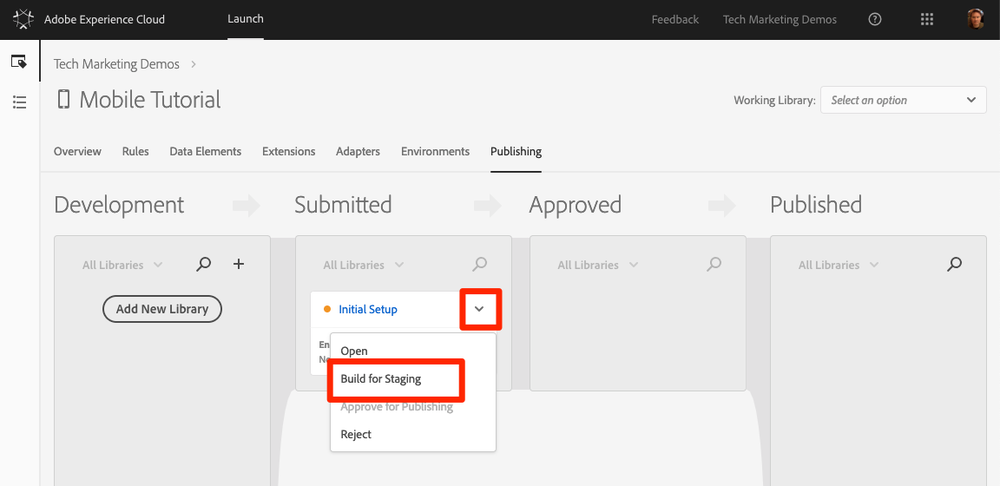
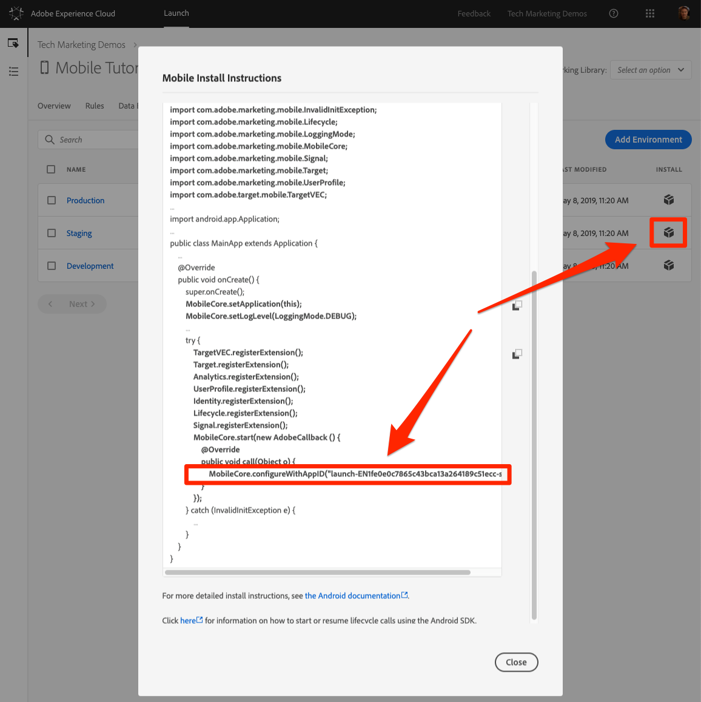

# Pubblicare la proprietà Launch

Ora che hai implementato alcune soluzioni chiave di Adobe Experience Cloud nel tuo ambiente di sviluppo, è il momento di imparare il flusso di lavoro di pubblicazione.

## Prerequisiti 

Per completare la lezione, l’account utente di Launch necessita dell’autorizzazione "Approva" e "Pubblica". Se non riesci a completare nessuno di questi passaggi perché le opzioni dell'interfaccia utente non sono disponibili, rivolgiti al tuo amministratore Experience Cloud per avere accesso. For more information on Launch permissions, see [the documentation](https://docs.adobe.com/content/help/en/launch/using/reference/admin/user-permissions.html).

## Obiettivi di apprendimento

Alla fine di questa lezione, potrai:

1. Pubblicare una libreria di sviluppo nell'ambiente di staging
1. Aggiornare l'app per caricare diversi ambienti Launch
1. Pubblicare una libreria di sviluppo nell'ambiente di produzione

## Pubblicare nell'ambiente di staging

Dopo aver creato e convalidato la libreria nell'ambiente di sviluppo, è ora di pubblicarla su Gestione temporanea.

1. Go to the **[!UICONTROL Publishing]** page

1. Aprite il menu a discesa accanto alla libreria e selezionate **[!UICONTROL Invia per approvazione]**

   

1. Fate clic sul pulsante **[!UICONTROL Invia]** nella finestra di dialogo:

   

1. La libreria verrà ora visualizzata nella colonna [!UICONTROL Inviato] in uno stato non generato:

1. Aprite il menu a discesa e selezionate **[!UICONTROL Genera per gestione temporanea]**:

   
1. Quando l'icona del puntino diventa verde, la libreria può essere visualizzata in anteprima nell'ambiente di staging.

In uno scenario reale, il passaggio successivo nel processo in genere consisterebbe nel far sì che il team di QA convalidi le modifiche nella libreria di staging.

**Convalida delle modifiche nella libreria Gestione temporanea**

1. Nella proprietà Launch, apri la pagina [!UICONTROL Ambienti]

1. Nella [!UICONTROL riga Staging] , fate clic sull'icona Install

    di installazione per aprire la modalità modale

A questo punto, l'unica differenza tra le istruzioni di installazione negli ambienti di sviluppo e di gestione temporanea è rappresentata dal riferimento Launch nel codice di inizializzazione, come evidenziato nella schermata precedente.   È sufficiente aggiornare la riga corrispondente nel file DemoApplication e ricreare l'app. Se utilizzi un progetto diverso per l'app Staging, dovrai accertarti che questo progetto contenga tutti gli altri aggiornamenti dell'app che hai effettuato durante questa esercitazione.

In tempo reale, una volta che il team di controllo qualità ha effettuato l'accesso rivedendo i cambiamenti nell'ambiente di gestione temporanea, è ora di pubblicare i dati in produzione.

## Pubblicare in produzione

1. Go to the [!UICONTROL Publishing] page

1. Dal menu a discesa, fate clic su **[!UICONTROL Approva per la pubblicazione]**:

   

1. Fate clic sul pulsante **[!UICONTROL Approva]** nella finestra di dialogo:

   

1. La libreria verrà ora visualizzata nella colonna [!UICONTROL Approvato] nello stato non generato (punto giallo):

1. Aprite il menu a discesa e selezionate **[!UICONTROL Genera e pubblica in produzione]**:

   

1. Fate clic su **[!UICONTROL Pubblica]** nella finestra di dialogo:

   

1. La libreria verrà ora visualizzata nella colonna [!UICONTROL Pubblicato] :

   

Anche in questo caso, l'ambiente di produzione utilizza un riferimento Launch nella configurazione di base, come evidenziato nella schermata seguente.  Se utilizzi un progetto diverso per l'app Produzione, dovrai accertarti che questo progetto contenga tutti gli aggiornamenti dell'app che hai fatto durante questa esercitazione.

>[!IMPORTANT] La prossima volta che apporti modifiche alla configurazione di Launch, dovrai creare una nuova libreria nell'ambiente di sviluppo. Ricorda che l'aggiunta e la rimozione di estensioni richiederà aggiornamenti all'app stessa. Fai attenzione a mantenere sincronizzati gli ambienti Launch e il codice dell'app per evitare problemi.

È tutto! Hai completato l'esercitazione e pubblicato la tua prima proprietà mobile in Launch!