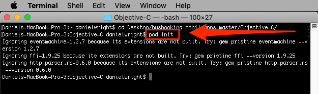
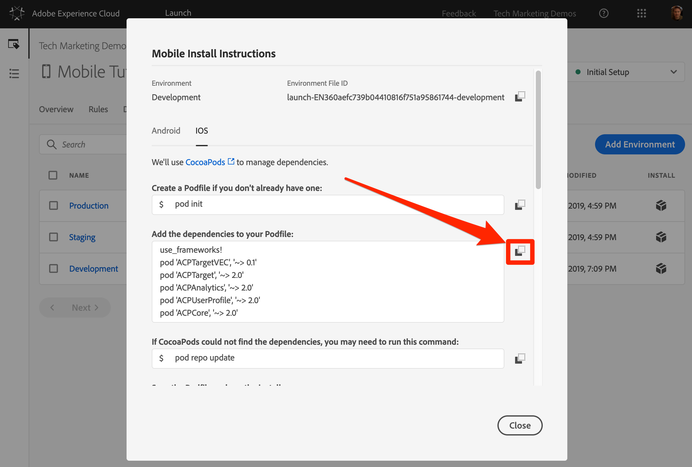
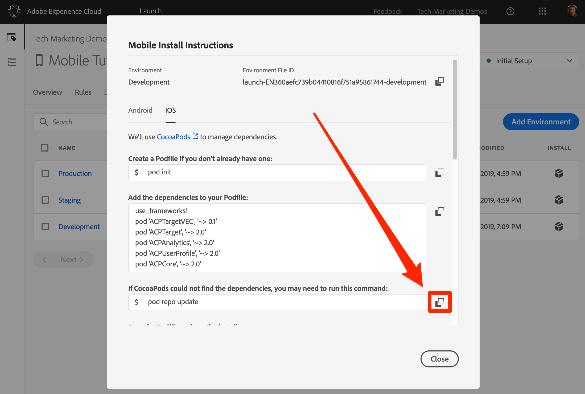
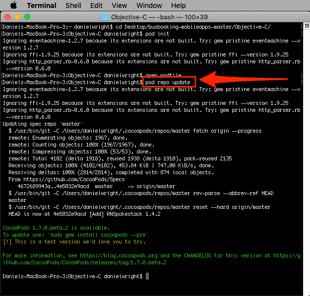
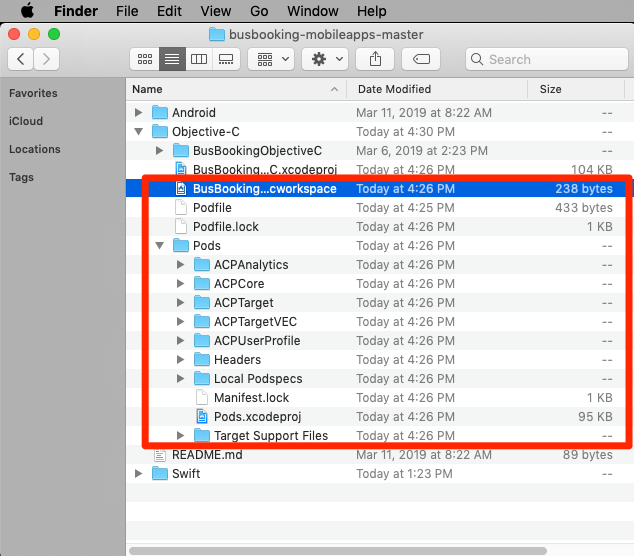
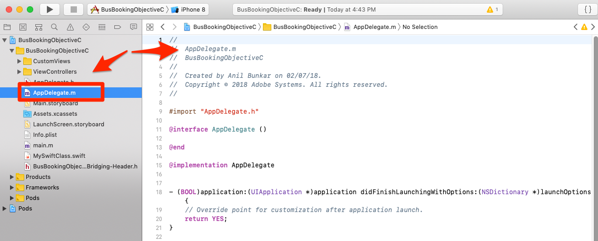
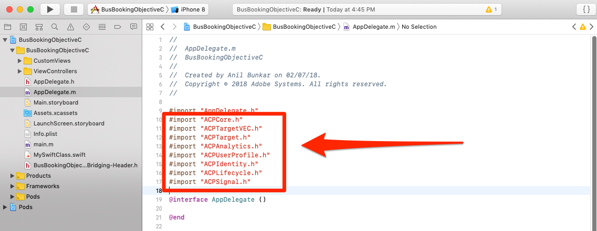
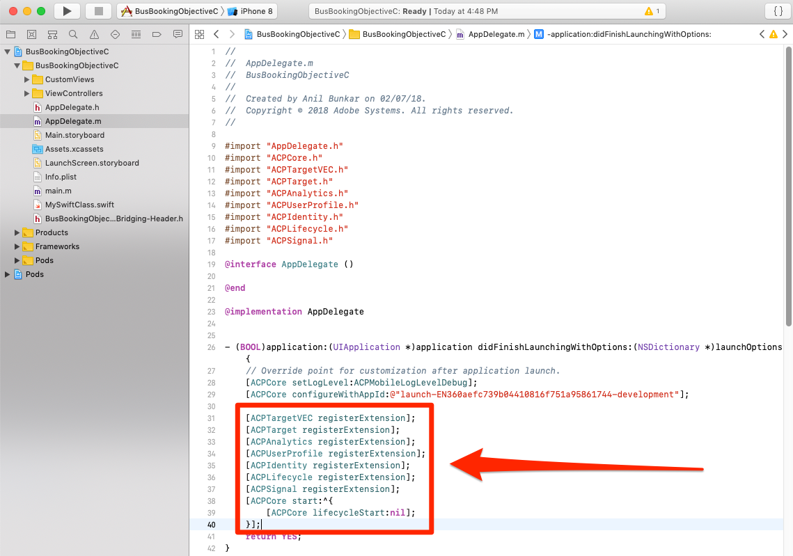
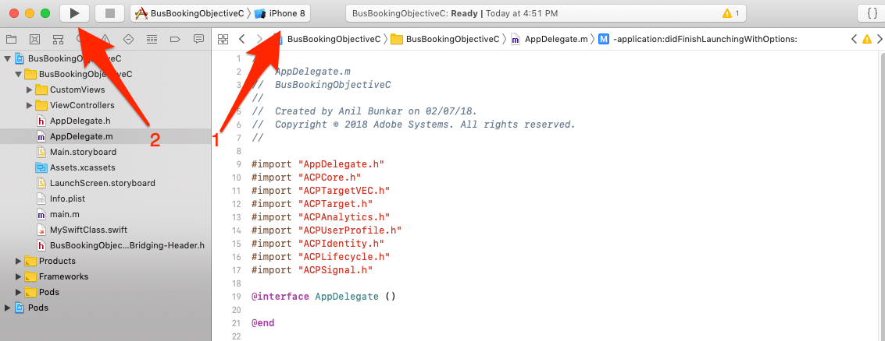

# Installare l’SDK di Mobile

In questa lezione implementerai l’SDK Mobile con le estensioni e le impostazioni corrispondenti all’ambiente di sviluppo della proprietà Launch.

## Obiettivi di apprendimento

Alla fine di questa lezione, potrai:

* Ottenere le istruzioni di installazione per la proprietà Lancio mobile
* Comprendi la differenza tra ambiente di sviluppo, ambiente di gestione temporanea e ambiente di produzione
* Creare e modificare il file contenitore
* Importa l’SDK di Mobile nel file AppDelegate
* Verifica che l’SDK sia stato implementato correttamente

## Ottenere le istruzioni di installazione

Le istruzioni di installazione per le proprietà di avvio per dispositivi mobili sono una raccolta di snippet di codice da eseguire nel terminale o aggiungere a posizioni specifiche nell’app mobile.

Fare clic sulla `Environments` scheda nella navigazione superiore per passare alla pagina degli ambienti. Gli ambienti di sviluppo, gestione delle risorse e produzione sono già stati creati per voi. Questi corrispondono agli ambienti tipici nel processo di sviluppo e rilascio del codice. Il codice viene scritto innanzitutto dallo sviluppatore in un ambiente di sviluppo. Una volta completato il lavoro, l'utente lo invierà a un ambiente di gestione temporanea per il QA e ad altri team per la revisione. Una volta soddisfatti i requisiti di qualità e gli altri team, il codice viene pubblicato nell'ambiente di produzione, che è l'ambiente rivolto al pubblico a cui i visitatori possono accedere quando scaricano l'app.

Launch consente ulteriori ambienti di sviluppo, utili nelle grandi organizzazioni in cui più sviluppatori lavorano contemporaneamente su progetti diversi.

Sviluppo, Staging e Produzione sono gli unici ambienti necessari per completare l'esercitazione.


Nella riga **[!UICONTROL Sviluppo]** , fate clic sull'icona  diinstallazione del codice da incorporare.


Passiamo alle istruzioni passo-passo.

## Creare il file contenitore e installare i contenitori

Se in precedenza avete utilizzato Launch in siti Web, una delle prime cose che noterete è che in questo modale sono presenti molte più informazioni rispetto alle proprietà Web.

L’SDK di Adobe Mobile per iOS utilizza i contenitori Cocoa per gestire le dipendenze tra i vari componenti. Se non hai già installato [CocoaPods](https://cocoapods.org/) nel tuo ambiente di sviluppo, segui le istruzioni di installazione sul loro sito web. Inoltre, se non avete già scaricato l'app [](https://github.com/Adobe-Marketing-Cloud/busbooking-mobileapps)Bus Booking, salvatela nel computer locale ed estraete l'archivio zip sul desktop.

**Per creare il profilo**

1. Aprite l' `Terminal` applicazione sul vostro Mac®

1. Andate alla cartella del progetto in cui avete salvato l'app Bus Booking Objective-C (ad esempio `cd Desktop/busbooking-mobileapps-master/Objective-C/`)

   

1. Nell'interfaccia Launch, modificare il sistema operativo in `iOS`

1. Copiate la prima istruzione iOS `pod init`, facendo clic sull'icona 

   

1. Nell'app Terminal, esegui il `pod init` comando e attendi il suo completamento

   

1. Nell'app Terminal, aprite il file contenitore con il `open podfile` comando

   

1. È possibile aprire una finestra di dialogo con cui si desidera aprire il file del contenitore. Scegliete un editor di testo, come `TextEdit`

1. Nell'interfaccia di Launch, copiare l'elenco delle dipendenze facendo clic sull'icona  . Si noti che esiste una riga corrispondente a ciascuna delle estensioni aggiunte nella lezione precedente. Ogni estensione ha un proprio set di codice che si basa sull’estensione Mobile Core e può essere aggiunta o rimossa solo con un aggiornamento dell’app:

   

1. Nell’editor di testo, incollate le dipendenze dagli Appunti subito dopo la riga `# Pods for BusBookingObjectiveC`

1. Salvate gli aggiornamenti nel file contenitore nell’editor di testo

   

1. È ora possibile chiudere l'editor di testo

1. Nell'interfaccia di Launch, copia l'istruzione iOS successiva `pod repo update`, facendo clic sull'icona 

   

1. Nell'app Terminal, eseguite il `pod repo update` comando e attendete il suo completamento (l'operazione potrebbe richiedere alcuni minuti)

   

1. Nell'interfaccia di Launch, copia l'istruzione iOS successiva `pod install`, facendo clic sull'icona 

   

1. Nell'app Terminal, esegui il `pod install` comando e attendi il suo completamento

   

1. È ora possibile chiudere la finestra del terminale

1. Aprite una finestra del Finder, individuate la cartella in cui è stata salvata l'app Bus Booking e verificate che sia stato creato il file BusBookingObjectiveC.xcworkspace, il file Podfile, il file Podfile.lock e la cartella Contenitori

   

## Aggiorna AppDelegate

Ora è il momento di aggiornare l'app per importare l'SDK:

1. Aprire il `BusBookingObjectiveC.xcworkspace` file in XCode
1. Aprire il `AppDelegate.m` file

   

1. Nell’interfaccia di Launch, scorri fino alla sezione **[!UICONTROL Aggiungi codice]** di inizializzazione e scegli **[!UICONTROL Obiettivo C]** come lingua iOS in uso.
1. Copiate le istruzioni di importazione facendo clic sulla prima icona  nella sezione **[!UICONTROL Aggiungi codice]** di inizializzazione:

   

1. In XCode, incollare queste istruzioni di importazione nel `AppDelegate.m` file dopo l'importazione per `AppDelegate.h`

   

1. Nell'interfaccia Launch, copiare le due righe relative all'estensione Core, facendo clic sulla seconda icona  nella sezione **[!UICONTROL Aggiungi codice]** di inizializzazione. La prima riga attiva le istruzioni di registrazione della console (le opzioni disponibili sono "debug", "verbose", "warning" e "error"). La seconda riga indica l'identificatore univoco dell'ambiente Launch. Questo è importante, in quanto sarà necessario aggiornare questo valore quando saremo pronti per distribuire l'app nell'ambiente di produzione.

   

1. In XCode, incollate queste istruzioni Core nel file AppDelegate nella parte superiore del `application(_:didFinishLaunchingWithOptions:)` metodo:

   

1. Nell'interfaccia Launch, copiare le istruzioni di estensione facendo clic sulla terza icona  nella sezione [!UICONTROL Aggiungi codice] di inizializzazione:

   

1. In XCode, incollate queste istruzioni di estensione nel file AppDelegate immediatamente prima della `return true` riga del `application(_:didFinishLaunchingWithOptions:)` metodo:

   

>[!NOTE] Le istruzioni di installazione mobile fornite nell'interfaccia Launch includono le istruzioni di importazione e registrazione per le estensioni Identità, Ciclo di vita e Segnale, nonché l'inizializzazione delle metriche Lifeyle. Queste estensioni sono considerate parte dell'estensione Mobile Core. Se non si desidera utilizzare queste estensioni nell'app, non è necessario importare, registrare o implementare altri codici associati a queste estensioni.
>
> Inoltre, vi sono opzioni di implementazione aggiuntive che dovrebbero essere prese in considerazione quando si utilizzano queste estensioni (ad esempio, potete mettere in pausa/riavviare la raccolta del ciclo di vita quando l'utente sfondi/rintraccia l'app). Per maggiori informazioni, consulta [la documentazione relativa alle estensioni di base per dispositivi mobili](https://aep-sdks.gitbook.io/docs/using-mobile-extensions/mobile-core)

## Verificare l'implementazione

1. Salva il progetto XCode
1. Eseguite l'app e avviatela nel simulatore. Se non avete configurato alcun dispositivo simulatore, configuratene uno ora, avendo cura di configurare un dispositivo con iOS 10+. Ci piace utilizzare un simulatore iPhone 8 perché è facile fare clic sul `Home` pulsante con un mouse.

   

1. Attendi che il simulatore venga avviato e apra completamente l'app alla schermata di prenotazione (l'operazione potrebbe richiedere alcuni minuti)

   

1. Conferma che le chiamate vengono effettuate ai server Adobe nella console XCode

   

Di seguito sono riportati alcuni esempi di chiamate specifiche che potete cercare:

1. **Chiamate per recuperare la configurazione** Launch (filtrare la console in `adobedtm.com`). Prendete nota delle configurazioni di estensione immesse nella lezione precedente. Quando l'aggiunta dell'estensione richiede un aggiornamento dell'app, queste impostazioni possono essere gestite esternamente in Launch e modificate in qualsiasi momento:

   ```objective-c
   2019-03-13 16:53:26.633816-0400 BusBookingObjectiveC[56630:3854917] [AMSDK DEBUG <RulesDownloader>]: Successfully downloaded Rules from 'https://assets.adobedtm.com/launch-EN360aefc739b04410816f751a95861744-development-rules.zip'
   
   {"target.propertyToken":"","target.timeout":5,"global.privacy":"optedin","analytics.backdatePreviousSessionInfo":true,"analytics.offlineEnabled":true,"build.environment":"dev","rules.url":"https://assets.adobedtm.com/launch-EN360aefc739b04410816f751a95861744-development-rules.zip","experienceCloud.org":"7ABB3E6A5A7491460A495D61@AdobeOrg","target.clientCode":"techmarketingdemos","target.autoFetch":true,"target.fetchBackground":false,"lifecycle.sessionTimeout":300,"target.environmentId":"busbookingapp","analytics.server":"tmd.sc.omtrdc.net","analytics.rsids":"tmd-mobile-dev1","analytics.batchLimit":0,"property.id":"PRb4881271498b4f2cbaf67d38a8f3891a","global.ssl":true,"analytics.aamForwardingEnabled":true}
   ```

1. **Richiesta al servizio** identità (filtrate la console in `demdex.net`) In questo esempio, l’ID (`d_mid`) è già stato impostato ed è appena stato riportato di nuovo)

   ```objective-c
   2019-03-13 16:53:26.655908-0400 BusBookingObjectiveC[56630:3854937] [AMSDK DEBUG <com.adobe.module.identity>]:
   
   Sending request (https://dpm.demdex.net/id?d_rtbd=json&d_ver=2&d_orgid=7ABB3E6A5A7491460A495D61@AdobeOrg&d_mid=67027929491180584128922600814231770586)
   ```

1. **Risposta dal servizio** identità (filtrate la console in `ID Service`). Notate come il `mid` valore corrisponde al `d_mid` valore nella richiesta precedente:

   ```objective-c
   2019-03-13 16:53:27.397048-0400 BusBookingObjectiveC[56630:3854937] [AMSDK DEBUG <com.adobe.module.identity>]:
   
   ID Service - Got ID Response (mid: 67027929491180584128922600814231770586, blob: j8Odv6LonN4r3an7LhD3WZrU1bUpAkFkkiY1ncBR96t2PTI, hint: 9, ttl: "604800000 ms")
   ```

1. **Richiesta** di Analytics (filtrate la console in `Analytics request`)

   ```objective-c
   2019-03-13 16:53:27.689061-0400 BusBookingObjectiveC[56630:3855024] [AMSDK DEBUG <AnalyticsHitDatabase>]: Analytics request was sent with body
   
   (ndh=1&c.&a.&AppID=BusBookingObjectiveC%201%20%281.0%29&CarrierName=%28null%29&DailyEngUserEvent=DailyEngUserEvent&DayOfWeek=4&DeviceName=x86_64&HourOfDay=16&InstallDate=3%2F13%2F2019&InstallEvent=InstallEvent&LaunchEvent=LaunchEvent&Launches=1&MonthlyEngUserEvent=MonthlyEngUserEvent&OSVersion=iOS%2012.1&Resolution=750x1334&RunMode=Application&TimeSinceLaunch=1&internalaction=Lifecycle&locale=en-US&.a&.c&ce=UTF-8&cp=foreground&mid=67027929491180584128922600814231770586&pageName=BusBookingObjectiveC%201%20%281.0%29&pe=lnk_o&pev2=ADBINTERNAL%3ALifecycle&t=00%2F00%2F0000%2000%3A00%3A00%200%20240&ts=1552510406)
   ```

Congratulazioni, hai aggiunto l’SDK a un’app mobile!

["Aggiungi il servizio identità Adobe Experience Platform" &gt;](id-service.md)