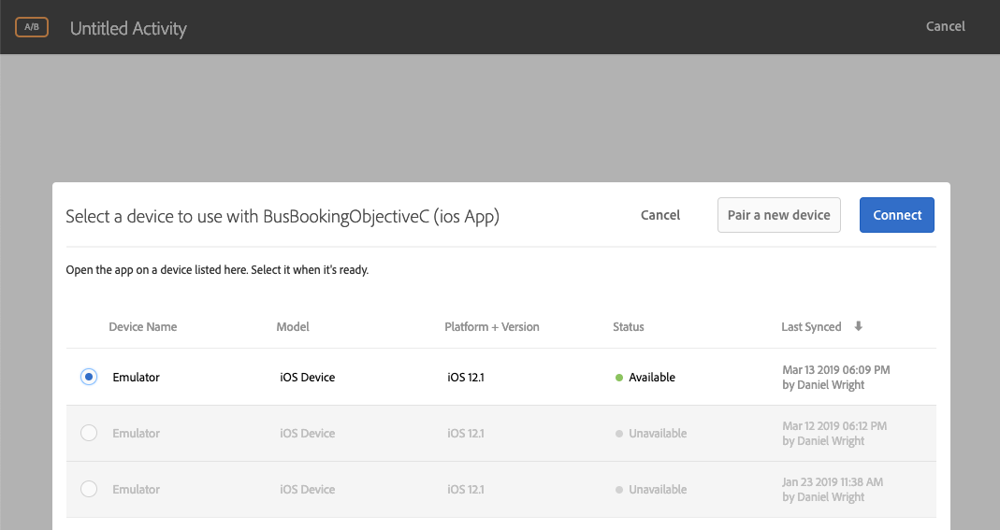

# Aggiunta di Visual Experience Composer (VEC) di Adobe Target

In questa lezione, abiliterete Target Visual Experience Composer (VEC) per le app mobili.

[Adobe Target](https://docs.adobe.com/content/help/en/target/using/target-home.html) è la soluzione Adobe Experience Cloud che offre tutto il necessario per adattare e personalizzare l'esperienza dei clienti, in modo da massimizzare le entrate sui siti Web e mobili, le app, i social media e altri canali digitali.

Il compositore esperienza visivo (VEC) per app mobile native ti permette di creare attività e personalizzare contenuti in app mobile native in modalità fai-da-te senza dover dipendere sempre dagli sviluppatori e dai cicli di rilascio delle app.

Nella lezione [Aggiungi estensioni](launch-add-extensions.md), hai aggiunto l’estensione VEC di Target alla proprietà Launch. Nella lezione [Installa l’SDK](launch-install-the-mobile-sdk.md) Mobile che hai importato nell’applicazione di esempio. Per avviare la configurazione delle attività in Target Mobile Experience Composer (Compositore esperienza visiva mobile) sono necessari solo alcuni piccoli aggiornamenti!

>[!WARNING] Sia le estensioni Target che Target VEC Launch sono necessarie per utilizzare Target VEC nella vostra applicazione mobile.

## Obiettivi di apprendimento

Alla fine di questa lezione, potrai:

* Abilitare l'app di esempio per Target VEC
* Aggiunta di parametri alla richiesta VEC di Target
* Collegare il dispositivo al VEC
* Creazione di un'attività tramite VEC

## Prerequisiti 

Per completare le lezioni in questa sezione, dovete:

* Completa le lezioni nella sezione [Configura lancio](launch-create-a-property.md) .
* Accesso a livello di approver all'interfaccia di Adobe Target

## Aggiungi parametri

Le metriche del ciclo di vita vengono incluse automaticamente come parametri nella richiesta VEC di Target. Potete anche aggiungere parametri personalizzati alle richieste.

**Aggiunta di parametri personalizzati**

1. In Xcode, aprire il `BookingViewController.m` file. Questo file viene utilizzato dalla schermata Home.
1. Importa le estensioni VEC Target e Target sotto le importazioni esistenti

   ```swift
   #import "ACPTarget.h"
   #import "ACPTargetVEC.h"
   ```

1. Nella `viewDidLoad` funzione, dopo la riga con `super.viewDidLoad` aggiungere il seguente codice. Questo codice di esempio mostra come parametri, parametri di profilo, parametri di prodotto (o entità) e parametri di ordine possono essere aggiunti alla richiesta TargetVEC. In questo esempio vengono utilizzati valori statici, mentre nell'app effettiva si desidera utilizzare le variabili dinamiche per comporre i valori. E naturalmente, si desidera solo compilare i parametri relativi alla vista:

   ```objective-c
   NSDictionary *params = @{@"param1":@"value1"};
   NSDictionary *profileParams = @{@"profilekey1":@"profilevalue1"};
   ACPTargetProduct *product = [ACPTargetProduct targetProductWithId:@"1234" categoryId:@"furniture"];
   ACPTargetOrder *order = [ACPTargetOrder targetOrderWithId:@"12343" total:@(123.45) purchasedProductIds:@[@"100",@"200"]];
   ACPTargetParameters *targetParams = [ACPTargetParameters targetParametersWithParameters:params
                                                                         profileParameters:profileParams
                                                                                   product:product
                                                                                     order:order];
   [ACPTargetVEC setGlobalRequestParameters:targetParams];
   ```

   

Ora che hai aggiunto parametri all'app, è ora di confermare che verranno passati nella richiesta.

**Verifica dei parametri**

1. Salva il progetto Xcode
1. Generate di nuovo l'app e attendete che si riapra nel simulatore
1. Fare clic nel riquadro Console di Xcode
1. Usare ▲-F per aprire la casella di ricerca
1. Cerca `targetvec` nella casella Trova
1. Premi `Enter` per passare alla richiesta Target e al corpo Post. Individuate i parametri personalizzati appena aggiunti alla richiesta:

   

## Associazione dell'app mobile all'interfaccia di destinazione

Per creare attività VEC nell'interfaccia di Target, devi prima associare Target alla tua app. Questo accoppiamento è ottenuto con l'uso di collegamenti profondi.

### Creazione di uno schema di collegamento profondo

iOS supporta l'utilizzo di collegamenti [](https://developer.apple.com/documentation/uikit/core_app/allowing_apps_and_websites_to_link_to_your_content) universali e schemi [URL](https://developer.apple.com/documentation/uikit/core_app/allowing_apps_and_websites_to_link_to_your_content/defining_a_custom_url_scheme_for_your_app) personalizzati per creare collegamenti profondi all'app. Probabilmente già utilizzate schemi URL personalizzati nella vostra app. In tal caso, potete utilizzare questi collegamenti esistenti per farli corrispondere a Target. Per questa esercitazione, dovete creare uno schema URL personalizzato.

**Per registrare lo schema URL**

1. In Xcode, fai doppio clic sull'app per aprire la schermata Impostazioni
1. Nella schermata Impostazioni, fate clic sulla `Info` scheda
1. Expand the `URL Types` section
1. L' **[!UICONTROL identificatore]** è impostato su `com.adobetarget.BusBookingObjectiveC`. Potete usare questo identificatore o modificarlo, se lo desiderate.
1. Lo schema **** URL è `BusBookingObjectiveC`. Potete utilizzare questo schema o modificarlo se lo desiderate.
1. Accertatevi che **[!UICONTROL Editor]** sia selezionato come **[!UICONTROL Ruolo]**

   

1. Se avete aggiornato l'identificatore o lo schema, fate clic sulla `General` scheda in modo che lo schema venga salvato.  Fate clic nuovamente sulla `Info` scheda, espandete la `URL type` sezione e verificate che l'identificatore o lo schema sia stato salvato.

Il passaggio successivo consiste nell'aggiungere un gestore al collegamento profondo.

**Gestione dei collegamenti profondi**

1. Aprire il `AppDelegate.m` file
1. Aggiungere la linea `[ACPCore collectLaunchInfo:@ {@"adb_deeplink": url.absoluteString}];` alla `AppDelegate:application:openURL` sezione come illustrato di seguito
   

### Verifica del collegamento profondo

Ora, quando un utente con l'app installata apre un URL come `BusBookingObjectiveC://com.adobetarget.BusBookingObjectiveC` (o qualsiasi schema definito) nel simulatore, l'applicazione viene aperta.

**Verifica dello schema di collegamento profondo**

1. Salva il progetto Xcode
1. Rigenerare l'app
1. Nel simulatore, aprite Safari
1. Immettere l'URL `BusBookingObjectiveC://com.adobetarget.BusBookingObjectiveC` (o qualsiasi schema definito) nella barra degli indirizzi. In caso di problemi, consulta la sezione Suggerimento di seguito.
1. È necessario che venga richiesto di "Aprire la pagina in "BusBookingObjectiveC". In caso di problemi, consulta la sezione Suggerimento di seguito.
1. Fai clic su `Open`
1. Questo dovrebbe aprire l'app di prenotazione bus

   > [!TIP] Se non riuscite a copiare e incollare l’URL dal desktop al simulatore, in genere accade per uno dei due motivi seguenti:
   >
   >   1. **L'URL copiato dall'interfaccia di Target non viene incollato nel simulatore** . Questo accade quando gli Appunti di Desktop e Simulator non vengono sincronizzati.  In questo caso, provate a disattivare e a impostare `Automatically Sync Pasteboard` in Simulatore e copiare/incollare di nuovo:
      >
      >      
      
      >
      >   
   1. **Incollando l’URL si inserisce nella pagina** dei risultati di Google Search. Provare a incollare nuovamente l’URL del collegamento profondo nella barra degli indirizzi e premere `Enter`. Potrebbe essere necessario ripeterlo qualche volta.


   

Ora che la vostra struttura di collegamento profondo è configurata, siete pronti a utilizzare Target VEC per configurare le attività!

## Creare un'attività in Mobile VEC

Ora creiamo un'attività nell'interfaccia di Target.

**Per creare un'attività con Target VEC**

1. Accedi ad [Adobe Experience Cloud](https://experiencecloud.adobe.com)
1. Utilizzare lo switcher della soluzione per passare a Target

   

1. Destinazione lancio

   

1. Fate clic sul pulsante **[!UICONTROL Crea attività]** e selezionate Test **[!UICONTROL A/B]**
1. Seleziona app **[!UICONTROL mobile]**
1. Accertatevi che **[!UICONTROL Visual]** sia selezionato in **[!UICONTROL Scegli Experience Composer (Scegli Experience Composer)]**
1. Fate clic sul pulsante **[!UICONTROL Avanti]**

   

1. Nella schermata **[!UICONTROL Selezionate un'app da usare]** , fate clic su **[!UICONTROL Aggiungi nuova app]**

   

1. Inserire lo schema URL appena definito nel campo **[!UICONTROL Inserisci schema]** URL, ad esempio `BusBookingObjectiveC://com.adobetarget.BusBookingObjectiveC`
1. Fai clic su **[!UICONTROL Crea collegamento profondo]**

   

   >[!NOTE] Hai alcune opzioni per inviare il collegamento profondo all'app. È possibile:
   >
   >   1. Scatta una foto del codice QR dal tuo dispositivo iOS (nella nostra esercitazione, il dispositivo dovrebbe essere collegato a Xcode)
   >   1. Copiare il collegamento profondo dall'interfaccia di Target e inviarlo al dispositivo come desiderato
   >   1. Invia per e-mail il collegamento profondo a un indirizzo e-mail valido, quindi apri il collegamento con un'applicazione e-mail sul dispositivo


1. Fate clic sulla scheda **[!UICONTROL Copia e invia collegamento]** .
1. Fai clic ovunque sul collegamento per copiare automaticamente il collegamento negli Appunti

   

1. Torna al simulatore
1. Apri Safari nel simulatore
1. Incolla l’URL del collegamento profondo nella barra degli indirizzi
1. Fate clic sul `Open` pulsante per aprire l'app

   > [!TIP] Se non riuscite a copiare e incollare l’URL dal desktop al simulatore, in genere accade per uno dei due motivi seguenti:
   >
   >   1. **L'URL copiato dall'interfaccia di Target non viene incollato nel simulatore** . Questo accade quando gli Appunti di Desktop e Simulator non vengono sincronizzati.  In questo caso, provate a disattivare e a impostare `Automatically Sync Pasteboard` in Simulatore e copiare/incollare di nuovo:
      >
      >      
      
      >
      >   
   1. **Incollando l’URL si inserisce nella pagina** dei risultati di Google Search. Provare a incollare nuovamente l’URL del collegamento profondo nella barra degli indirizzi e premere `Enter`. Potrebbe essere necessario ripeterlo qualche volta.


   

1. Dopo il caricamento dell'app, tornate alla scheda del browser in cui avete aperto Target. Dovresti vedere l'app caricata nel VEC.
1. Fai clic sulle risorse di testo e immagini nell'app e dovresti vedere le opzioni per modificarle e sostituirle!

   

1. Apportate alcune modifiche alla prima schermata dell'app
1. Ora posizionare il simulatore accanto al browser con il VEC aperto
1. Passa a una schermata diversa nell'app e osserva come il VEC si aggiorna con il simulatore!
1. Puoi effettuare aggiornamenti a più viste nell'app, in una singola attività!
   
1. Puoi anche aggiungere visivamente metriche di monitoraggio dei clic e utilizzare l'integrazione A4T con Analytics!
1. Salvate e accettate l'attività e verificate di poterla vedere nell'app di esempio

La coppia del dispositivo con il VEC è un'azione una tantum. Quando crei più attività in futuro sullo stesso dispositivo, potrai semplicemente selezionare il dispositivo da un elenco, come illustrato di seguito:



>[!TIP] Se il dispositivo è aperto, ma è "Non disponibile" nel menu di selezione, eseguite in background l'app tornando alla schermata iniziale e quindi spostate di nuovo l'app in primo piano per renderla nuovamente disponibile.

## Creazione di audience in base alle metriche del ciclo di vita

Metriche del ciclo di vita integrate relative all’utilizzo dell’app da parte del visitatore, incluse automaticamente nelle chiamate effettuate dall’SDK di Adobe Mobile. Puoi creare facilmente audience in Target in base a queste metriche.

**Per creare un'audience**

1. Nell'interfaccia di Target, fai clic su **Audience** nella navigazione superiore
1. Fate clic sul pulsante **Crea pubblico**

   

1. Name the Audience `Launches < 5`
1. Click **Add Rule &gt; Custom**

   

1. Nel primo elenco a discesa, selezionate il parametro **a.Launches** . Tutti i parametri della metrica Ciclo di vita iniziano con "a". prefix. Il contenuto verrà indirizzato al pubblico in base al numero di avvii dell'app di cui dispone l'utente, il che rappresenta un modo eccellente per eseguire il targeting dei nuovi utenti dell'app con un'esperienza di primo utilizzo (FTUE) di tipo istruttivo.
1. Nel menu a discesa successivo, seleziona **è minore di**
1. Nel terzo menu a discesa, digitate **5**
1. Fai clic su **Salva**

   

In Target sono disponibili numerose opzioni per la creazione di audience pronte all'uso. Inoltre, puoi inviare dati personalizzati nella richiesta Target per la creazione di audience, utilizzare audience condivise da altre soluzioni Experience Cloud come Audience Manager e Analytics e dati CRM condivisi con Target tramite la funzione Attributi cliente del servizio core Persone.

[Next "Add Adobe Target" (Aggiungi Adobe Target) &gt;](target.md)