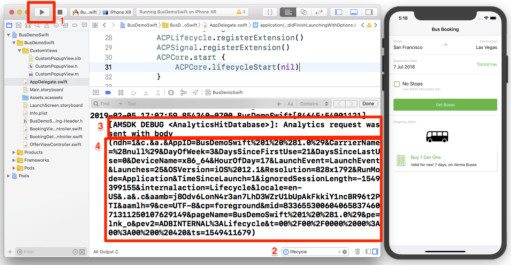
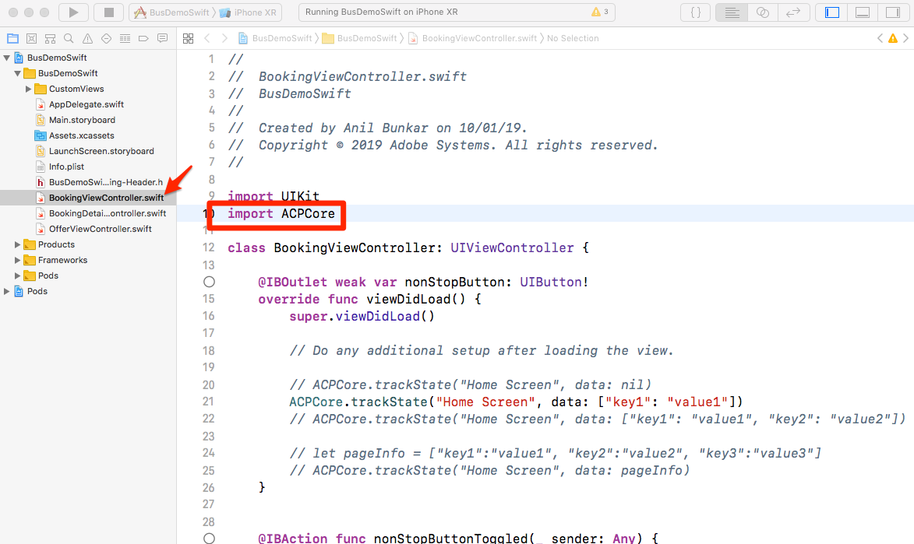
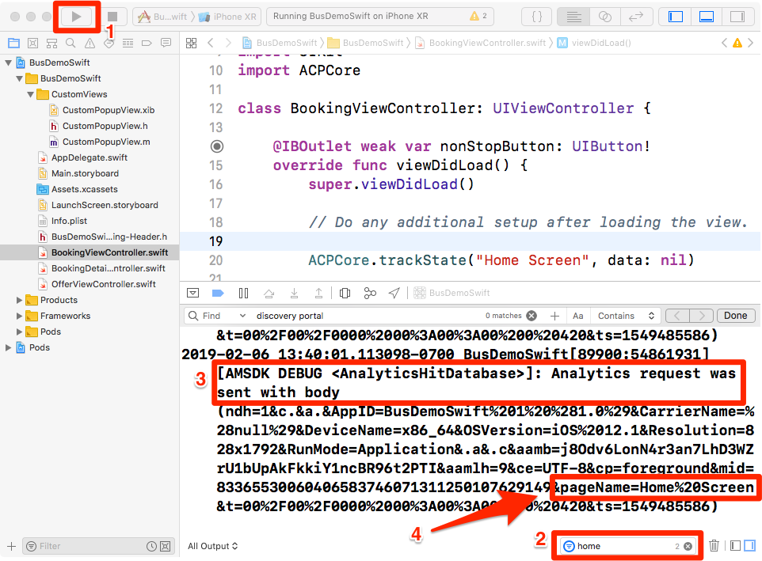
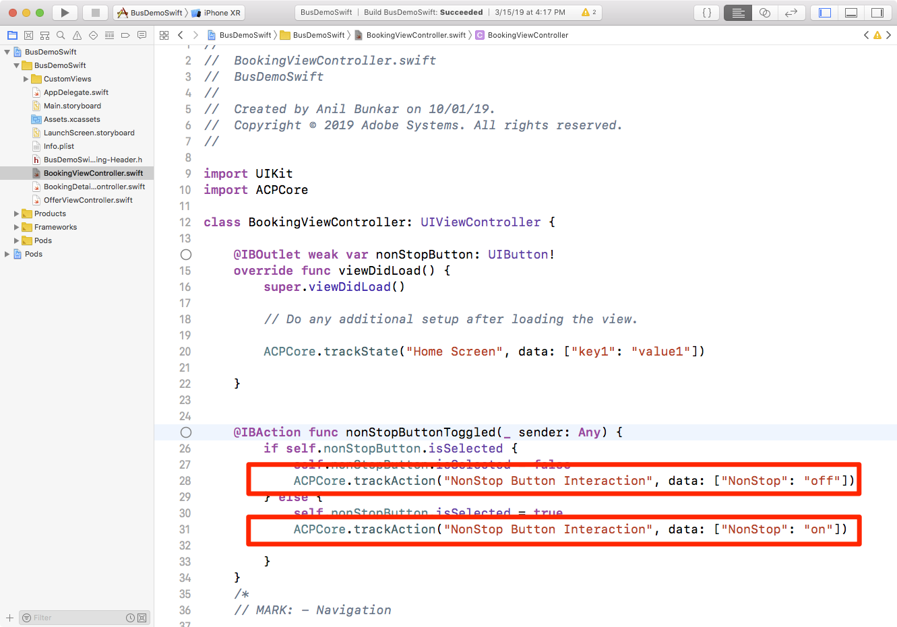
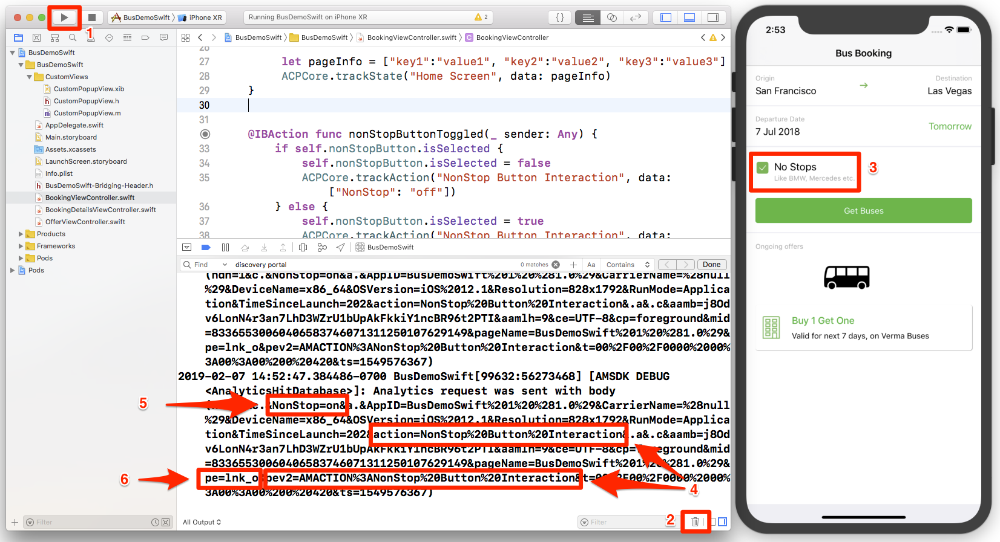

# Aggiungere Adobe Analytics

In questa lezione, avrai abilitato il tracciamento di Adobe Analytics nella tua app.

[Adobe Analytics](https://docs.adobe.com/content/help/en/analytics/landing/home.html) è una soluzione leader di settore che ti consente di comprendere i tuoi clienti come persone e gestire la tua attività grazie alle informazioni sul cliente.

Nelle lezioni [Aggiungi estensioni](launch-add-extensions.md) e [Installa l’SDK](launch-install-the-mobile-sdk.md) Mobile, hai aggiunto l’estensione Adobe Analytics alla proprietà Launch e l’hai importata nell’applicazione di esempio.  Ora è sufficiente aggiungere codice per tenere traccia degli stati e delle azioni nell’app!

## Obiettivi di apprendimento

Alla fine di questa lezione, potrai:

* Verifica che le metriche del ciclo di vita vengano inviate ad Adobe Analytics
* Aggiunta di codice per tenere traccia degli stati nell'app con dati aggiuntivi
* Aggiunta di codice per tenere traccia delle azioni nell'app con dati aggiuntivi

Ci sono molte cose che potrebbero essere implementate per Analytics in Launch. Questa lezione non è esaustiva, ma dovrebbe fornire una panoramica completa delle tecniche principali necessarie per l'implementazione nella vostra app.

## Prerequisiti 

You should have already completed the lessons in the [Configure Launch](launch-create-a-property.md) section. In questa sezione hai aggiunto l’estensione Analytics e configurato il server di tracciamento e gli ID suite di rapporti.

## Metriche del ciclo di vita e Adobe Analytics

Le metriche del ciclo di vita sono metriche e dimensioni basate sull'ambiente che possono essere facilmente abilitate in un'app tramite l'SDK di Experience Platform Mobile. Infatti, li hai già aggiunti!

Hai già attivato le metriche del ciclo di vita quando hai aggiunto l’estensione Core alla tua proprietà e hai seguito le istruzioni di installazione mobile fornite nell’interfaccia. Queste metriche e dimensioni, comprese metriche specifiche per l'ambiente e l'app come la versione dell'app, il numero di utenti coinvolti, la versione del sistema operativo, la suddivisione del tempo, i giorni dall'ultimo utilizzo, ecc. può essere molto utile nell'analisi dell'app, soprattutto quando crei segmenti Analytics da essi da applicare a tutti i tuoi report. L'elenco completo delle metriche è disponibile nella [documentazione](https://docs.adobe.com/content/help/en/mobile-services/ios/metrics.html).

### Visualizzazione dell’hit del ciclo di vita di Analytics

Sebbene sia possibile visualizzare gli hit del ciclo di vita in qualsiasi programma di debug/packet sniffer, tali hit verranno semplicemente visualizzati nella console di debug Xcode.

1. Create ed eseguite il progetto in Xcode in modo che avvii il simulatore
1. Nella console di debug Xcode, digitare `lifecycle` il filtro nella parte inferiore per limitare la visualizzazione, quindi scorrere fino alla parte inferiore delle voci
1. Osserva la `Analytics request was sent with body` sezione
1. Le metriche del ciclo di vita includono elementi come AppID, CarrierName, DayOfWeek, DaysSinceFirstUse e altre metriche/dimensioni elencate nella [documentazione](https://docs.adobe.com/content/help/en/mobile-services/ios/metrics.html)

   

## Importare la libreria ACPCore

Negli esercizi successivi, utilizzerai le API per monitorare gli stati ("trackState") e le azioni ("trackAction") nell'app. Per utilizzare queste API, è necessario importare la libreria che le contiene.  Nella nuova SDK Experience Cloud Platform Mobile, le API trackState e trackAction sono state spostate dalla libreria Analytics alla libreria Core, consentendo di sfruttare queste API per scopi diversi dal tracciamento di Adobe Analytics.

In questa esercitazione, potrai tenere traccia di un solo stato, ma nell’app effettiva dovrai tenere traccia di più stati.

**Importazione della libreria ACPCore**

1. Open BookingViewController.swift in Xcode
1. Nella parte superiore del file, in genere insieme ad altre istruzioni di importazione, aggiungere `import ACPCore`
1. Salva
1. Ora sei pronto a utilizzare le API trackState o trackAction in questo file

   

## Stati traccia

Nell'app, puoi avere diverse schermate di contenuto che fornisci agli utenti. Sono l’equivalente delle pagine di un sito Web. Adobe Analytics fornisce un metodo che consente di inviare questi "hit di visualizzazione delle pagine" e di visualizzarli negli stessi report utilizzati per le proprietà Web. Questo metodo è denominato "trackState".

In questa esercitazione inserirai il codice per una chiamata trackState in una sola schermata (pagina) dell’app. Nella vita reale, questo verrà replicato su tutti gli altri schermi/stati dell'app. Verranno inoltre esplorati alcuni modi diversi di inviare dati (coppie chiave/valore) con l’hit.

Di seguito sono riportati la sintassi e un esempio di codice dalla documentazione che puoi copiare e incollare in questa esercitazione o nella tua app.

**Sintassi:**

```swift
+ (void) trackState: (nullable NSString*) state data: (nullable NSDictionary*) data;
```

**Esempio:**

```swift
ACPCore.trackState("state name", data: ["key": "value"])
```

### Tracciare uno stato senza dati

1. Con l’app di esempio aperta in Xcode, andate a BookingViewController.swift e, nella funzione viewDidLoad(), aggiungete una chiamata al metodo trackState
1. Imposta `state name` su "Home Screen"
1. Invece di aggiungere altri dati, aggiungi `nil` come segnaposto nella chiamata del metodo
1. Oppure copiate e incollate i seguenti elementi:

   ```swift
   ACPCore.trackState("Home Screen", data: nil)
   ```

   

>[!NOTE] Se hai completato le lezioni per implementare il VEC di Target, avrai a disposizione del codice aggiuntivo nella funzione viewDidLoad(), che non viene visualizzata nelle schermate di questo esercizio. Questo è previsto e concepito per mettere a fuoco il compito in corso.

**Per convalidare trackState**

1. Salvare, generare ed eseguire il progetto
1. Quando il simulatore viene eseguito e apre la schermata iniziale dell'app, visualizzate la console Xcode
1. Filtrare la console alle voci con "home" e osservare la voce in basso che mostra che il `Analytics request was sent with body`
1. Si noti che la variabile pageName è impostata su `Home Screen`e che non sono presenti altre coppie di dati personalizzate. Anche se tecnicamente state impostando un "nome stato" e non un "nome pagina", il nome del parametro utilizzato è `pageName` allo scopo di fornire coerenza con le implementazioni del sito Web.

   

### Tracciare uno stato con i dati

1. Tornare a BookingViewController.swift e, nella `viewDidLoad()` funzione, commentare (o eliminare) la chiamata trackState di base (nessun dato aggiunto) dall'ultimo esercizio
1. Aggiungi una nuova chiamata del metodo trackState, questa volta con i dati, utilizzando `key1` come chiave e `value1` come valore
1. Lasciate `state name` come "Home Screen"
1. Oppure copiate e incollate in:

   ```swift
   ACPCore.trackState("Home Screen", data: ["key1": "value1"])
   ```

   

**Convalida di trackState con i dati**

1. Salvate, create ed eseguite nuovamente il progetto
1. Quando il simulatore viene eseguito e apre la schermata iniziale dell'app, visualizzate la console Xcode
1. Lasciate il filtro come "home" e osservate la voce inferiore che mostra che il `Analytics request was sent with body`
1. Ora puoi vedere che oltre all’impostazione pageName, hai anche la coppia chiave/valore che è stata inviata sull’hit

   

>[!NOTE] Se hai familiarità con "prop ed eVar" in Analytics, noterai che questi nomi di variabili non sono nell’SDK. Tutti i dati chiave/valore provenienti dall’SDK saranno inviati come variabili [](https://docs.adobe.com/content/help/en/analytics/implementation/javascript-implementation/variables-analytics-reporting/context-data-variables.html)contextData e come tali dovranno essere mappati su proprietà o eVar (o altre variabili) utilizzando le regole [di](https://docs.adobe.com/content/help/en/analytics/admin/admin-tools/processing-rules/processing-rules.html) elaborazione nell’interfaccia utente di Analytics.

### Opzioni aggiuntive di invio dei dati

Nei due esercizi precedenti sono state effettuate due richieste, una con dati aggiuntivi e una senza. Tuttavia, cosa succede se vuoi inviare più punti dati ad Analytics con uno schermo o un carico di stato? Di seguito sono riportate due opzioni.

#### Opzione 1: Più coppie chiave/valore

Nella chiamata trackState è possibile inviare più coppie chiave/valore semplicemente separandole con una virgola nel set di dati. Ad esempio:

```swift
ACPCore.trackState("Home Screen", data: ["key1": "value1", "key2": "value2"])
```

#### Opzione 2: Oggetto dizionario

Puoi anche definire un dizionario nel codice e inviarlo con trackState. Naturalmente, se hai già definito alcuni oggetti dizionario nel codice e vuoi inviarli in Analytics, questa potrebbe essere l'opzione perfetta per te. Ad esempio:

```swift
let screenInfo = ["key1":"value1", "key2":"value2", "key3":"value3"]
ACPCore.trackState("Home Screen", data: screenInfo)
```

**Crediti** extraVai avanti e prova queste due opzioni fuori nel codice, visualizzando i risultati nella console di debug Xcode. Potete utilizzare lo stesso filtro di prima e verificare i risultati per essere certi che le variabili e i valori vengano elaborati

## Tracciare le azioni

Simile al tracciamento delle azioni non caricate di pagina su un sito Web, spesso si desidera tracciare un’azione eseguita da un utente nell’app, ad esempio clic su elementi che non caricano un’altra schermata. Questo viene gestito in modo molto simile a trackState utilizzato in precedenza, con la differenza che questo metodo viene chiamato `trackAction`.

Di seguito sono riportati sintassi ed esempio di codice dalla documentazione che puoi copiare e incollare in questa esercitazione o nella tua app.

**Sintassi:**

```swift
+ (void) trackAction: (nullable NSString*) action data: (nullable NSDictionary*) data;
```

**Esempio:**

```swift
ACPCore.trackAction("action name", data: ["key": "value"])
```

### Tracciare l'interazione con la casella di controllo 'Nessun arresto'

In questa app di prenotazione bus di esempio, è presente una casella di controllo che consente agli utenti di decidere se limitare i risultati della ricerca alle opzioni. Hai deciso di monitorare l'interazione con quella casella di controllo in Adobe Analytics.


Questa casella di controllo è controllata nel file BookingViewController.swift nel progetto di esempio. In questo esercizio, invierai un hit trackAction ogni volta che gli utenti selezionano o deselezionano la casella.

#### Impostazione del codice trackAction

1. Con il progetto di esempio aperto in Xcode, andare a BookingViewController.swift e individuare la funzione "nonStopButtonToggle"
1. Nell' `if` istruzione, la prima sezione deseleziona la casella se è già selezionata. In questo scenario, si desidera inviare un hit con un valore "off", utilizzando il seguente codice:

   ```swift
   ACPCore.trackAction("NonStop Button Interaction", data: ["NonStop": "off"])
   ```

1. Nella sezione successiva (sezione "else"), la casella viene selezionata se non è già selezionata. In questo scenario, si desidera inviare un hit con un valore "on", utilizzando il seguente codice:

   ```swift
   ACPCore.trackAction("NonStop Button Interaction", data: ["NonStop": "on"])
   ```

Osservate le altre personalizzazioni nel codice:

* Si sta impostando `action name` su "Interazione pulsante non arresto". Questo valore popolerà il parametro "action" della richiesta e il report/dimensione del collegamento personalizzato in Adobe Analytics
* Il nome dell’ `key` utente corrente è "NonStop". Questo è il nome chiave che puoi cercare nelle Regole di elaborazione nell’Admin Console di Analytics, in modo da mappare questi valori su una prop o eVar.

La funzione ora si presenta così:



#### Convalida del codice trackAction

1. Dopo aver aggiunto il codice, salvate il progetto, eseguite e create
1. Fate clic sull'icona del cestino per cancellare la console
1. Selezionate la casella nel simulatore, notando che vengono visualizzate due richieste nella console. L'ultimo è l'invio di dati ad Adobe Analytics dal codice appena aggiunto.
1. Notate che entrambi i parametri action e pev2 sono impostati su "NonStop Button Interaction" (con spazi codificati).
1. Tenere presente che la coppia chiave/valore "NonStop=on" è presente e può quindi essere assegnata a una prop/eVar nelle regole di elaborazione
1. Osservate il valore o la chiave "pe=lnk_o", che indica che si tratta di un hit di "collegamento personalizzato", attivato da trackAction



Bel lavoro! Hai completato la lezione di Analytics. Naturalmente, ci sono molte altre cose che potete fare per migliorare la nostra implementazione di Analytics, ma spero che questo vi abbia dato alcune delle competenze fondamentali che avrete bisogno di affrontare il resto delle vostre esigenze.

## Ulteriori vantaggi di trackState e trackAction

In questi ultimi esercizi, è stato possibile inviare dati dall’app ad Adobe Analytics utilizzando le API trackState e trackAction. Poiché l’SDK di Experience Platform Mobile si basa su Launch, nell’interfaccia Launch sono disponibili molte altre operazioni che puoi eseguire sfruttando il codice appena aggiunto.

In Launch è possibile creare regole attivate dalle API trackState e trackAction e farle eseguire azioni aggiuntive, ad esempio richieste ad altre soluzioni Adobe o ad altri partner esterni.

[Successivo "Aggiungi Adobe Audience Manager" &gt;](audience-manager.md)
