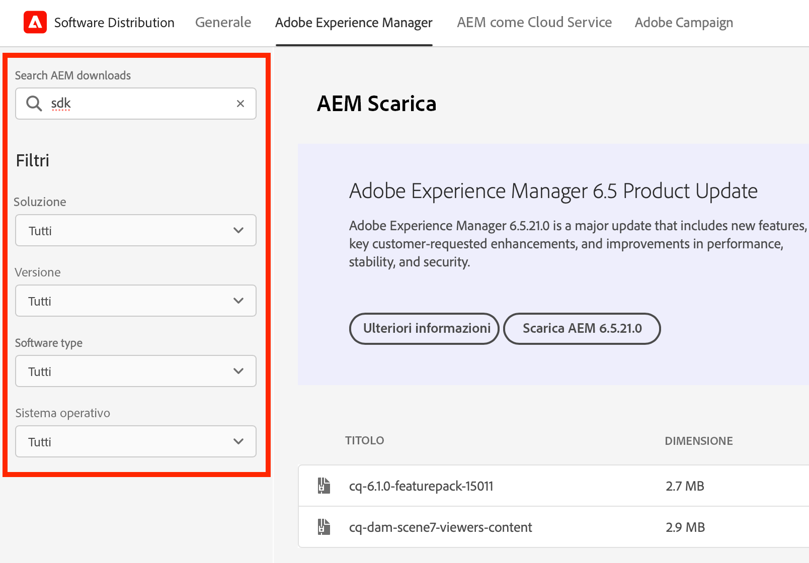
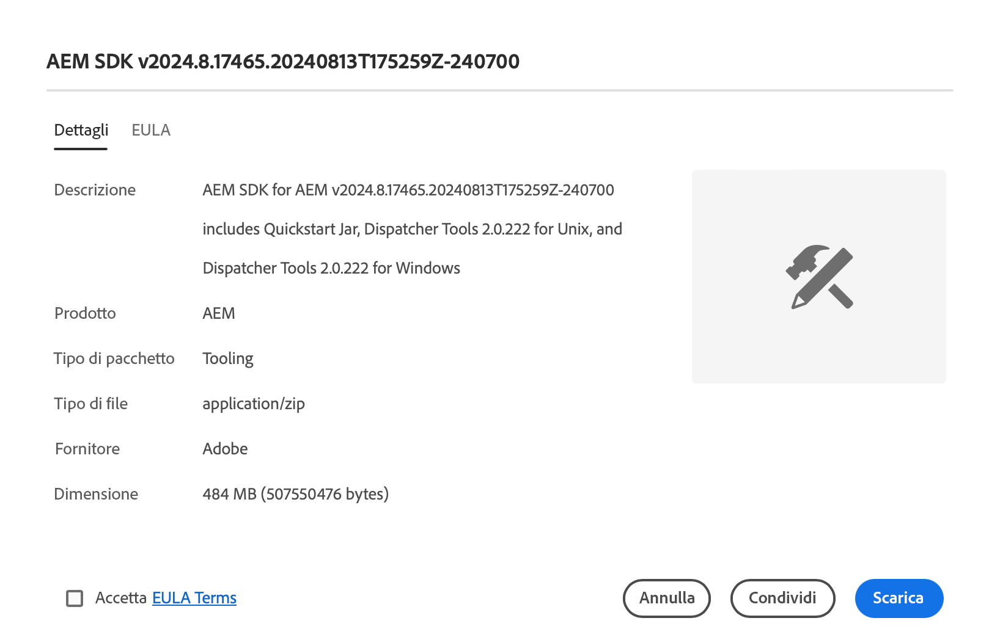

# Distribuzione di software

Scopri come utilizzare la Distribuzione di software per scaricare il software Adobe Experience Cloud.

## Introduzione

Software Distribution offre un&#39;esperienza efficiente per trovare e scaricare il software Adobe Experience Cloud. I pacchetti software approvati da Adobe e i pacchetti di aziende partner sono disponibili per i seguenti prodotti:

1. **Adobe Experience Manager** - Tutto ciò che riguarda il servizio e la manutenzione, la sicurezza, gli strumenti e altro ancora - per tutte le versioni AEM supportate
1. **Adobe Experience Manager as a [!UICONTROL Cloud Service]** - [!UICONTROL AEM Cloud SDK], [!UICONTROL AEM Cloud] strumenti di migrazione e altro ancora
1. **Adobe Campaign** - Tutte le versioni correnti del programma di installazione di [!DNL Campaign] e gli strumenti correlati
1. **Generale** - Strumenti generali tra cui [!DNL Oracle] JDK per clienti Adobi

L’utilizzo di Software Distribution è semplice come:

1. [Accesso alla distribuzione di software](#accessing)
1. [Selezione del prodotto](#selecting)
1. [Ricerca del download](#finding)
1. [Download del software](#downloading)

## Accesso alla Distribuzione di software {#accessing}

Per accedere a Software Distribution, vai a [`https://experience.adobe.com/downloads`](https://experience.adobe.com/downloads) e accedi a [!UICONTROL Software Distribution] con il tuo Adobe ID.

## Selezione del prodotto {#selecting}

L’interfaccia utente di Software Distribution è organizzata per prodotto, come illustrato nel menu.

Si accede alla scheda **Generale**, in cui è possibile trovare i download di software generici.

Tocca o fai clic sul prodotto nel menu per il quale desideri scaricare il software. Possono essere scaricati solo i prodotti per i quali la tua organizzazione ha concesso la licenza.

## Ricerca del download {#finding}

Dopo aver selezionato la scheda prodotto desiderata, verranno visualizzati tutti i download correlati. Utilizza i filtri di ricerca nel pannello a sinistra per trovare rapidamente il download. Le opzioni di filtro variano a seconda del prodotto.

## Download del software {#downloading}

Toccando o facendo clic su un download visualizzato, si apre una finestra di dialogo contenente ulteriori informazioni sul download. Ad esempio, puoi visualizzare una descrizione, il nome del fornitore e il contratto di licenza.

Per abilitare il pulsante **Scarica**, è necessario accettare l&#39;EULA selezionando **Accetta termini EULA**.

Puoi anche condividere un collegamento a quel particolare download toccando o facendo clic su **Condividi** per copiare l&#39;URL.

## Condivisione pacchetti {#package-share}

Nel mese di giugno 2020, [!UICONTROL Distribuzione software] ha sostituito [!UICONTROL Condivisione pacchetti] per AEM e [!DNL Neolane] per [!DNL Campaign]. Un’interfaccia utente intuitiva, una ricerca semplificata e una velocità di download notevolmente migliorata rendono il download di pacchetti software per prodotti di Experience Cloud un’esperienza migliore utilizzando Software Distribution.

>[!IMPORTANT]
>
>Le credenziali di accesso da [!UICONTROL Condivisione pacchetti] o [!DNL Neolane] non funzioneranno per [!UICONTROL Distribuzione software], che fornisce le funzionalità necessarie per accedere con gli standard di sicurezza Adobe. Se non conosci il tuo Adobe ID, contatta un amministratore del supporto all’interno della tua organizzazione.

>[!NOTE]
>
>La [!UICONTROL Distribuzione di software] supporta esclusivamente i download dal browser. Durante l’utilizzo di [!UICONTROL Gestione pacchetti] di AEM per le nuove installazioni, si consiglia di scaricare il pacchetto in una cartella locale e installarlo da questa posizione.
