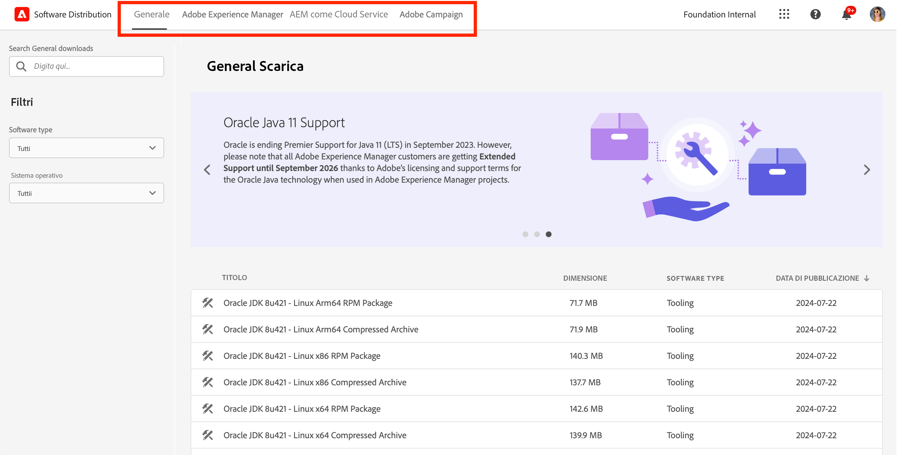

# Distribuzione del software

Scopri come utilizzare la distribuzione del software per scaricare il software Adobe Experience Cloud.

## Introduzione

La distribuzione del software offre un’esperienza efficiente per trovare e scaricare il software Adobe Experience Cloud. I pacchetti software approvati da Adobe e i pacchetti di società partner sono ora disponibili per i seguenti prodotti:

1. **Adobe Experience Manager**: tutto ciò che riguarda servizio e manutenzione, sicurezza, strumenti e molto altro (per tutte le versioni AEM supportate)
1. **Adobe Experience Manager as a [!UICONTROL Cloud Service]**: [!UICONTROL SDK di AEM Cloud], strumenti di migrazione di [!UICONTROL AEM Cloud] e molto altro.
1. **Adobe Campaign**: tutte le versioni correnti del programma di installazione di [!DNL Campaign] e gli strumenti correlati.
1. **Generale**: strumenti di uso generale tra cui JDK di [!DNL Oracle] per clienti Adobe.

L’utilizzo della distribuzione del software ti permette in modo semplice di:

1. [Accedere alla distribuzione del software](#accessing)
1. [Selezionare il prodotto](#selecting)
1. [Trovare il download](#finding)
1. [Scaricare il software](#downloading)

## Accesso alla distribuzione del software {#accessing}

Accedi alla distribuzione del software, passa a [`https://experience.adobe.com/downloads` ](https://experience.adobe.com/downloads) e accedi alla [!UICONTROL Distribuzione del software] con il tuo Adobe ID.

## Selezionare il prodotto {#selecting}

L’interfaccia utente della distribuzione del software è organizzata per prodotto, come illustrato nel menu.

Vieni indirizzato alla scheda **Generale**, in cui è possibile trovare i download di software di utilizzo generico.

Tocca o fai clic sul prodotto nel menu per il quale desideri scaricare il software. Possono essere scaricati solo i prodotti per i quali la tua organizzazione ha concesso la licenza.

## Trovare il download {#finding}

Dopo aver selezionato la scheda prodotto desiderata, verranno visualizzati tutti i download correlati. Utilizza i filtri di ricerca nel pannello a sinistra per trovare rapidamente il download. Le opzioni di filtro variano a seconda del prodotto.

## Scaricare il software {#downloading}

Toccando o facendo clic su un download visualizzato, si apre una finestra di dialogo contenente ulteriori informazioni sul download. Ad esempio, puoi visualizzare una descrizione, il nome del fornitore e l Accordo di licenza con l&#39;utente finale (EULA).

Per abilitare il pulsante **Scarica**, è necessario accettare l’EULA selezionando **Accetta termini EULA**.

Puoi anche condividere un collegamento a quel particolare download toccando o facendo clic su **Condividi** per copiare l’URL.

## Condivisione pacchetti {#package-share}

Nel mese di giugno 2020, la [!UICONTROL Distribuzione del software] ha sostituito [!UICONTROL Condivisione pacchetti] per AEM e [!DNL Neolane] per [!DNL Campaign]. Grazie a un’interfaccia utente intuitiva, una ricerca semplificata e una velocità di download notevolmente migliorata, il download dei pacchetti software per i prodotti Experience Cloud è un’esperienza utente straordinaria utilizzando la distribuzione del software.

>[!IMPORTANT]
>
>Le credenziali per l’accesso a [!UICONTROL Condivisione pacchetti] o [!DNL Neolane] non saranno valide per la [!UICONTROL Distribuzione del software], che offre la possibilità di accedere con gli standard di sicurezza di Adobe. Se non conosci il tuo Adobe ID, contatta l’amministratore del supporto all’interno della tua organizzazione.

>[!NOTE]
>
>La [!UICONTROL Distribuzione di software] supporta esclusivamente i download dal browser. Durante l’utilizzo di [!UICONTROL Gestione pacchetti] di AEM per le nuove installazioni, si consiglia di scaricare il pacchetto in una cartella locale e installarlo da questa posizione.
