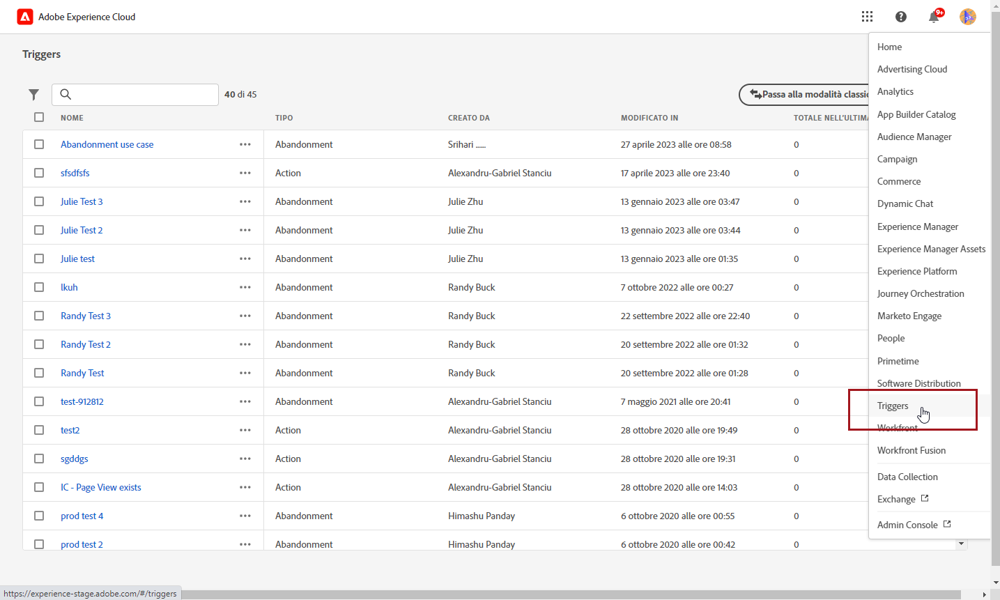
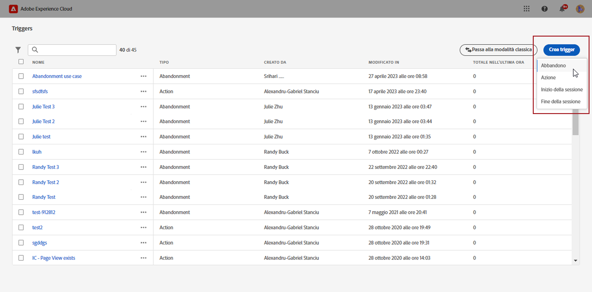
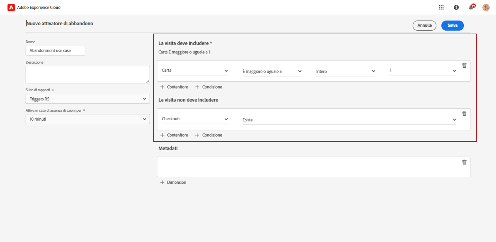
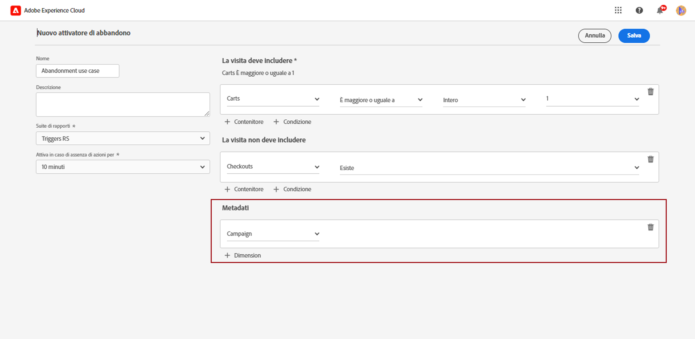
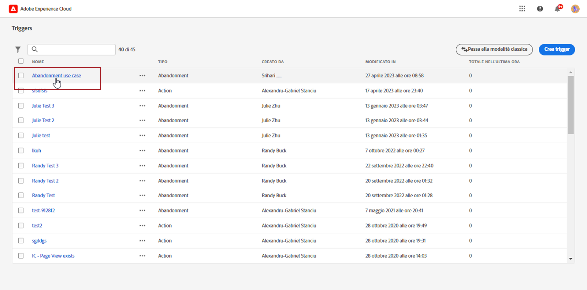
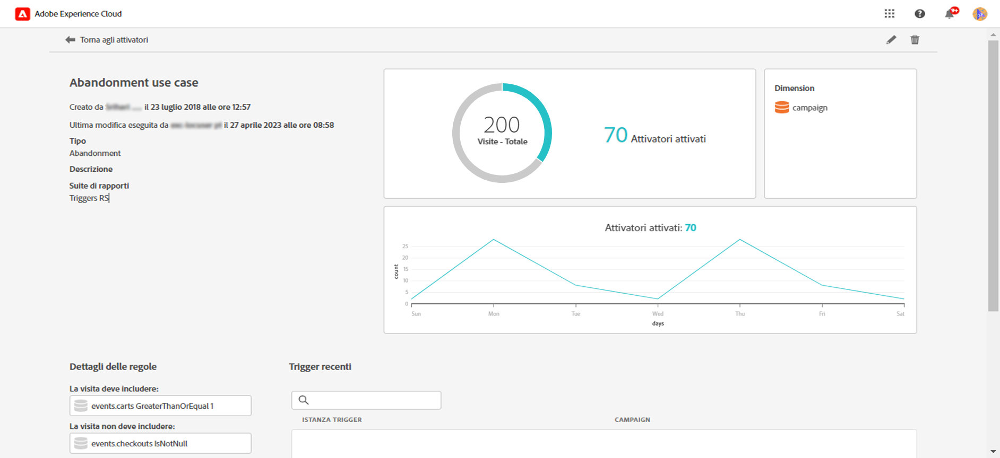

# Creare un trigger di Experience Cloud {#create-triggers}

>[!NOTE]
>
> La nuova interfaccia utente Triggers, ad Experience Cloud, offre un’esperienza intuitiva per gestire i comportamenti dei consumatori e personalizzare le esperienze utente. Per tornare all’interfaccia precedente, fai clic sul pulsante **[!UICONTROL Passa alla modalità classica]** pulsante .

Crea un trigger e configurane le condizioni. Ad esempio, puoi specificare i criteri per le regole di un attivatore durante una visita, come metriche quali abbandono del carrello o dimensioni quali il nome del prodotto. Quando le regole sono soddisfatte, il trigger viene eseguito.

1. Nell’Experience Cloud, seleziona il menu avanzato, quindi Triggers.

   

1. Dalla home page di Trigger, fai clic su **[!UICONTROL Crea trigger]**, quindi specifica il tipo di trigger.

   Sono disponibili tre tipi di trigger:

   * **[!UICONTROL Abbandono]**: Puoi creare un trigger che si attiva quando un visitatore visualizza un prodotto ma non aggiunge nulla al carrello.

   * **[!UICONTROL Azione]**: Puoi creare trigger, ad esempio, che si attivano dopo che un utente ha effettuato un’iscrizione a una newsletter, un’iscrizione e-mail o ha usato applicazioni per le carte di credito (conferme). Se sei un rivenditore, puoi creare un trigger per un visitatore che si iscrive a un programma fedeltà. Nei contenuti multimediali e di intrattenimento, crea trigger per i visitatori che guardano un determinato show e che vorresti rispondessero a un sondaggio.

   * **[!UICONTROL Avvio e fine della sessione]**: Crea un trigger per gli eventi di inizio e fine sessione.

   

1. Aggiungi un **[!UICONTROL Nome]** e **[!UICONTROL Descrizione]** al trigger.

1. Selezionare Analytics **[!UICONTROL Suite di rapporti]** utilizzato per questo trigger. Questa impostazione identifica i dati di reporting da utilizzare.

   [Ulteriori informazioni sulla suite di rapporti](https://experienceleague.adobe.com/docs/analytics/admin/admin-tools/manage-report-suites/c-new-report-suite/t-create-a-report-suite.html).

1. Scegli la **[!UICONTROL Trigger dopo nessuna azione per]** periodo di validità.

1. Da **[!UICONTROL La visita deve includere]** e **[!UICONTROL La visita non deve includere]** puoi definire i criteri o i comportamenti dei visitatori desiderati o meno. Puoi specificare **E** o **Oppure** all’interno o tra condizioni, a seconda dei criteri stabiliti.

   Ad esempio, le regole per un semplice attivatore di abbandono carrello potrebbero essere:

   * **[!UICONTROL La visita deve includere]**: `Carts (metric) Is greater or equal to 1` per eseguire il targeting dei visitatori con almeno un elemento nel carrello.
   * **[!UICONTROL La visita non deve includere]**: `Checkout (metric) Exists.` per rimuovere i visitatori che hanno acquistato gli elementi nei loro carrelli.

   

1. Fai clic su **[!UICONTROL Contenitore]** stabilire e salvare regole, condizioni o filtri che definiscono un trigger. Per fare in modo che gli eventi si verifichino contemporaneamente, è necessario posizionarli nello stesso contenitore.

   Ogni contenitore elabora in modo indipendente a livello di hit, il che significa che se due contenitori sono uniti con il **[!UICONTROL E]** le regole si qualificano solo quando due risultati soddisfano i requisiti.

1. Da **[!UICONTROL Metadati]** campo, fai clic su **[!UICONTROL + Dimension]** per scegliere una dimensione Campaign particolare o variabili rilevanti per il comportamento di un visitatore.

   

1. Fai clic su **[!UICONTROL Salva]**.

1. Seleziona la nuova **[!UICONTROL Trigger]** dall’elenco per accedere al rapporto di dettaglio del trigger.

   

1. Dalla visualizzazione dettagliata del trigger, puoi accedere ai rapporti sul numero di attivatori attivati. Se necessario, puoi modificare il trigger con l’icona a forma di matita.

   
