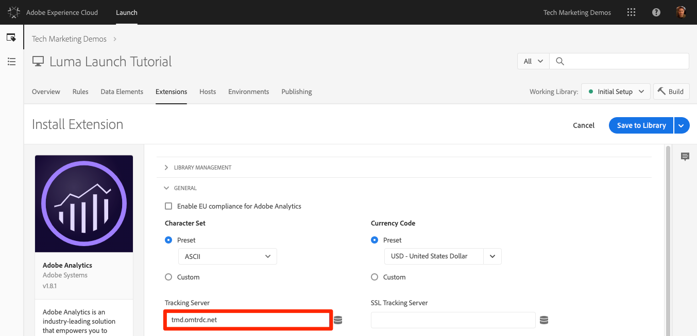
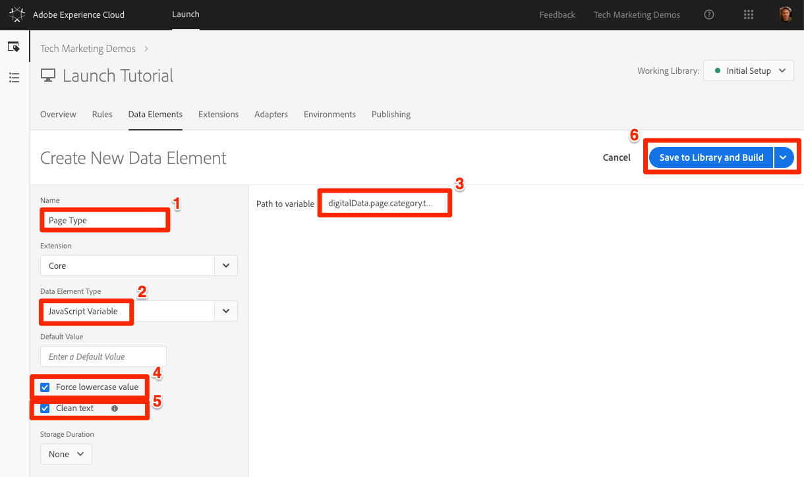
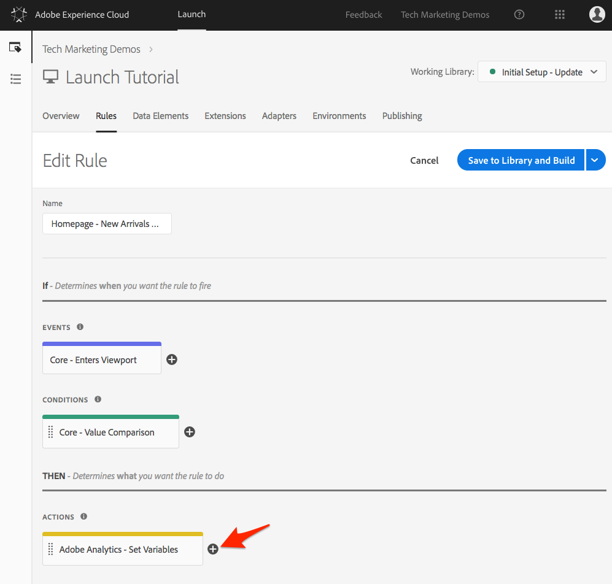
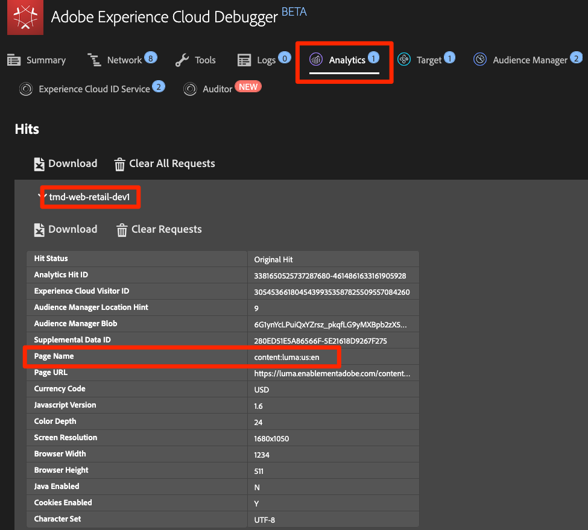

# Aggiungere Adobe Analytics

In questa lezione, implementerai l'estensione [](https://docs.adobe.com/content/help/en/launch/using/extensions-ref/adobe-extension/analytics-extension/overview.html) Adobe Analytics e creerai regole per inviare dati ad Adobe Analytics.

[Adobe Analytics](https://docs.adobe.com/content/help/en/analytics/landing/home.html) è una soluzione leader di settore che ti consente di comprendere i tuoi clienti come persone e gestire la tua attività grazie alle informazioni sul cliente.

## Obiettivi di apprendimento

Alla fine di questa lezione, potrai:

1. Aggiungere l’estensione Adobe Analytics
1. Imposta le variabili globali tramite l'estensione
1. Aggiungi il beacon di visualizzazione pagina
1. Aggiungi variabili aggiuntive tramite le regole
1. Aggiungi il tracciamento dei clic e altri beacon basati su eventi
1. Aggiunta di plug-in di Analytics

Ci sono molte cose che potrebbero essere implementate per Analytics in Launch. Questa lezione non è esaustiva, ma dovrebbe fornire una solida panoramica delle tecniche principali che sarà necessario implementare nel sito.

## Prerequisiti 

You should have already completed the lessons in [Configure Launch](launch.md) and [Add the Identity Service](id-service.md).

Inoltre, avrai bisogno di almeno un ID suite di rapporti e del server di tracciamento. Se non disponi di una suite di rapporti test/dev che puoi utilizzare per questa esercitazione, creane una. Se non sei sicuro di come farlo, consulta [la documentazione](https://docs.adobe.com/content/help/en/analytics/admin/manage-report-suites/new-report-suite/new-report-suite.html). Puoi recuperare il server di tracciamento dall’implementazione corrente, dal consulente Adobe o dal rappresentante dell’assistenza clienti.

## Aggiungi l'estensione Analytics

L'estensione Analytics è costituita da due parti principali:

1. La configurazione dell'estensione, che gestisce le impostazioni della libreria principale AppMeasurement.js e può impostare variabili globali
1. Azioni di regola per eseguire le operazioni seguenti:
   1. Imposta variabili
   1. Cancella variabili
   1. Invia beacon di Analytics

**Per aggiungere l'estensione Analytics**

1. Vai a **[!UICONTROL Estensioni &gt; Catalogo]**
1. Individuare l’estensione Adobe Analytics
1. Fate clic su **[!UICONTROL Installa]**

   

1. In [!UICONTROL Library Management (Gestione libreria) &gt; Report Suites (Suite di rapporti]), immetti gli ID suite di rapporti che desideri usare con ogni ambiente Launch. Quando inizi a digitare nella casella, visualizzerai un elenco precompilato di tutte le suite di rapporti. (È possibile utilizzare una suite di rapporti per tutti gli ambienti in questa esercitazione, ma nella vita reale si desidera utilizzare suite di rapporti separate, come illustrato nell'immagine seguente)

   

   >[!TIP] È consigliabile utilizzare l'opzione [!UICONTROL Gestisci la libreria per] me come impostazione Gestione  libreria, in quanto consente di mantenere la `AppMeasurement.js` libreria aggiornata in modo molto più semplice.

1. In [!UICONTROL Generale &gt; Server]di tracciamento, inserite il server di tracciamento, ad esempio "`tmd.sc.omtrdc.net`." Immetti SSL Tracking Server se il sito supporta `https://`

   

1. Nella sezione [!UICONTROL Variabili]globali, imposta la variabile Nome  pagina utilizzando l’elemento `Page Name` dati. Fate clic sull’icona  dati per aprire la modale e scegliere l’elemento `Page Name` dati della pagina)

1. Fate clic su **[!UICONTROL Salva nella libreria e crea]**

   

>[!NOTE] Le variabili globali possono essere impostate nella configurazione dell'estensione o nelle azioni di regola. Be aware that when setting variables in the extension configuration, the data layer must be defined *before* the Launch embed codes.

## Invia beacon visualizzazione pagina

Ora creerete una regola per attivare il beacon di Analytics, che invierà la variabile Nome  pagina impostata nella configurazione dell'estensione.

You have already created an "All Pages - Library Loaded" rule in the [Add a Data Element, a Rule and a Library](launch-data-elements-rules.md) lesson of this tutorial, which is triggered on every page when the Launch library loads. È *possibile* utilizzare questa regola anche per Analytics, tuttavia questa impostazione richiede che tutti gli attributi del livello dati utilizzati nel beacon di Analytics siano definiti prima dei codici di incorporamento di Launch. Per consentire una maggiore flessibilità nella raccolta dei dati, creerete una nuova regola "tutte le pagine" attivata in DOM Ready per attivare il beacon Analytics.

**Per inviare il beacon Visualizzazione pagina**

1. Vai alla sezione **[!UICONTROL Regole]** nella navigazione superiore, quindi fai clic su **[!UICONTROL Aggiungi regola]**

   

1. Denomina la regola `All Pages - DOM Ready`
1. Click **[!UICONTROL Events &gt; Add]** to open the `Event Configuration` screen

   

1. Selezionate Tipo **[!UICONTROL evento &gt; DOM Ready]** (tenete presente che l'ordine della regola è 50)
1. Click **[!UICONTROL Keep Changes]**
   

1. Under Actions, click the  to add a new action

   

1. Selezionate **[!UICONTROL Estensione &gt; Adobe Analytics]**

1. Seleziona Tipo **[!UICONTROL azione &gt; Invia beacon]**

1. Lascia Tracking impostato su `s.t()`. Note that if you wanted to make an `s.tl()` call in a click-event rule you could do that using the Send Beacon action, as well.

1. Fate clic sul pulsante **[!UICONTROL Mantieni modifiche]** .

   

1. Fate clic su **[!UICONTROL Salva nella libreria e crea]**

   

### Convalida del beacon Visualizzazione pagina

Dopo aver creato una regola per inviare un beacon Analytics, dovresti essere in grado di visualizzare la richiesta in Experience Cloud Debugger.

1. Open the [Luma site](https://luma.enablementadobe.com/content/luma/us/en.html) in your Chrome browser
1. Fai clic sull'icona Debugger  Experience Cloud per aprire **[!UICONTROL Adobe Experience Cloud Debugger]**
1. Make sure the Debugger is mapping the Launch property to *your* Development environment, as described in the [earlier lesson](launch-switch-environments.md)

   

1. Fate clic per aprire la scheda Analisi
1. Espandi il nome della suite di rapporti per mostrare tutte le richieste ad essa inviate
1. Conferma l'avvio della richiesta con la variabile e il valore Nome pagina

   

>[!NOTE] Se Nome pagina non viene visualizzato, torna indietro nei passaggi della pagina per assicurarti di non aver tralasciato nulla.

## Aggiungi variabili con regole

When you configured the Analytics Extension, you populated the `pageName` variable in the extension configuration. Si tratta di una posizione valida per compilare altre variabili globali, ad esempio eVar e proprietà, a condizione che il valore sia disponibile sulla pagina prima del caricamento del codice di incorporamento Launch.

Una posizione più flessibile per impostare le variabili, così come gli eventi, si trova nelle regole utilizzando l' `Set Variables` azione. Le regole consentono di impostare variabili ed eventi diversi di Analytics in condizioni diverse. For example, you could set the `prodView` only on product detail pages and the `purchase` event only on order confirmation pages. Questa sezione illustra come impostare le variabili utilizzando le regole.

### Caso d'uso

Product Detail Pages (PDP) sono punti importanti per la raccolta di dati sui siti di vendita al dettaglio. In genere, si desidera che Analytics registri la visualizzazione di un prodotto e il prodotto visualizzato. Questo è utile per capire i prodotti più popolari tra i clienti. In un sito multimediale, le pagine di articoli o video potrebbero usare tecniche di tracciamento simili a quelle che utilizzerete in questa sezione.  When you load a Product Detail Page, you might want to put that value into a "Page Type" `eVar`, as well as set some events and the product id. Questo ci permetterà di vedere quanto segue nella nostra analisi:

1. Quante volte vengono caricate le pagine dei dettagli del prodotto
1. Quali prodotti specifici vengono visualizzati e quante volte
1. Come incidono gli altri fattori (campagne, ricerca, ecc.) sul numero di persone PDP che caricano

### Crea elemento dati per tipo di pagina

Innanzitutto, è necessario identificare quali pagine sono le pagine Dettagli prodotto. Lo si farà con un elemento dati.

**Per creare l'elemento dati per il tipo di pagina**

1. Fai clic su **[!UICONTROL Elementi]** dati nella barra di navigazione superiore
1. Fai clic su **[!UICONTROL Aggiungi elemento dati]**

   

1. Denomina l'elemento dati `Page Type`
1. Selezionare Tipo elemento **[!UICONTROL dati &gt; Variabile JavaScript]**
1. Usa `digitalData.page.category.type` come `JavaScript variable name`
1. Check the `Clean text` and `Force Lower Case` options
1. Fate clic su **[!UICONTROL Salva nella libreria e crea]**

   

### Crea elemento dati per ID prodotto

Successivamente, raccoglierai l'ID prodotto della pagina Dettagli prodotto corrente con un elemento dati

**Per creare l'elemento dati per l'ID prodotto**

1. Fai clic su **[!UICONTROL Elementi]** dati nella barra di navigazione superiore
1. Fai clic su **[!UICONTROL Aggiungi elemento dati]**

   

1. Denomina l'elemento dati `Product Id`
1. Selezionare Tipo elemento **[!UICONTROL dati &gt; Variabile JavaScript]**
1. Usa `digitalData.product.0.productInfo.sku` come `JavaScript variable name`
1. Check the `Force lowercase value` option
1. Check the `Clean text` option
1. Fate clic su **[!UICONTROL Salva nella libreria e crea]**

   

### Aggiungi l'estensione Adobe Analytics Product String

If you are already familiar with Adobe Analytics implementations, you are probably familiar with the [products variable](https://docs.adobe.com/content/help/en/analytics/components/variables/dimensions-reports/reports-products.html). La variabile products ha una sintassi molto specifica e viene utilizzata in modi leggermente diversi a seconda del contesto. Per facilitare la popolazione dei prodotti in modo variabile in Launch, sono già state create tre estensioni aggiuntive nel mercato Launch extension! In questa sezione verrà aggiunta un’estensione creata da Adobe Consulting per l’utilizzo nella pagina Dettagli prodotto.

**Per aggiungere l'`Adobe Analytics Product String`estensione**

1. Vai alla pagina [!UICONTROL Estensioni &gt; Catalogo]
1. Trovate l' `Adobe Analytics Product String` estensione da Adobe Consulting Services e fate clic su **[!UICONTROL Installa]**
   
1. Leggi le istruzioni
1. Fate clic su **[!UICONTROL Salva nella libreria e crea]**

   

### Crea la regola per le pagine dettagli prodotto

A questo punto, utilizzerete i nuovi elementi di dati e l'estensione per creare la regola della pagina Dettagli prodotto. Per questa funzionalità, verrà creata un'altra regola di caricamento pagina, attivata da DOM Ready. However, you will use a condition so that it only fires on the Product Detail pages and the order setting so that it fires _before_ the rule that sends the beacon.

**Per creare la regola della pagina Dettagli prodotto**

1. Vai alla sezione **[!UICONTROL Regole]** nella navigazione superiore, quindi fai clic su **[!UICONTROL Aggiungi regola]**

   

1. Denomina la regola `Product Details - DOM Ready - 40`
1. Click **[!UICONTROL Events &gt; Add]** to open the `Event Configuration` screen

   

1. Selezionate Tipo **[!UICONTROL evento &gt; DOM Ready]**
1. Set the **[!UICONTROL Order]** to 40, so that the rule will run *before* the rule containing the Analytics &gt; Send Beacon action
1. Click **[!UICONTROL Keep Changes]**
   

1. In **[!UICONTROL Condizioni]**, fate clic sull'icona  più per aprire la `Condition Configuration` schermata
   

   1. Selezionare Tipo **[!UICONTROL condizione &gt; Confronto valori]**
   1. Use the data element picker, choose `Page Type` in the first field
   1. Seleziona **[!UICONTROL Contiene]** dal menu a discesa dell'operatore di confronto
   1. Nel tipo di campo successivo `product-page` (questa è la parte univoca del valore del tipo di pagina estratto dal livello dati su PDP)
   1. Click **[!UICONTROL Keep Changes]**

      

1. Under Actions, click the  to add a new action

   

1. Selezionate **[!UICONTROL Estensione &gt; Adobe Analytics]**
1. Selezionare Tipo **[!UICONTROL azione &gt; Imposta variabili]**
1. Selezionate **[!UICONTROL eVar1 &gt; Imposta come]** e immettete `product detail page`
1. Set **[!UICONTROL event1]**, leaving the optional values blank
1. In Eventi, fate clic sul pulsante **[!UICONTROL Aggiungi un altro]**
1. Set the **[!UICONTROL prodView]** event, leaving the optional values blank
1. Click **[!UICONTROL Keep Changes]**

   

1. Under Actions, click the  to add a new action

   

1. Selezionate **[!UICONTROL Estensione &gt; Stringa prodotto Adobe Analytics]**
1. Selezionate Tipo **[!UICONTROL azione &gt; Imposta s.products]**

1. Nella sezione Evento **[!UICONTROL e-commerce di]** Analytics, selezionate **[!UICONTROL prodView]**

1. Nella sezione Variabili del livello **[!UICONTROL Dati per i dati]** del prodotto, utilizza il selettore Elemento dati per scegliere l’elemento `Product Id` dati

1. Click **[!UICONTROL Keep Changes]**

   

1. Fate clic su **[!UICONTROL Salva nella libreria e crea]**

   

### Convalida i dati della pagina di dettagli prodotto

È stata appena creata una regola che imposta le variabili prima dell’invio del beacon. Ora dovresti essere in grado di visualizzare i nuovi dati nell'hit in Experience Cloud Debugger.

**Per convalidare i dati della pagina Dettagli prodotto**

1. Open the [Luma site](https://luma.enablementadobe.com/content/luma/us/en.html) in your Chrome browser
1. Vai a qualsiasi pagina dei dettagli del prodotto
1. Fai clic sull'icona Debugger  Experience Cloud per aprire **[!UICONTROL Adobe Experience Cloud Debugger]**
1. Fare clic sulla scheda Analisi
1. Espandi la suite di rapporti
1. Notice the Product Detail Variables that are now in the debugger, namely that `eVar1` has been set to "product detail page", that the `Events` variable has been set to "event1" and "prodView", that the products variable is set with the product id of the product you are viewing, and that your Page Name is still set by the Analytics extension

   

## Invia un beacon per tracciamento collegamento

Quando viene caricata una pagina, in genere viene attivato un beacon di caricamento della pagina dalla funzione `s.t()`. This automatically increments a `page view` metric for the page listed in the `pageName` variable.

Tuttavia, a volte non si desidera incrementare le visualizzazioni di pagina sul sito, perché l'azione in corso è "più piccola" (o forse solo diversa) di una visualizzazione di pagina. In this case, you will use the `s.tl()` function, which is commonly referred to as a "track link" request. Anche se è definita richiesta di collegamento di tracciamento, non deve essere attivata su un clic di collegamento. It can be triggered by *any* of the events that are available to you in the Launch rule builder, including your own custom JavaScript.

In questa esercitazione, verrà attivata una `s.tl()` chiamata utilizzando uno degli eventi JavaScript più interessanti, un `Enters Viewport` evento.

### Il caso d'uso

Per questo caso d'uso, si desidera sapere se le persone stanno scorrendo sulla nostra home page Luma abbastanza lontano da vedere la sezione *Nuovi arrivi* della nostra pagina. Nella nostra azienda c'è qualche disaccordo interno sulla possibilità o meno che le persone vedano o meno quella sezione, per cui vuoi usare Analytics per determinare la verità.

### Creare la regola in Launch

1. Vai alla sezione **[!UICONTROL Regole]** nella navigazione superiore e fai clic su **[!UICONTROL Aggiungi regola]**
   
1. Denomina la regola `Homepage - New Arrivals enters Viewport`
1. Click **[!UICONTROL Events &gt; Add]** to open the `Event Configuration` screen

   

1. Selezionate Tipo **[!UICONTROL evento &gt; Finestra di immissione]**. Viene visualizzato un campo in cui è necessario inserire il selettore CSS che identificherà l'elemento nella pagina che dovrebbe attivare la regola quando entra in visualizzazione nel browser.
1. Tornate alla home page di Luma e scorrete verso il basso fino alla sezione Nuovi arrivi.
1. Fai clic con il pulsante destro del mouse sullo spazio tra il titolo "NEW ARRIVALS" e gli elementi in questa sezione e scegli `Inspect` dal menu di scelta rapida. Questo ti porterà vicino a quello che vuoi.
1. Proprio lì intorno, possibilmente sotto la sezione selezionata, si sta cercando un div con `class="we-productgrid aem-GridColumn aem-GridColumn--default--12"`. Individuate questo elemento.
1. Fare clic con il pulsante destro del mouse su questo elemento e selezionare **[!UICONTROL Copia &gt; Copia selettore]**

   

1. Tornate a Launch e incollate questo valore dagli Appunti nel campo contrassegnato `Elements matching the CSS selector`.
   1. In una nota a margine, spetta a voi decidere come identificare i selettori CSS. Questo metodo è un po' fragile, in quanto alcune modifiche sulla pagina potrebbero interrompere il selettore. Considerate questo aspetto quando utilizzate eventuali selettori CSS in Launch.
1. Click **[!UICONTROL Keep Changes]**
   

1. In Condizioni, fai clic sull’icona  più per aggiungere una nuova condizione
1. Selezionare Tipo **[!UICONTROL condizione &gt; Confronto valori]**
1. Use the data element picker, choose `Page Name` in the first field
1. Selezionate **[!UICONTROL Uguale]** dal menu a discesa dell'operatore di confronto
1. Nel tipo di campo successivo `content:we-retail:us:en` (si tratta del nome della pagina principale come estratto dal livello dati), vogliamo solo che questa regola venga eseguita sulla pagina principale
1. Click **[!UICONTROL Keep Changes]**

   

1. Under Actions, click the  to add a new action
1. Selezionate **[!UICONTROL Estensione &gt; Adobe Analytics]**
1. Selezionare Tipo **[!UICONTROL azione &gt; Imposta variabili]**
1. Imposta `eVar3` su `Home Page - New Arrivals`
1. Imposta `prop3` su `Home Page - New Arrivals`
1. Set the `Events` variable to `event3`
1. Click **[!UICONTROL Keep Changes]**

   

1. Under Actions, click the  to add another new action

   

1. Selezionate **[!UICONTROL Estensione &gt; Adobe Analytics]**
1. Seleziona Tipo **[!UICONTROL azione &gt; Invia beacon]**
1. Choose the **[!UICONTROL s.tl()]** tracking option
1. Nel campo Nome **** collegamento, immettere `Scrolled down to New Arrivals`. Questo valore verrà inserito nel report Collegamenti personalizzati in Analytics.
1. Click **[!UICONTROL Keep Changes]**

   

1. Fate clic su **[!UICONTROL Salva nella libreria e crea]**

   

### Convalida del beacon di tracciamento collegamento

Ora è necessario assicurarsi che questo hit vada dentro quando si scorre verso il basso fino alla sezione Nuovi arrivi della Home Page del nostro sito. La prima volta che carichi la pagina principale, la richiesta non dovrebbe essere fatta, ma quando scorri verso il basso e la sezione viene visualizzata, l'hit dovrebbe essere attivato con i nostri nuovi valori.

1. Aprite il sito [](https://luma.enablementadobe.com/content/luma/us/en.html) Luma nel browser Chrome e accertatevi di essere nella parte superiore della pagina principale.
1. Fai clic sull'icona **[!UICONTROL del]** debugger  Experience Cloud per aprire [!UICONTROL Adobe Experience Cloud Debugger]
1. Fare clic sulla scheda Analisi
1. Espandi l'hit della suite di rapporti
1. Osservate l’hit della visualizzazione pagina normale per la pagina principale con il nome della pagina, ecc. (ma niente in eVar3 o prop3).

   

1. Lasciando il debugger aperto, scorri verso il basso sul tuo sito fino a visualizzare la sezione Nuovi arrivi
1. Visualizzate di nuovo il Debugger e dovrebbe essere visualizzato un altro hit Analytics. L’hit deve contenere i parametri associati all’hit s.tl() configurato, ovvero:
   1. `LinkType = "link_o"` (significa che l’hit è un hit di collegamento personalizzato, non un hit di visualizzazione della pagina)
   1. `LinkName = "Scrolled down to New Arrivals"`
   1. `prop3 = "Home Page - New Arrivals"`
   1. `eVar3 = "Home Page - New Arrivals"`
   1. `Events = "event3"`

      

## Aggiunta di un plug-in

Un plug-in è una parte di codice JavaScript che puoi aggiungere all'implementazione per eseguire una funzione specifica che non è integrata nel prodotto. I plug-in possono essere creati da voi, da altri clienti/partner Adobe o da Adobe Consulting.

Per implementare i plug-in, sono sostanzialmente tre i passaggi:

1. Includete la funzione doPlugins, in cui verrà fatto riferimento al plug-in
1. Aggiungi il codice della funzione principale per il plug-in
1. Include il codice che chiama la funzione e imposta le variabili, ecc.

### Rendere l'oggetto Analytics accessibile a livello globale

Per aggiungere la funzione doPlugins (di seguito) e utilizzare i plug-in, è necessario selezionare una casella per rendere l'oggetto "s" di Analytics disponibile a livello globale nell'implementazione di Analytics.

1. Vai a **[!UICONTROL Estensioni &gt; Installate]**

1. Nell’estensione Adobe Analytics, fai clic su **[!UICONTROL Configura]**

   

1. In Gestione **** libreria, selezionare la casella etichettata `Make tracker globally accessible`. Come si può vedere nella bolla dell'Aiuto, questo farà sì che il tracciatore sia ambito globale sotto window.s, che sarà importante come si fa riferimento ad esso nel vostro JavaScript cliente.

### Inclusione della funzione doPlugins

Per aggiungere plug-in, è necessario aggiungere una funzione denominata doPlugins. Questa funzione non viene aggiunta per impostazione predefinita, ma una volta aggiunta, viene gestita dalla libreria AppMeasurement e viene chiamata per ultima quando un hit viene inviato in Adobe Analytics. Pertanto, puoi utilizzare questa funzione per eseguire un codice JavaScript per impostare variabili più facilmente in questo modo.

1. Mentre è ancora nell'estensione Analytics, scorri verso il basso ed espandi la sezione con titolo `Configure Tracker Using Custom Code.`
1. Click **[!UICONTROL Open Editor]**
1. Incolla il seguente codice nell'editor di codice:

   ```javascript
   /* Plugin Config */
   s.usePlugins=true
   s.doPlugins=function(s) {
   /* Add calls to plugins here */
   }
   ```

1. Tieni aperta questa finestra per il passaggio successivo

### Aggiungi codice di funzione per il plug-in

State per chiamare due plug-in in questo codice, ma uno di questi è incorporato nella libreria AppMeasurement, quindi per quello non è necessario aggiungere la funzione da chiamare. Tuttavia, per il secondo, è necessario aggiungere anche il codice della funzione. Questa funzione è denominata getValOnce().

### Il plug-in getValOnce()

Lo scopo di questo plug-in è evitare che i valori vengano falsamente duplicati nel codice quando un visitatore aggiorna una pagina o utilizza il pulsante Indietro del browser per tornare alla pagina in cui è stato impostato un valore. In questa lezione, lo utilizzerete per evitare che l' `clickthrough` evento venga duplicato.

Il codice di questo plug-in è disponibile nella [documentazione Analytics](https://docs.adobe.com/content/help/en/analytics/implementation/javascript-implementation/plugins/getvalonce.html), ma è incluso qui per semplificare la funzione di copia/incolla.

1. Copia il seguente codice

   ```javascript
   /*
   * Plugin: getValOnce_v1.11
   */
   s.getValOnce=new Function("v","c","e","t",""
   +"var s=this,a=new Date,v=v?v:'',c=c?c:'s_gvo',e=e?e:0,i=t=='m'?6000"
   +"0:86400000,k=s.c_r(c);if(v){a.setTime(a.getTime()+e*i);s.c_w(c,v,e"
   +"==0?0:a);}return v==k?'':v");
   ```

1. Incollatela nella finestra del codice nell’estensione Analytics (se non è ancora aperta, riapritela come nel passaggio precedente), **completamente sotto** la funzione doPlugins (non all’interno).

   

Ora puoi chiamare questo plug-in dall'interno di doPlugins.

### Chiamata dei plug-in da doPlugins

Ora che il codice è presente e si può fare riferimento, è possibile effettuare le chiamate ai plug-in all'interno della funzione doPlugins.

Innanzitutto, chiamerete un plug-in che è stato incorporato nella libreria AppMeasurement, ed è noto come "utility". It is referred to as `s.Util.getQueryParam`, because it is part of the s object, is a built-in utility, and will grab values (based on a parameter) from the query string in the URL.

1. Copia il seguente codice:

   ```javascript
   s.campaign = s.Util.getQueryParam("cid");
   ```

1. Incollatela nella funzione doPlugins. This will look for a parameter called `cid` in the current page URL and place it into the s.campaign variable.
1. Ora chiama la funzione getValOnce copiando il codice seguente e incollandolo subito sotto la chiamata a getQueryParam:

   ```javascript
   s.campaign=s.getValOnce(s.campaign,'s_cmp',30);
   ```

   Questo codice assicurerà che lo stesso valore non venga inviato più di una volta alla riga per 30 giorni (consultate la documentazione per i modi in cui personalizzare il codice in base alle vostre esigenze).

   

1. Salva la finestra del codice
1. Fate clic su **[!UICONTROL Salva nella libreria e crea]**

   

### Convalida dei plug-in

Ora potete verificare che i plug-in funzionino.

**Convalida dei plug-in**

1. Open the [Luma site](https://luma.enablementadobe.com/content/luma/us/en.html) in your Chrome browser
1. Fai clic sull'icona Debugger  Experience Cloud per aprire **[!UICONTROL Adobe Experience Cloud Debugger]**
1. Fare clic sulla scheda Analisi
1. Espandi la suite di rapporti
1. L'hit di Analytics non ha una variabile Campaign
1. Leaving the Debugger open, go back to the Luma site and add  `?cid=1234` to the URL and hit Enter to refresh the page with that query string included

   

1. Check the Debugger and confirm that there is a second Analytics request with a Campaign variable set to `1234`

   

1. Tornate indietro e aggiornate di nuovo la pagina Luma, con la stringa di query ancora nell’URL
1. Controllate l'hit successivo nel Debugger e la variabile Campagna **non** deve essere presente, perché il plug-in getValOnce si è accertato che non venga duplicato e che sembri che un'altra persona sia venuta fuori dal codice di tracciamento della campagna.

   

1. BONUS: You can test this over and over by changing the value of the `cid` parameter in the query string. The Campaign variable should only be there if it is the **first** time you run the page with the value. If you are not seeing the Campaign value in the debugger, simply change the value of the `cid` in the query string of the URL, hit enter, and you should see it again in the debugger.

   >[!NOTE] Esistono in realtà alcuni modi diversi per estrarre un parametro dalla stringa di query dell'URL, inclusa la configurazione dell'estensione di Analytics. Tuttavia, in queste altre opzioni non plug-in, non è possibile interrompere inutili duplicazioni, come si è già fatto con il plug-in getValOnce. Questo è il metodo preferito dall'autore, ma è necessario determinare quale sia il metodo più adatto alle proprie esigenze.

Bel lavoro! Hai completato la lezione di Analytics. Naturalmente, ci sono molte altre cose che potete fare per migliorare la nostra implementazione di Analytics, ma spero che questo vi abbia dato alcune delle competenze fondamentali che avrete bisogno di affrontare il resto delle vostre esigenze.

[Successivo "Aggiungi Adobe Audience Manager" &gt;](audience-manager.md)
