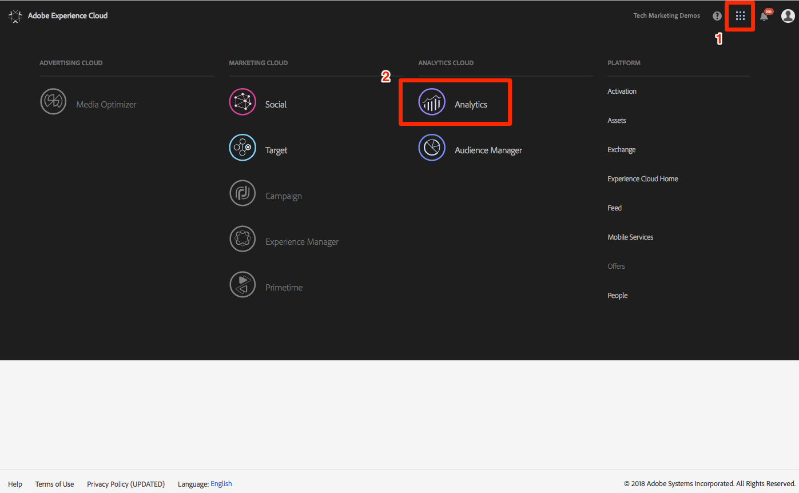
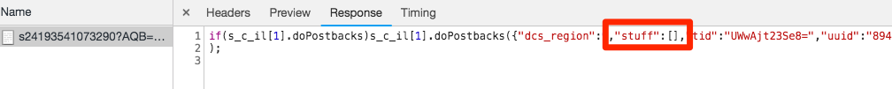

# Aggiungi Adobe Audience Manager

Questa lezione illustra i passaggi necessari per abilitare Adobe Audience Manager mediante l’inoltro lato server.

[Adobe Audience Manager](https://docs.adobe.com/content/help/en/audience-manager/user-guide/aam-home.html) (AAM) offre servizi leader di settore per la gestione online dei dati di audience, fornendo agli inserzionisti e agli editori digitali gli strumenti necessari per controllare e sfruttare le risorse di dati per favorire il successo delle vendite.

## Obiettivi di apprendimento

Alla fine di questa lezione, potrai:

1. Descrivete i due modi principali per implementare Audience Manager in un sito Web
1. Aggiunta di Audience Manager tramite l'inoltro lato server del beacon Analytics
1. Convalida dell’implementazione di Audience Manager

## Prerequisiti 

Per completare questa lezione, è necessario:

1. Per completare le lezioni in [Configura lancio](launch.md), [Aggiungi Adobe Analytics](analytics.md)e [Aggiungi servizio](id-service.md)identità.

1. L'amministratore può accedere ad Adobe Analytics per abilitare l'inoltro lato server per la suite di rapporti utilizzata per questa esercitazione. In alternativa, puoi chiedere a un amministratore esistente nella tua compagnia di farlo, seguendo le istruzioni di seguito.

1. Il tuo "sottodominio Audience Manager" (noto anche come "Nome partner" "ID partner" o "Sottodominio partner"). Se sul sito Web effettivo è già implementato Audience Manager, il modo più semplice per ottenerlo è andare sul sito Web reale e aprire il Debugger. Il sottodominio è disponibile nella scheda Riepilogo, nella sezione Audience Manager:

   

Se Audience Manager non è già stato implementato, segui queste istruzioni per [ottenere il tuo sottodominio](https://docs.adobe.com/content/help/en/audience-manager-learn/tutorials/web-implementation/how-to-identify-your-partner-id-or-subdomain.html)Audience Manager.

## Opzioni di implementazione

Esistono due modi per implementare Audience Manager in un sito Web:

* **SFF (Server-Side Forwarding)**: per i clienti con Adobe Analytics, questo è il modo più semplice e consigliato per implementare. Adobe Analytics inoltra i dati ad AAM sul back-end di Adobe, consentendo una richiesta in meno sulla pagina. Questo consente inoltre di ottenere caratteristiche di integrazione chiave e si conforma alle nostre best practice per l’implementazione e la distribuzione del codice di Audience Manager.

* **DIL** lato client: questo approccio è rivolto ai clienti che non dispongono di Adobe Analytics. Codice DIL (Data Integration Library Code, il codice di configurazione JavaScript di AAM) invia dati direttamente dalla pagina Web ad Audience Manager.

Poiché hai già implementato Adobe Analytics in questa esercitazione, distribuirai Audience Manager utilizzando l'inoltro lato server. For a complete description and requirements list for Server-Side forwarding, please review the [documentation](https://docs.adobe.com/content/help/en/analytics/admin/admin-tools/server-side-forwarding/ssf.html), so that you are familiar with how it works, what is required, and how to validate.

## Abilita Server-Side Forwarding

Esistono due passaggi principali per eseguire un’implementazione dell’SSF:

1. Attiva uno "switch" nell’Admin Console di Analytics per inoltrare i dati da Analytics ad Audience Manager *per suite* di rapporti.
1. Posizionare il codice, che viene eseguito tramite Launch. Affinché questo funzioni correttamente, è necessario che sia installata l’estensione Adobe Experience Platform Identity Service e l’estensione Analytics (in realtà *non* sarà necessaria l’estensione AAM, come illustrato di seguito).

### Abilita Server-Side Forwarding in Analytics Admin Console

Per iniziare a inoltrare i dati da Adobe Analytics ad Adobe Audience Manager è necessaria una configurazione nell’Admin Console di Adobe Analytics. Poiché l'inoltro dei dati può richiedere fino a quattro ore, è necessario eseguire prima questo passaggio.

#### Per abilitare SSF nell'Admin Console di Analytics

1. Accedi ad Analytics tramite l’interfaccia utente di Experience Cloud. Se non disponi dell'accesso dell'amministratore ad Analytics, dovrai rivolgerti al tuo amministratore Experience Cloud o Analytics per assegnarti l'accesso o completare questi passaggi.

   

1. Dalla navigazione superiore in Analytics, scegliete **[!UICONTROL Amministratore &gt; Suite]** di rapporti e, dall’elenco, selezionate (più selezioni) le suite di rapporti da inoltrare ad Audience Manager.

   

1. Dalla schermata Suite di rapporti e con le suite di rapporti selezionate, scegliete **[!UICONTROL Modifica impostazioni &gt; Generale &gt; Inoltro]** lato server.

   

   >[!WARNING] Come indicato sopra, per visualizzare questa voce di menu dovrai disporre delle facoltà di amministratore.

1. Una volta visualizzata la pagina Inoltro lato server, leggete le informazioni e selezionate la casella **[!UICONTROL Abilita inoltro]** lato server per le suite di rapporti.

1. Fai clic su **[!UICONTROL Salva]**

   

>[!NOTE] Poiché SSF deve essere abilitato per ogni suite di rapporti, non dimenticare di ripetere questo passaggio per le suite di rapporti reali quando distribuisci SSF nella suite di rapporti del tuo sito.
>
>Inoltre, se l'opzione SSF è disattivata, per abilitare l'opzione dovrete "mappare le suite di rapporti sull'organizzazione Experience Cloud". Questo è spiegato [nella documentazione](https://docs.adobe.com/content/help/en/core-services/interface/about-core-services/report-suite-mapping.html).

Una volta completato questo passaggio e se hai abilitato Adobe Experience Platform Identity Service, i dati saranno inoltrati da Analytics ad AAM. Tuttavia, per completare il processo in modo che la risposta torni correttamente da AAM alla pagina (e anche ad Analytics tramite la funzione Audience Analytics), devi completare anche il passaggio seguente in Launch. Non preoccuparti, è super facile.

### Abilita Server-Side Forwarding in Launch

Questo è il secondo dei due passaggi per abilitare SSF. Hai già attivato lo switch nell'Admin Console di Analytics e ora devi solo aggiungere il codice, che Launch farà per te se semplicemente seleziona la casella a destra.

>[!NOTE] Per implementare l'inoltro lato server dei dati di Analytics in AAM, in realtà modificheremo/configureremo l'estensione Analytics in Launch, **non** nell'estensione AAM. L'estensione AAM è utilizzata esclusivamente per le implementazioni DIL lato client, per coloro che non dispongono di Adobe Analytics. Pertanto, i passaggi seguenti sono corretti quando ti inviano nell'estensione Analytics per configurare questa configurazione.

#### Per abilitare SSF in Launch

1. Andate a **[!UICONTROL Estensioni &gt; Installate]** e fate clic per configurare l'estensione Analytics.

   

1. Expand the `Adobe Audience Manager` section

1. Selezionate la casella per condividere **[!UICONTROL automaticamente i dati di Analytics con Audience Manager]**. Questo aggiungerà il "modulo" di Audience Manager (codice) all' `AppMeasurement.js` implementazione di Analytics.

1. Aggiungi il tuo "Sottodominio Audience Manager" (noto anche come "Nome partner", "ID partner" o "Sottodominio partner"). Segui queste istruzioni per [ottenere il tuo sottodominio](https://docs.adobe.com/content/help/en/audience-manager-learn/tutorials/web-implementation/how-to-identify-your-partner-id-or-subdomain.html)Audience Manager.

1. Fate clic su **[!UICONTROL Salva nella libreria e crea]**

   

Il codice di inoltro lato server è ora implementato.

### Convalida Server-Side Forwarding

Il modo principale per verificare che l’inoltro lato server sia attivo e in esecuzione consiste nel verificare la risposta a uno degli hit Adobe Analytics. Ci arriveremo tra un minuto. Nel frattempo, vediamo un paio di altre cose che possono aiutarci a assicurarci che funzioni come vogliamo.

#### Verificare che il codice sia caricato correttamente

Il codice installato da Adobe Launch per gestire l’inoltro, e in particolare la risposta di AAM alla pagina, è denominato Audience Manager"Module". Possiamo utilizzare Experience Cloud Debugger per assicurarci che sia stato caricato.

1. Aprire il sito Luma
1. Fai clic sull’icona del debugger nel browser per aprire Experience Cloud Debugger
1. Nella scheda Riepilogo, scorri verso il basso fino alla sezione Analisi
1. Verify that **AudienceManagement** is listed under the Modules section

   

#### Verifica l'ID Partner nel debugger

Quindi, possiamo anche verificare che il debugger stia rilevando l'ID partner corretto (sottodominio partner AKA, ecc.) dal codice.

1. Sempre nel debugger e sempre nella scheda Riepilogo, scorri verso il basso fino alla sezione Audience Manager
1. Verifica il tuo ID partner/sottodominio in "Partner"

   

>[!WARNING] Potresti notare che la sezione Audience Manager del debugger fa riferimento a "DIL", che è la "Data Integration Library", e in genere si riferisce a un'implementazione lato client, invece dell'approccio lato server che abbiamo implementato qui. La verità è che il "modulo" AAM (utilizzato in questo approccio SSF) utilizza molto dello stesso codice della libreria DIL lato client, quindi questo debugger sta attualmente segnalando tale codice. Se si sono seguiti i passaggi di questa esercitazione e gli altri elementi di questa sezione di convalida sono corretti, è possibile che l'inoltro lato server funzioni correttamente.

#### Verifica della richiesta e della risposta di Analytics

OK, questo è il grande. Se non effettui l'inoltro lato server dei dati da Analytics ad Audience Manager, non ci sarà alcuna risposta al beacon di Analytics (oltre a un pixel 2x2). Tuttavia, se state utilizzando SSF, potete verificare alcuni elementi nella richiesta e nella risposta di Analytics per informarvi che funziona correttamente.
Purtroppo, al momento, Experience Cloud Debugger non supporta la visualizzazione della risposta ai beacon. È quindi necessario utilizzare un altro debugger/packet sniffer, come Charles Proxy o gli strumenti per sviluppatori del browser.

1. Aprire gli strumenti Developer nel browser e passare alla scheda Rete
1. Nel campo del filtro, digita `b/ss` che limiterà il contenuto visualizzato alle richieste di Adobe Analytics
1. Aggiorna la pagina per visualizzare la richiesta di Analytics

   

1. Nel beacon di Analytics (richiesta), cercate un parametro "callback". Sarà impostato su qualcosa di simile a questo: `s_c_il[1].doPostbacks`

   

1. Riceverai una risposta al beacon Analytics. Conterrà riferimenti a doPostback, come chiamato nella richiesta, e soprattutto, dovrebbe avere un oggetto "roba". Qui gli ID del segmento AAM verranno inviati al browser. Se avete l'oggetto "roba", SSF sta funzionando!

   

>[!WARNING] Attenzione al falso "successo" - Se c'è una risposta, e tutto sembra funzionare, assicurarsi **che** si ha quell'oggetto "roba". In caso contrario, nella risposta potrebbe comparire un messaggio con la dicitura "status": "SUCCESS". Per quanto sembri folle, questa è la prova che **NON** funziona correttamente. Se vedi questo, significa che hai completato il secondo passaggio (il codice in Launch), ma che l’inoltro nell’Admin Console di Analytics (il primo passaggio di questa sezione) non è ancora stato completato. In questo caso devi verificare di aver attivato SSF nell’Admin Console di Analytics. Se lo avete fatto, e non sono ancora state 4 ore, siate pazienti.

[Successive "Integrazioni Experience Cloud" &gt;](integrations.md)