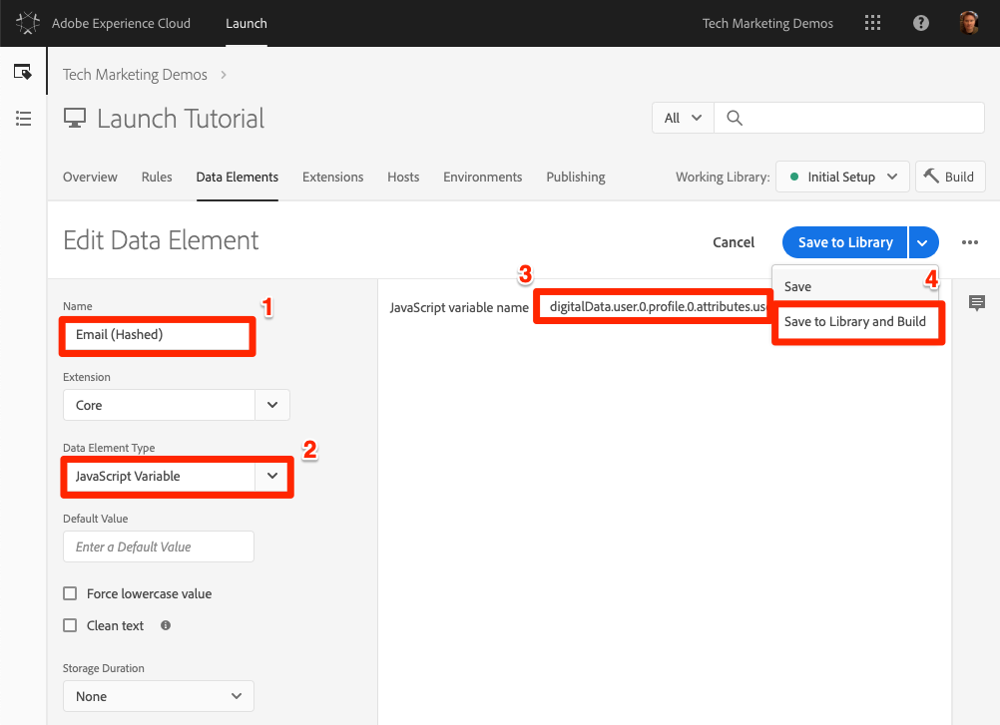
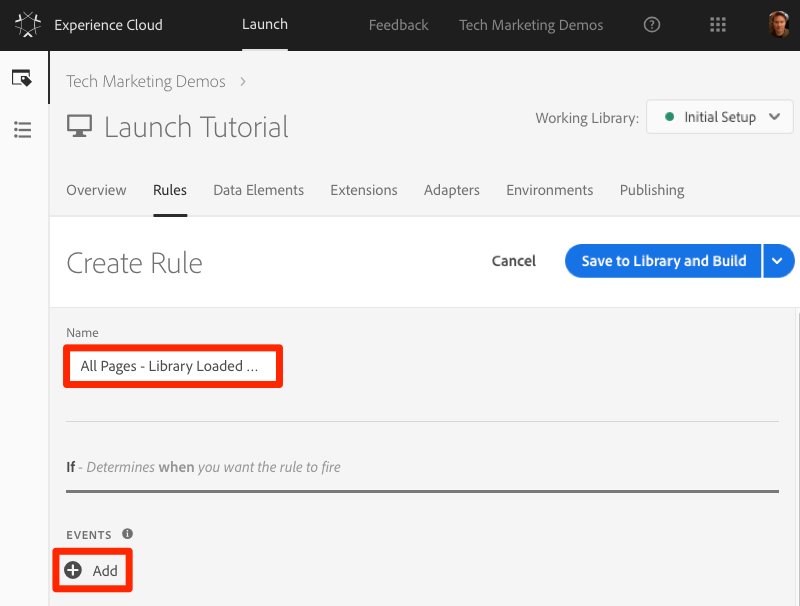
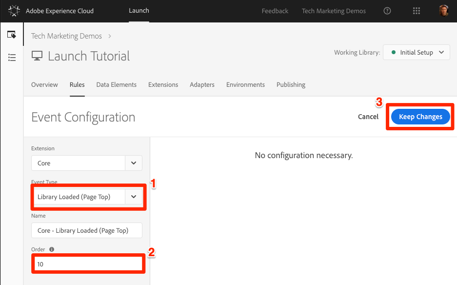

# Aggiunta di Adobe Experience Platform Identity Service

Questa lezione guiderà i passaggi necessari per implementare l’estensione [](https://docs.adobe.com/content/help/en/launch/using/extensions-ref/adobe-extension/id-service-extension/overview.html) Adobe Experience Platform Identity Service e inviare gli ID cliente.

Il servizio [Adobe Experience Platform Identity Service](https://docs.adobe.com/content/help/en/id-service/using/home.html) imposta un ID visitatore comune tra tutte le soluzioni Adobe per sviluppare le funzionalità di Experience Cloud, ad esempio la condivisione del pubblico tra le soluzioni.  Puoi anche inviare i tuoi ID cliente al Servizio per abilitare il targeting cross-device e le integrazioni con il sistema CRM (Customer Relationship Management).

## Obiettivi di apprendimento

Alla fine di questa lezione, potrai:

* Aggiungere l’estensione Servizio identità
* Creazione di un elemento dati per la raccolta degli ID cliente
* Crea una regola che utilizza l'azione "Imposta ID cliente" per inviare gli ID cliente ad Adobe
* Utilizzare la funzione di ordinamento delle regole per mettere in sequenza le regole che si attivano nello stesso evento

## Prerequisiti

You should have already completed the lessons in the [Configure Launch](launch.md) section.

## Aggiungere l’estensione del servizio identità

Dato che questa è la prima estensione che state aggiungendo, ecco una breve panoramica delle estensioni. Le estensioni sono una delle funzionalità principali di Launch. Un'estensione è un'integrazione realizzata da Adobe, un partner Adobe o qualsiasi cliente Adobe che aggiunge nuove e infinite opzioni per i tag che puoi distribuire sul tuo sito Web. Se pensi a Launch come a un sistema operativo, le estensioni sono le app che si installa in modo da Launch può fare le cose che ti serve per fare.

**Per aggiungere l’estensione del servizio identità**

1. In the top navigation, click **[!UICONTROL Extensions]**

1. Fate clic su **[!UICONTROL Catalogo]** per passare alla pagina Catalogo estensioni

   

1. Notate la varietà di estensioni disponibili nel Catalogo

1. Nel filtro nella parte superiore, digitate "id" per filtrare il Catalogo

1. Nella scheda di Adobe Experience Platform Identity Service, fai clic su **[!UICONTROL Installa]**

   

1. Il tuo ID organizzazione Experience Cloud è stato rilevato automaticamente.

1. Lasciate tutte le impostazioni predefinite e fate clic su **[!UICONTROL Salva nella libreria e crea]**

   

>[!NOTE] Ogni versione dell’estensione del servizio identità viene fornita con una versione specifica di VisitorAPI.js, nota nella descrizione dell’estensione. Aggiornate la versione VisitorAPI.js aggiornando l’estensione del servizio identità.

### Convalida dell’estensione

L'estensione Servizio identità è una delle poche estensioni Launch che effettua una richiesta senza dover utilizzare un'azione regola. L’estensione effettua automaticamente una richiesta al Servizio identità al caricamento della prima pagina della prima visita a un sito Web. Una volta richiesto, l'ID verrà memorizzato in un cookie di prime parti a partire da "AMCV_".

**Per convalidare l'estensione del servizio identità**

1. Open the [Luma site](https://luma.enablementadobe.com/content/luma/us/en.html)

1. Make sure the Debugger is mapping the Launch property to *your* Development environment, as described in the [earlier lesson](launch-switch-environments.md).

1. Nella scheda Riepilogo del debugger, la sezione Lancio deve indicare che l’estensione Adobe Experience Platform Identity Service è implementata.

1. Inoltre, nella scheda Riepilogo, la sezione Servizio identità deve compilare con lo stesso ID organizzazione presente nella schermata di configurazione dell’estensione nell’interfaccia Launch:

   

1. La richiesta iniziale per recuperare l'ID visitatore potrebbe essere visualizzata nella scheda Servizio identità del Debugger. Questo, tuttavia, potrebbe essere già stato richiesto, per cui non preoccuparti se non la vedi:
   

1. Dopo la richiesta iniziale di recupero dell'ID visitatore, l'ID viene memorizzato in un cookie il cui nome inizia con `AMCV_`. Puoi confermare che il cookie è stato impostato seguendo questa procedura:
   1. Apri gli strumenti per sviluppatori del browser
   1. Go to the `Application` tab
   1. Expand `Cookies` on the left side
   1. Click on the domain `https://luma.enablementadobe.com`
   1. Cercare il cookie AMCV_ sul lato destro. È possibile che vengano visualizzati diversi elementi dal momento in cui il sito Luma è stato caricato utilizzando sia la proprietà Luma che la relativa proprietà Launch hardcoded.
      

Tutto qui. Hai aggiunto la tua prima estensione! Per ulteriori informazioni sulle opzioni di configurazione del servizio identità, consulta [la documentazione](https://docs.adobe.com/content/help/en/id-service/using/id-service-api/configurations/function-vars.html).

## Invia ID cliente

Successivamente, invierai un ID [](https://docs.adobe.com/content/help/en/id-service/using/reference/authenticated-state.html) cliente al servizio identità. This will allow you to [integrate your CRM](https://docs.adobe.com/content/help/en/core-services/interface/customer-attributes/attributes.html) with the Experience Cloud as well as track visitors across devices.

In the earlier lesson, [Add Data Elements, Rules, and Libraries](launch-data-elements-rules.md) you created a data element and used it in a rule. Ora, utilizzerete queste stesse tecniche per inviare un ID cliente quando il visitatore viene autenticato.

### Creare elementi di dati per gli ID cliente

Inizia creando due elementi di dati:

1. `Authentication State`—per stabilire se il visitatore ha eseguito o meno l'accesso
1. `Email (Hashed)`—per acquisire la versione con hash dell'indirizzo e-mail (utilizzato come ID cliente) dal livello dati

**Creazione dell'elemento dati per lo stato di autenticazione**

1. Fai clic su **[!UICONTROL Elementi]** dati nella barra di navigazione superiore
1. Fate clic sul pulsante **[!UICONTROL Aggiungi elemento]** dati

   

1. Denomina l'elemento dati `Authentication State`
1. Per Tipo **[!UICONTROL elemento]** dati, selezionare Codice **[!UICONTROL personalizzato]**
1. Fate clic sul pulsante **[!UICONTROL Apri editor]**

   

1. Nella finestra [!UICONTROL Modifica codice] , utilizzate il seguente codice per restituire i valori di "connesso" o "disconnesso" in base a un attributo nel livello dati del sito Luma:

   ```javascript
   if (digitalData.user[0].profile[0].attributes.loggedIn)
       return "logged in"
   else
       return "logged out"
   ```

1. Click **[!UICONTROL Save]** to save the custom code

   

1. Lascia i valori predefiniti per tutte le altre impostazioni
1. Fai clic su **[!UICONTROL Salva nella libreria e crea]** per salvare l'elemento dati e tornare alla pagina degli elementi dati

   

Conoscendo lo stato di autenticazione dell'utente, sai quando un ID cliente deve esistere sulla pagina per inviare al servizio identità. Il passaggio successivo consiste nel creare un elemento dati per l'ID cliente stesso. Sul sito dimostrativo Luma, utilizzerete la versione con hash dell'indirizzo e-mail del visitatore.

**Aggiunta dell'elemento dati per l'e-mail con hash**

1. Fate clic sul pulsante **[!UICONTROL Aggiungi elemento]** dati

   

1. Denomina l'elemento dati `Email (Hashed)`
1. Per Tipo **[!UICONTROL elemento]** dati, selezionare Variabile **[!UICONTROL JavaScript]**
1. Come nome **[!UICONTROL della variabile]** JavaScript, usate il puntatore seguente su una variabile nel livello dati del sito Luma: `digitalData.user.0.profile.0.attributes.username`
1. Lascia i valori predefiniti per tutte le altre impostazioni
1. Fai clic su **[!UICONTROL Salva nella libreria e crea]** per salvare l'elemento dati

   

### Aggiungere una regola per inviare gli ID cliente

Il servizio Adobe Experience Platform Identity Service trasmette gli ID cliente nelle regole utilizzando un'azione denominata "Imposta ID cliente".  Ora verrà creata una regola per attivare questa azione quando il visitatore viene autenticato.

**Creazione di una regola per l'invio degli ID cliente**

1. In the top navigation, click **[!UICONTROL Rules]**
1. Fate clic su **[!UICONTROL Aggiungi regola]** per aprire il Generatore di regole

   

1. Denomina la regola `All Pages - Library Loaded - Authenticated - 10`

   >[!TIP] Questa convenzione di denominazione indica che la regola viene attivata nella parte superiore di tutte le pagine quando l’utente è autenticato e che l’ordine è "10". L'utilizzo di una convenzione di denominazione come questa, invece di denominarla per le soluzioni attivate nelle azioni, consentirà di ridurre al minimo il numero complessivo di regole necessarie per l'implementazione.

1. Under **[!UICONTROL Events]** click **[!UICONTROL Add]**

   

   1. For the **[!UICONTROL Event Type]** select **[!UICONTROL Library Loaded (Page Top)]**
   1. For the  **[!UICONTROL Order]** enter `10`. L'ordine controlla la sequenza di regole attivate dallo stesso evento. Le regole con un ordine inferiore verranno attivate prima delle regole con un ordine superiore. In this case, you want to set the customer ID before you fire the Target request, which you will do in the next lesson with a rule with an order of `50` .
   1. Fate clic sul pulsante **[!UICONTROL Mantieni modifiche]** per tornare al Generatore di regole
   

1. In **[!UICONTROL Condizioni]** fate clic su **[!UICONTROL Aggiungi]**

   

   1. Per Tipo **[!UICONTROL di]** condizione, selezionare Confronto **[!UICONTROL valori]**
   1. Click the  icon to open the Data Element modal

      

   1. In Data Element Modal, fai clic su **[!UICONTROL Autenticazione stato]** , quindi fai clic su **[!UICONTROL Seleziona]**

      

1. Make sure `Equals` is the operator
1. Digitare "login" nel campo di testo, causando l'attivazione della regola ogni volta che l'elemento dati "Stato autenticazione" ha un valore "login"

1. Click **[!UICONTROL Keep Changes]**

   

1. In **[!UICONTROL Azioni]** fare clic su **[!UICONTROL Aggiungi]**

   

   1. Per l’ **[!UICONTROL estensione]** , seleziona Servizio identità **[!UICONTROL Adobe Experience Platform]**
   1. Per Tipo **** azione, seleziona **[!UICONTROL Imposta ID cliente]**
   1. Per il codice **[!UICONTROL di]** integrazione immettere `crm_id`
   1. Per **[!UICONTROL Valore]** , apri il selettore modale Elemento dati e seleziona la `Email (Hashed)`
   1. Per lo stato **[!UICONTROL di]** autenticazione, selezionate **[!UICONTROL Autenticato]**
   1. Click the **[!UICONTROL Keep Changes]** button to save the action and return to the Rule Builder

      

1. Fate clic sul pulsante **[!UICONTROL Salva nella libreria e crea]** per salvare la regola

   

Ora hai creato una regola che invierà l'ID cliente come variabile `crm_id` quando il visitatore viene autenticato. Poiché hai specificato l'ordine come `10` questa regola verrà attivata prima della `All Pages - Library Loaded` regola creata nella lezione [Aggiungi elementi dati, Regole e librerie](launch-data-elements-rules.md) , che utilizza il valore predefinito Ordine di `50`.

### Convalida degli ID cliente

Per convalidare il lavoro, si accede al sito Luma per confermare il comportamento della nuova regola.

**Per accedere al sito Luma**

1. Open the [Luma site](https://luma.enablementadobe.com/content/luma/us/en.html)

1. Make sure the Debugger is mapping the Launch property to *your* Development environment, as described in the [earlier lesson](launch-switch-environments.md)

   

1. Fate clic sul collegamento **[!UICONTROL LOGIN]** nell’angolo in alto a destra del sito Luma

   

1. Inserisci `test@adobe.com` come nome utente
1. Immettere `test` come password
1. Fare clic sul pulsante **[!UICONTROL LOGIN]**

   

1. Torna alla pagina principale

A questo punto, confermate che l'ID cliente venga inviato al servizio utilizzando l'estensione Debugger.

**Per verificare che il servizio identità stia passando l'ID cliente**

1. Verificare che la scheda con il sito Luma sia attiva
1. Nel debugger, andate alla scheda Adobe Experience Platform Identity Service
1. Espandi il tuo ID organizzazione
1. Click on the cell with the `Customer ID - crm_id` value
1. In the modal, note the customer id value and that the `AUTHENTICATED` state is reflected:

   

1. Potete confermare il valore dell’e-mail con hash visualizzando il codice sorgente della pagina Luma e esaminando la proprietà username. Deve corrispondere al valore visualizzato nel debugger:

   

### Suggerimenti per la convalida aggiuntivi

Launch dispone anche di funzioni avanzate per la registrazione delle console. Per attivarli, andate alla scheda **[!UICONTROL Strumenti]** del Debugger e attivate l’opzione **[!UICONTROL Avvia registrazione]** console.


Questo attiverà la registrazione della console sia nella console del browser che nella scheda Registri del debugger. Dovresti visualizzare la registrazione di tutte le regole create finora! Le nuove voci di registro vengono aggiunte all'inizio dell'elenco, pertanto la regola "Tutte le pagine - Libreria caricata - Autenticata - 10" deve essere attivata prima della regola "Tutte le pagine - Libreria caricata" e visualizzata sotto di essa nella console Registrazione del debugger:


[Next "Add Adobe Target" (Aggiungi Adobe Target) &gt;](target.md)
