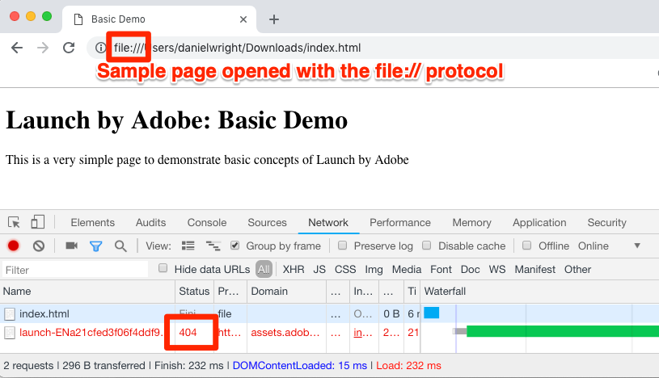

# Aggiungere il codice di incorporamento Launch

In questa lezione verrà implementato il codice da incorporare asincrono nell'ambiente di sviluppo della proprietà Launch. Lungo il percorso verranno illustrati due concetti principali di Launch: Ambienti e Codici di incorporazione.

## Obiettivi di apprendimento

Alla fine di questa lezione, potrai:

* Ottenere il codice da incorporare per la proprietà Launch
* Comprendi la differenza tra ambiente di sviluppo, ambiente di gestione temporanea e ambiente di produzione
* Aggiunta di un codice da incorporare di Launch a un documento HTML
* Explain the optimal location of the Launch embed code in relation to other code in the `<head>` of an html document

## Copiare il codice da incorporare

The embed code is a `<script>` tag that you put on your webpages to load and execute the logic you build in Launch. Se caricate la libreria in modo asincrono, il browser continua a caricare la pagina, recupera la libreria Launch ed esegue la libreria in parallelo. In questo caso, esiste un solo codice da incorporare, che collochi in `<head>`. (When Launch is deployed synchronously, there are two embed codes, one which you put in the `<head>` and another which you put before the `</body>`).

Dalla schermata Overview della proprietà, fai clic sulla scheda `Environments` per passare alla pagina degli ambienti. Gli ambienti di sviluppo, gestione delle risorse e produzione sono già stati creati per voi.


Gli ambienti di sviluppo, gestione temporanea e produzione corrispondono agli ambienti tipici nel processo di sviluppo e rilascio del codice. Il codice viene scritto innanzitutto dallo sviluppatore in un ambiente di sviluppo. Una volta completato il lavoro, l'utente lo invierà a un ambiente di gestione temporanea per il QA e ad altri team per la revisione. Una volta soddisfatti i requisiti di qualità e gli altri team, il codice viene pubblicato nell'ambiente di produzione, che è l'ambiente rivolto al pubblico a cui i visitatori possono accedere quando accedono al sito Web.

Launch consente ulteriori ambienti di sviluppo, utili nelle grandi organizzazioni in cui più sviluppatori lavorano contemporaneamente su progetti diversi.

Questi sono gli unici ambienti necessari per completare l'esercitazione. Gli ambienti consentono di disporre di diverse versioni operative delle librerie Launch ospitate a diversi URL, per aggiungere nuove funzioni e renderle disponibili agli utenti giusti (ad esempio sviluppatori, tecnici di controllo della qualità, pubblico ecc.) al momento giusto.

Ora copiamo il codice da incorporare:

1. In the **[!UICONTROL Development]** row, click the Install icon  to open the modal.

1. Si noti che Launch verrà impostato come predefinito sui codici di incorporamento asincroni

1. Fate clic sull’icona  Copia per copiare il codice da incorporare negli Appunti.

1. Click **[!UICONTROL Close]** to close the modal.

   

## Implement the Embed Code in the `<head>` of the Sample HTML Page

The embed code should be implemented in the `<head>` element of all HTML pages that will share the property. You might have one or several template files which control the `<head>` globally across the site, making it a straightforward process to add Launch.

Se non lo avete già fatto, scaricate [la pagina](https://www.enablementadobe.com/multi/web/basic-sample.html) HTML di esempio (fate clic con il pulsante destro del mouse su questo collegamento e fate clic su "Salva collegamento con nome") e apritela in un editor di codice. [Le parentesi](http://brackets.io/) è un editor gratuito open source, se necessario.

Sostituite il codice da incorporare esistente sulla riga 34 o intorno a esso con quello presente negli Appunti e salvate la pagina. Aprite la pagina in un browser Web. If you are loading the page using the `file://` protocol, you will need to add "https:" at the beginning of the embed code URL in your code editor). Le linee 33-36 della pagina di esempio possono essere così:

```html
    <!--Launch Header Embed Code: REPLACE LINE 39 WITH THE EMBED CODE FROM YOUR OWN DEVELOPMENT ENVIRONMENT-->
    <script src="https://assets.adobedtm.com/launch-ENa21cfed3f06f4ddf9690de8077b39e81-development.min.js" async></script>
    <!--/Launch Header Embed Code-->
```

Aprite gli strumenti di sviluppo del browser Web e passate alla scheda Rete. At this point you should see a 404 error for the Launch environment URL:


L'errore 404 è previsto perché non è ancora stata creata una libreria in questo ambiente di Launch. Scoprirai come farlo nella lezione successiva. Se compare un messaggio "failed" invece di un errore 404, probabilmente hai dimenticato di aggiungere il protocollo `https://` nel codice di incorporamento. Di nuovo, devi solo specificare il protocollo `https://` solo se si sta cari cando la pagina di esempio utilizzando il protocollo `file://`. Effettua la modifica e ricarica la pagina finché non viene visualizzato l'errore 404.

## Best practice per l’implementazione di Launch

Dedichiamo un momento alla verifica di alcune delle procedure ottimali per l’implementazione di Launch, illustrate nella pagina di esempio:

* **Data Layer**:

   * We *strongly* recommend creating a digital data layer on your site containing all of the attributes needed to populate variables in Analytics, Target, and other marketing solutions. Questa pagina di esempio contiene solo un livello di dati molto semplice, ma un livello dati reale potrebbe contenere ulteriori dettagli sulla pagina, il visitatore, i dettagli del carrello, ecc. For more info on data layers, please see [Customer Experience Digital Data Layer 1.0](https://www.w3.org/2013/12/ceddl-201312.pdf)

   * Definite il livello dati prima del codice da incorporare di Launch, in modo da massimizzare le operazioni consentite in Target, Attributi cliente e Analytics.

* **Librerie** di supporto JavaScript: Se hai già una libreria come JQuery implementata nelle pagine, caricala prima `<head>` di Launch per utilizzarne la sintassi in Launch e Target

* **doctype** HTML5: Il doctype HTML5 è richiesto da Target

* **preconnect e dns-prefetch**: utilizza preconnect e il dns-prefetch per migliorare il tempo di caricamento della pagina. Vedi anche: [https://w3c.github.io/resource-hints/](https://w3c.github.io/resource-hints/)

* **pre-nascondere lo snippet per le implementazioni** asincrone di Target: Per ulteriori informazioni, consulta la lezione di Target, ma quando Target viene distribuito tramite i codici di incorporamento Launch asincroni, devi codificare uno snippet di pre-occultamento sulle pagine prima dei codici di incorporamento Launch per gestire lo sfarfallio del contenuto

Di seguito viene riportato un riepilogo delle best practice nell'ordine suggerito. Si noti che esistono alcuni segnaposto per i dettagli specifici dell'account:

```html
<!doctype html>
<html lang="en">
<head>
    <title>Basic Demo</title>
    <!--Preconnect and DNS-Prefetch to improve page load time. REPLACE "techmarketingdemos" WITH YOUR OWN AAM PARTNER ID, TARGET CLIENT CODE, AND ANALYTICS TRACKING SERVER-->
    <link rel="preconnect" href="//dpm.demdex.net">
    <link rel="preconnect" href="//fast.techmarketingdemos.demdex.net">
    <link rel="preconnect" href="//techmarketingdemos.demdex.net">
    <link rel="preconnect" href="//cm.everesttech.net">
    <link rel="preconnect" href="//techmarketingdemos.tt.omtrdc.net">
    <link rel="preconnect" href="//techmarketingdemos.sc.omtrdc.net">
    <link rel="dns-prefetch" href="//dpm.demdex.net">
    <link rel="dns-prefetch" href="//fast.techmarketingdemos.demdex.net">
    <link rel="dns-prefetch" href="//techmarketingdemos.demdex.net">
    <link rel="dns-prefetch" href="//cm.everesttech.net">
    <link rel="dns-prefetch" href="//techmarketingdemos.tt.omtrdc.net">
    <link rel="dns-prefetch" href="//techmarketingdemos.sc.omtrdc.net">
    <!--/Preconnect and DNS-Prefetch-->
    <!--Data Layer to enable rich data collection and targeting-->
    <script>
    var digitalData = {
        "page": {
            "pageInfo" : {
                "pageName": "Home"
                }
            }
    };
    </script>
    <!--/Data Layer-->
    <!--jQuery or other helper libraries-->
    <script src="https://code.jquery.com/jquery-3.3.1.min.js"></script>
    <!--/jQuery-->
    <!--prehiding snippet for Adobe Target with asynchronous Launch deployment-->
    <script>
        (function(g,b,d,f){(function(a,c,d){if(a){var e=b.createElement("style");e.id=c;e.innerHTML=d;a.appendChild(e)}})(b.getElementsByTagName("head")[0],"at-body-style",d);setTimeout(function(){var a=b.getElementsByTagName("head")[0];if(a){var c=b.getElementById("at-body-style");c&&a.removeChild(c)}},f)})(window,document,"body {opacity: 0 !important}",3E3);
    </script>
    <!--/prehiding snippet for Adobe Target with asynchronous Launch deployment-->
    <!--Launch Header Embed Code: REPLACE LINE 39 WITH THE INSTALL CODE FROM YOUR OWN DEVELOPMENT ENVIRONMENT-->
    <script src="//assets.adobedtm.com/launch-EN93497c30fdf0424eb678d5f4ffac66dc.min.js" async></script>
    <!--/Launch Header Embed Code-->
</head>
<body>
    <h1>Launch by Adobe: Basic Demo</h1>
    <p>This is a very simple page to demonstrate basic concepts of Launch by Adobe</p>
</body>
</html>
```

Ora sai come aggiungere il codice di incorporamento Launch al tuo sito!

["Aggiungi un elemento dati, una regola e una libreria" &gt;](launch-data-elements-rules.md)