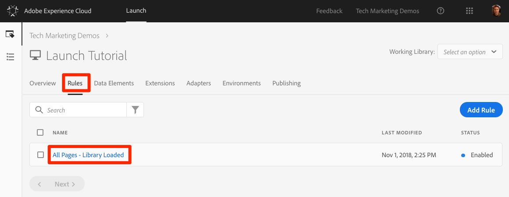

# Aggiungere un elemento dati, una regola e una libreria

In questa lezione, creerai il tuo primo elemento dati, regola e libreria.

Elementi e regole dati sono gli elementi costitutivi fondamentali di Launch. Gli elementi dati memorizzano gli attributi che desiderate inviare alle vostre soluzioni di marketing e pubblicità, mentre le richieste a tali soluzioni vengono inviate dalle Regole alle condizioni giuste.  Le librerie sono i file JavaScript caricati sulla pagina per eseguire tutto il lavoro. In questa lezione, utilizzerete tutti e tre per fare in modo che la nostra pagina di esempio faccia qualcosa.

## Obiettivi di apprendimento

Alla fine di questa lezione, potrai:

* Creare un elemento dati
* Creare una regola
* Creare una libreria
* Aggiungere modifiche a una libreria
* Convalidare il caricamento della libreria nel browser Web
* Utilizzo della funzione "Working Library" per un funzionamento più efficiente

## Creare un elemento dati per il nome della pagina

Gli elementi dati sono la versione di Launch di un livello dati. Possono memorizzare valori provenienti da oggetti livello dati personali, cookie, oggetti di memorizzazione locale, parametri stringa query, elementi pagina, tag meta ecc. In questo esercizio, creerai un elemento dati per Nome pagina, che utilizzerai successivamente nelle implementazioni di Target e Analytics.

**Creazione di un elemento dati**

1. Nella navigazione superiore, fai clic su Elementi **[!UICONTROL dati]**

1. Poiché non avete ancora creato elementi di dati in questa proprietà, viene visualizzato un breve video con informazioni aggiuntive sull’argomento. Se lo desideri, guarda questo video.

1. Click the **[!UICONTROL Create New Data Element]** button:

   

1. Name the data element, e.g. `Page Name`

1. Use the [!UICONTROL JavaScript Variable] Data Element type to point to a value in your sample page's data layer: `digitalData.page.pageInfo.pageName`

1. Use "`not available`" as the [!UICONTROL Default Value]. The [!UICONTROL Default Value] tells Launch what value to use for the data element if your JavaScript Variable specified above is not found.

1. Seleziona le caselle per **[!UICONTROL Force lowercase value]** (Forza valori minuscoli) e **[!UICONTROL Clean text]** (Pulisci testo) per standardizzare l’uso di maiuscole/minuscole e rimuovere spazi estranei

1. Lascia **[!UICONTROL Nessuno]** come impostazione Durata **** memorizzazione, poiché questo valore è in genere diverso su ogni pagina

1. Fare clic sul pulsante **[!UICONTROL Salva]** per salvare l'elemento dati

   dati Nome pagina.

>[!NOTE]**** Migratori DTM: Nuovi tipi di elementi dati sono stati aggiunti a Launch, che non esistevano in DTM. Alcuni dei nuovi tipi di elementi dati includono Local Storage, Session Storage, Page Info e Random Number
<!-- -->
>[!NOTE]Le funzionalità degli elementi dati _possono essere estese con le estensioni_. Ad esempio, l'estensione ContextHub consente di aggiungere elementi di dati utilizzando le funzioni dell'estensione.

## Crea una regola

Quindi, utilizzerete questo elemento dati in una regola semplice. Le regole sono una delle funzioni più potenti di Launch e consentono di specificare cosa deve accadere quando il visitatore interagisce con il sito Web. Una volta soddisfatti i criteri indicati nelle regole, la regola attiva l'azione specificata.

State per creare una regola che genera il valore dell’elemento dati Nome pagina nella console del browser.

**Creazione di una regola**

1. In the top navigation, click **[!UICONTROL Rules]**

1. Poiché non avete ancora creato regole in questa proprietà, viene visualizzato un breve video con informazioni aggiuntive sull’argomento. Se lo desideri, guarda questo video.

1. Click the **[!UICONTROL Create New Rule]** button:

   

1. Name the Rule `All Pages - Library Loaded`. Questa convenzione di denominazione indica dove e quando verrà attivata la regola, facilitando l’identificazione e il riutilizzo alla scadenza della proprietà Launch.

1. In Eventi, fai clic su **[!UICONTROL Aggiungi]**. L'evento indica a Launch quando la regola deve essere attivata e può essere composta da molti elementi, tra cui un caricamento di pagina, un clic, un evento JavaScript personalizzato e così via.

   

   1. In Tipo evento, seleziona **[!UICONTROL Libreria caricata (Pagina in alto)]**. Quando si seleziona il tipo di evento, Launch precompila un nome per l'evento utilizzando la selezione. Inoltre, l’ordine predefinito per l’evento è 50. L'ordinamento è una funzione potente in Launch che consente di controllare con precisione la sequenza di azioni in presenza di più regole attivate dallo stesso evento. Questa funzione verrà utilizzata più avanti nell'esercitazione.

   1. Fate clic sul pulsante **[!UICONTROL Mantieni modifiche]** .
   

1. Poiché questa regola deve essere attivata su tutte le pagine, lasciate **[!UICONTROL vuoti le condizioni]** . Se apri la modale Conditions, vedrai che le condizioni possono aggiungere restrizioni ed esclusioni in base a un'ampia gamma di opzioni, inclusi URL, valori degli elementi dati, intervalli di date e molto altro.

1. Under Actions, click **[!UICONTROL Add]**

1. Selezionare Tipo **[!UICONTROL azione &gt; Codice]** personalizzato, che a questo punto è l'unica opzione. Più avanti nell'esercitazione, quando si aggiungono estensioni saranno disponibili più opzioni.

1. Selezionare **[!UICONTROL &lt;/&gt; Apri editor]** per aprire l'editor di codice

   

1. Aggiungi quanto segue all'editor di codice. Questo codice invia il valore dell’elemento di dati Nome pagina alla console del browser, in modo che possiate confermare il funzionamento:

   ```javascript
   console.log('The page name is '+_satellite.getVar('Page Name'));
   ```

1. Salvare l’editor di codice

   

1. On the Action configuration screen click **[!UICONTROL Keep Changes]**

1. Fate clic su **[!UICONTROL Salva]** per salvare la regola

>[!NOTE]**** Migratori DTM: In Launch, le regole sono necessarie per attivare la maggior parte dei pixel di marketing. Ad esempio, per attivare il beacon Adobe Analytics, devi usare una regola per indicare a Launch di eseguire questa operazione.
>
> Il generatore di regole è stato completamente riprogettato e riprogettato in Launch.
> Alcune delle modifiche principali sono:
>
> * Esiste un solo generatore di regole. I tipi di regola DTM come "Page Bottom", "Click" e "Direct Call" sono tutti tipi di eventi nel generatore di regole. Questo rende molto più semplice aggiornare una regola, qualora sia necessario modificare il trigger, ad esempio, da un evento DOM Ready a un evento personalizzato.
> * Esiste un nuovo tipo di evento "Codice personalizzato"
> * Le estensioni possono aggiungere nuovi tipi di eventi al generatore di regole. Ad esempio, l’estensione Target potrebbe aggiungere supporto integrato per i suoi [eventi personalizzati at.js](https://docs.adobe.com/content/help/en/target/using/implement-target/client-side/functions-overview/atjs-custom-events.html), pertanto per utilizzare questa funzione non sarebbe necessario alcun codice personalizzato.
> * Le estensioni possono aggiungere nuove azioni al generatore di regole, riducendo i problemi eliminando la dipendenza dal codice personalizzato. Molte di queste azioni di estensione saranno utilizzate in questa esercitazione.
> * Le regole sono necessarie per attivare le richieste associate alla maggior parte degli strumenti di marketing. Ciò richiederà un adeguamento della mentalità, soprattutto per cose come l'impostazione degli ID cliente, l'attivazione dei beacon di Analytics e l'attivazione delle richieste Target.


## Salvare le modifiche in una libreria

Dopo aver configurato una raccolta di estensioni, elementi di dati e regole nell'interfaccia di Launch, è necessario creare un pacchetto di queste funzionalità e logica in un set di codice JavaScript che è possibile distribuire sul sito Web, in modo che i tag di marketing si attivino quando i visitatori accedono al sito. Una libreria è il set di codice JavaScript che esegue questa operazione.

In una lezione precedente, hai implementato il codice di incorporamento dell'ambiente di sviluppo nella pagina di esempio. Quando si caricava la pagina di esempio, per l’URL del codice da incorporare veniva restituito un errore 404, perché una libreria Launch non era ancora stata creata e assegnata all’ambiente. Ora inserisci il nuovo elemento dati e la regola in una libreria in modo che la pagina di esempio possa fare qualcosa.

**Aggiunta e creazione di una libreria**

1. Go to the [!UICONTROL Publishing] tab

1. Click **[!UICONTROL Add New Library]**

   

1. Denominate la libreria "Impostazione iniziale"

1. Selezionare **[!UICONTROL Ambiente &gt; Sviluppo]**

1. Fai clic su **[!UICONTROL Aggiungi tutte le risorse modificate]**

   

1. Dopo aver fatto clic su **[!UICONTROL Aggiungi tutte le risorse]** modificate Lancio, viene visualizzato un riepilogo delle modifiche appena apportate.

1. Fai clic su **[!UICONTROL Salva e genera per sviluppo]**

   

Dopo alcuni istanti, il punto di stato diventa verde per indicare che la libreria è stata creata correttamente.


## Convalida del lavoro

Ora verifica che la regola funzioni come previsto.

Ricarica la pagina di esempio. Se si guarda la scheda Strumenti sviluppatore &gt; Rete, è ora possibile visualizzare una risposta di 200 per la libreria Lancio!


Se si guarda Strumenti per sviluppatori &gt; Console, è necessario visualizzare il testo "Il nome della pagina è home"


Congratulazioni, hai creato il tuo primo elemento dati e regola e hai creato la tua prima libreria Launch!

## Utilizzo della funzione Libreria di lavoro

Quando si apportano numerose modifiche in Launch, è difficile passare alla scheda Pubblicazione, aggiungere modifiche e creare la libreria ogni volta che si desidera visualizzare il risultato.  Dopo aver creato la libreria "Configurazione iniziale", potete utilizzare una funzione denominata "Libreria di lavoro" per salvare rapidamente le modifiche e ricreare la libreria in un singolo passaggio.

Apportate una piccola modifica alla regola "Tutte le pagine - Libreria caricata". In the top navigation, click **[!UICONTROL Rules]** and then click on the `All Pages - Library Loaded` rule to open it up.



Nella `Edit Rule` pagina, fate clic sul menu a discesa ***[!UICONTROL Libreria]*** di lavoro e selezionate la vostra `Initial Setup` libreria.


Dopo aver selezionato la libreria, il pulsante **[!UICONTROL Salva]** è ora **[!UICONTROL Salva nella libreria e Genera]** per impostazione predefinita. Quando si apporta una modifica in Launch, è possibile utilizzare questa opzione per aggiungere automaticamente la modifica direttamente alla libreria di lavoro e ricrearla.

Test. Aprite l’azione Codice personalizzato e aggiungete due punti dopo il testo "Il nome della pagina è", in modo che l’intero blocco di codice legga:

```javascript
console.log('The page name is: '+_satellite.getVar('Page Name'));
```

Salvate il codice, mantenete le modifiche nell’azione, quindi fate clic sul pulsante **[!UICONTROL Salva nella libreria e genera]** .


Attendi che il punto verde venga nuovamente visualizzato accanto al menu a discesa [!UICONTROL Libreria] di lavoro. A questo punto, ricaricate la pagina di esempio e dovreste visualizzare le modifiche riportate nel messaggio della console (per visualizzare la modifica alla pagina potrebbe essere necessario cancellare la cache del browser e ricaricarla):


Si tratta di un metodo di lavoro molto più veloce e questo approccio verrà utilizzato per il resto dell'esercitazione.

[Successivo "Passa agli ambienti con Experience Cloud Debugger" &gt;](launch-switch-environments.md)
