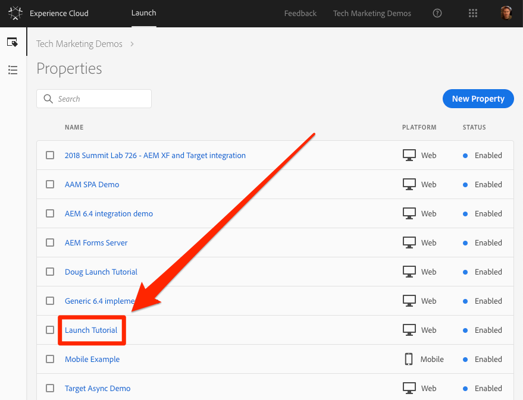

# Creare una proprietà Launch

In questa lezione verrà creata la prima proprietà Launch.

Una proprietà è fondamentalmente un contenitore che riempi con estensioni, regole, elementi dati e librerie durante la distribuzione di tag sul sito.

## Prerequisiti 

Per completare le lezioni successive, è necessario disporre dell'autorizzazione per sviluppare, approvare, pubblicare, gestire le estensioni e gestire gli ambienti in Launch. Se non riesci a completare nessuno di questi passaggi perché le opzioni dell'interfaccia utente non sono disponibili, contatta il tuo amministratore Experience Cloud per richiedere l'accesso. For more information on Launch permissions, see [the documentation](https://docs.adobe.com/content/help/en/launch/using/reference/admin/user-permissions.html).

## Obiettivi di apprendimento

Alla fine di questa lezione, potrai:

* Accedere all'interfaccia utente di Launch
* Creare una nuova proprietà Launch
* Configurare una proprietà Launch

## Vai a Launch

**Per accedere a Launch**

1. Accedi ad [Adobe Experience Cloud](https://experiencecloud.adobe.com)

1. Fate clic sull'icona  soluzione per aprire lo switcher della soluzione

1. Selezionate **[!UICONTROL Avvia]** dal menu 

1. In **[!UICONTROL Adobe Experience Cloud Launch]**, fai clic sul pulsante **[!UICONTROL Vai al lancio]**

   

You should now see the `Properties` screen (if no properties have ever been created in the account, this screen might be empty):

Se utilizzate frequentemente Launch, potete anche inserire nei segnalibri il seguente URL ed effettuare l'accesso direttamente [https://launch.adobe.com](https://launch.adobe.com)

## Creare una proprietà

Una proprietà è fondamentalmente un contenitore che riempi con estensioni, regole, elementi dati e librerie durante la distribuzione di tag sul sito. Una proprietà può essere un raggruppamento di uno o più domini e sottodomini. Puoi gestire e tenere traccia di queste risorse in modo simile. Ad esempio, supponi di disporre di più siti Web basati su un modello e di voler tenere traccia delle stesse risorse su tutti. Puoi applicare una proprietà a più domini. Per ulteriori informazioni sulla creazione di proprietà, vedere ["Aziende e proprietà"](https://docs.adobe.com/content/help/en/launch/using/reference/admin/companies-and-properties.html) nella documentazione del prodotto.

**Per creare una proprietà**

1. Fate clic sul pulsante **[!UICONTROL Nuova proprietà]** :

   

1. Denominate la proprietà (ad esempio `Launch Tutorial` o `Daniel's Launch Tutorial`)
1. Come dominio, immettete `enablementadobe.com` perché si tratta del dominio in cui è ospitato il sito dimostrativo Luma. Anche se il campo "Dominio" è obbligatorio, la proprietà Launch funziona su qualsiasi dominio in cui è implementato. Lo scopo principale di questo campo è precompilare le opzioni di menu nel generatore di regole.
1. Fate clic sul pulsante **[!UICONTROL Salva]**

   

La nuova proprietà deve essere visualizzata nella pagina Proprietà. Note that if you check the box next to the property name, options to **[!UICONTROL Configure]** or **[!UICONTROL Delete]** the property appear above the property list. Fate clic sul nome della proprietà (ad es. `Launch Tutorial`) per aprire la `Overview` schermata.

["Aggiungi il codice di incorporamento del lancio" &gt;](launch-add-embed.md)
