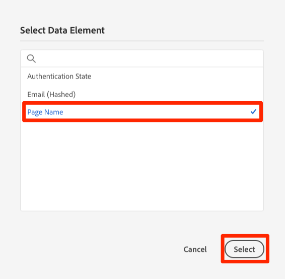
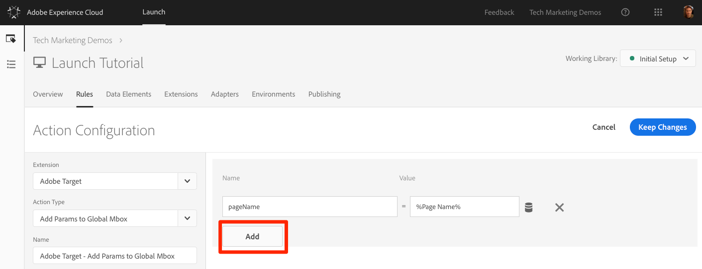
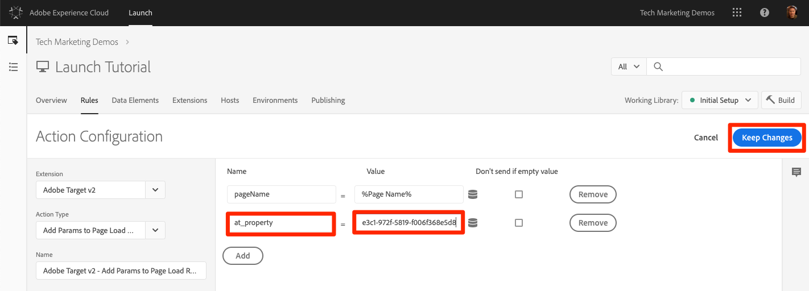
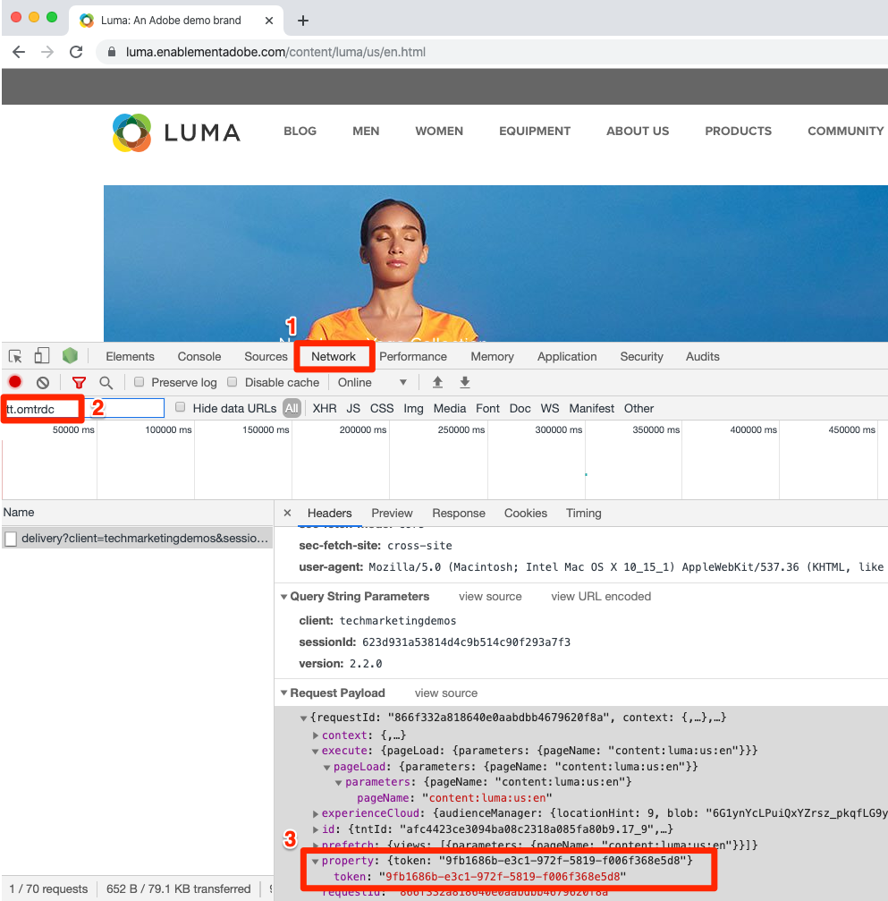

# Aggiungere Adobe Target

In questa lezione, implementeremo l'estensione [](https://docs.adobe.com/content/help/en/launch/using/extensions-ref/adobe-extension/target-extension/overview.html) Adobe Target con una richiesta di caricamento di pagina e parametri personalizzati.

[Adobe Target](https://docs.adobe.com/content/help/en/target/using/target-home.html) è la soluzione Adobe Marketing Cloud che offre tutto il necessario per adattare e personalizzare l'esperienza dei clienti, in modo da massimizzare le entrate sui siti Web e mobili, le app, i social media e altri canali digitali.

## Obiettivi di apprendimento

Alla fine di questa lezione, potrai:

* Aggiungete lo snippet di pre-occultamento utilizzato per gestire lo sfarfallio quando si utilizza Target con i codici di incorporamento di Launch asincroni
* Aggiungere l'estensione Target v2
* Incendi la richiesta di caricamento della pagina (precedentemente denominata "mbox globale")
* Aggiunta di parametri alla richiesta di caricamento della pagina
* Spiegate in che modo i parametri di profilo e di entità possono essere aggiunti alla richiesta di caricamento della pagina
* Incendio della richiesta di conferma dell'ordine con i parametri richiesti
* Spiega come aggiungere configurazioni avanzate, ad esempio Library Header e Library Footer code
* Convalida di un'implementazione di Target

## Prerequisiti 

To complete the lessons in this section, you must first complete the lessons in [Configure Launch](launch.md) and [Add the Identity Service](id-service.md).

## Aggiunta dello snippet di pre-disattivazione della destinazione

Prima di iniziare, è necessario aggiornare leggermente i codici di incorporamento di Launch. Quando i codici di incorporamento Launch vengono caricati in modo asincrono, il rendering della pagina potrebbe terminare prima che la libreria Target sia completamente caricata ed abbia eseguito lo scambio di contenuti. Questo può portare a ciò che è noto come "sfarfallio", dove il contenuto predefinito viene visualizzato brevemente prima di essere sostituito dal contenuto personalizzato specificato da Target. Per evitare questo sfarfallio, consigliamo vivamente di codificare uno snippet speciale di pre-occultamento immediatamente prima dei codici di incorporamento asincrono di Launch.

Questo è già stato fatto sul sito Luma, ma andiamo avanti e facciamolo sulla pagina di esempio in modo che possiate capire l'implementazione. Copia le seguenti righe di codice:

```html
<script>
    //prehiding snippet for Adobe Target with asynchronous Launch deployment
    (function(g,b,d,f){(function(a,c,d){if(a){var e=b.createElement("style");e.id=c;e.innerHTML=d;a.appendChild(e)}})(b.getElementsByTagName("head")[0],"at-body-style",d);setTimeout(function(){var a=b.getElementsByTagName("head")[0];if(a){var c=b.getElementById("at-body-style");c&&a.removeChild(c)}},f)})(window,document,"body {opacity: 0 !important}",3E3);
</script>
```

Aprite la pagina di esempio e incollatela immediatamente prima del codice da incorporare di Launch come illustrato di seguito (non preoccupatevi se i numeri di riga sono diversi):
Passa il

Ricarica la pagina di esempio. La pagina verrà nascosta per tre secondi prima della visualizzazione. Questo comportamento è temporaneo e sparirà dopo la distribuzione di Target. Questo comportamento di pre-occultamento è controllato da due configurazioni alla fine del frammento di codice, che possono essere personalizzate ma che in genere sono lasciate libere nelle impostazioni predefinite:

* `body {opacity: 0 !important}` specifica la definizione css da utilizzare per la pre-disattivazione fino al caricamento di Target. Per impostazione predefinita, il corpo intero viene nascosto. Se disponete di una struttura DOM coerente con un elemento contenitore facilmente identificabile che racchiude tutto il contenuto sotto la navigazione, ad esempio, e non desiderate mai testare o personalizzare la navigazione, potete utilizzare questa impostazione per limitare la pre-occultamento a tale elemento contenitore.
* `3E3` specifica l'impostazione di timeout per il pre-nascondiglio. Per impostazione predefinita, se Target non viene caricato in tre secondi, la pagina viene visualizzata. Questo dovrebbe accadere di rado.

For more details and to obtain the un-minified pre-hiding snippet, please see [the Adobe Target extension with an asynchronous deployment&#x200B;](https://docs.adobe.com/content/help/en/launch/using/extensions-ref/adobe-extension/target-extension/overview.html#adobe-target-extension-with-an-asynchronous-deployment).

## Aggiungere l’estensione di destinazione

L'estensione Adobe Target supporta implementazioni lato client tramite l'SDK JavaScript di Target per il Web moderno, at.js. Customers still using Target's older library, mbox.js, [should upgrade to at.js 2.x](https://docs.adobe.com/content/help/en/target/using/implement-target/client-side/mbox-implement/migrate-mbox/target-atjs-implementation.html) in order to use Launch.

L'estensione Target v2 è costituita da due parti principali:

1. La configurazione dell'estensione, che gestisce le impostazioni della libreria principale
1. Azioni di regola per eseguire le operazioni seguenti:
   1. Load Target (at.js 2.x)
   1. Aggiunta di parametri alle richieste di caricamento della pagina
   1. Aggiungi parametri a All Requests
   1. Avvia Page Load Request

In questo primo esercizio aggiungeremo l'estensione ed esamineremo le configurazioni. Negli esercizi successivi utilizzeremo le azioni.

**Per aggiungere l’estensione**

1. Vai a **[!UICONTROL Estensioni &gt; Catalogo]**
1. Digitate `target` il filtro per individuare rapidamente le estensioni Adobe Target. Esistono due estensioni: Adobe Target e Adobe Target v2. Questa esercitazione utilizzerà la versione v2 dell'estensione che utilizza l'ultima versione di at.js (attualmente 2.x), ideale sia per i siti Web tradizionali che per le applicazioni a pagina singola (SPA).
1. Fate clic su **[!UICONTROL Installa]**

   

1. Quando aggiungete l'estensione, verranno importate molte delle impostazioni at.js dall'interfaccia di Target, ma non tutte, come illustrato di seguito. Un'impostazione che non verrà importata è Timeout, che sarà sempre 3000 ms dopo l'aggiunta dell'estensione. Per l'esercitazione, lascia le impostazioni predefinite. Si noti che a sinistra mostrerà la versione at.js fornita con la versione corrente dell'estensione.

1. Fate clic su **[!UICONTROL Salva nella libreria e crea]**

   

A questo punto, Target non sta realmente facendo nulla, quindi non c'è nulla da convalidare.

>[!NOTE] Ogni versione dell'estensione Target include una versione specifica di at.js, elencata nella descrizione dell'estensione. Aggiornate la versione at.js aggiornando l'estensione Target.

## Carica destinazione e attiva la richiesta di caricamento pagina

Gli esperti di marketing utilizzano Target per controllare l'esperienza dei visitatori sulla pagina durante il test e il targeting del contenuto. Grazie a questo ruolo importante nella visualizzazione della pagina, dovresti caricare Target il prima possibile per ridurre al minimo l'impatto sulla visibilità della pagina. In questa sezione verranno caricate la libreria JavaScript di Target, at.js, nonché la richiesta di caricamento della pagina (detta "mbox globale" nelle versioni precedenti di at.js).

Puoi utilizzare la `All Pages - Library Loaded` regola creata nella lezione "[Aggiungi elementi dati, regole e librerie](launch-data-elements-rules.md)" per implementare Target perché è già attivata il prima possibile sui caricamenti di pagina.

**Per caricare la destinazione**

1. Vai a **[!UICONTROL Rules]** nella navigazione in alto, quindi fai clic su `All Pages - Library Loaded` per aprire l'editor di regole

   

1. Under Actions, click the  to add a new action

   

1. Selezionate **[!UICONTROL Estensione &gt; Adobe Target v2]**

1. Selezionate Tipo **[!UICONTROL azione &gt; Carica destinazione]**

1. Click **[!UICONTROL Keep Changes]**

   

With the `Load Target` action added, at.js will load on the page. Tuttavia, nessuna richiesta Target verrà attivata finché non verrà aggiunta l' `Fire Page Load Request` azione.

**Per attivare la richiesta di caricamento della pagina**

1. In Azioni, fai di nuovo clic sull’icona  nuovamente su Più per aggiungere un’altra azione

   

1. Selezionate **[!UICONTROL Estensione &gt; Adobe Target v2]**

1. Selezionare Tipo **[!UICONTROL azione &gt; Richiesta caricamento pagina di attivazione]**

1. Sono disponibili alcune configurazioni per la richiesta di caricamento della pagina relative al fatto che sia necessario nascondere o meno la pagina e il selettore CSS da utilizzare per la pre-occultamento. Queste impostazioni funzionano insieme allo snippet di pre-occultamento codificato sulla pagina. Lascia le impostazioni predefinite.

1. Click **[!UICONTROL Keep Changes]**

   

1. La nuova azione viene aggiunta in sequenza dopo l’ `Load Target` azione e le azioni vengono eseguite in questo ordine. Potete trascinare le azioni per riordinare l’ordine, ma in questo caso `Load Target` deve essere prima `Fire Page Load Request`.

1. Fate clic su **[!UICONTROL Salva nella libreria e crea]**

   

### Convalida della richiesta di caricamento pagina

Dopo aver aggiunto l'estensione Target v2 e aver avviato le azioni `Load Target` e `Fire Page Load Request` , è necessario eseguire una richiesta di caricamento di pagina su tutte le pagine in cui viene utilizzata la proprietà Launch.

**Per convalidare le azioni di destinazione di caricamento e richiesta di caricamento delle pagine di attivazione**

1. Ricarica la pagina di esempio. Non si verifica più un ritardo di tre secondi prima che la pagina sia visibile. If you are loading the sample page using the `file://` protocol, you should do this step in Firefox or Safari browsers since Chrome will not fire a Target request when using the `file://` protocol.

1. Open the [Luma site](https://luma.enablementadobe.com/content/luma/us/en.html)

1. Make sure the Debugger is mapping the Launch property to *your* Development environment, as described in the [earlier lesson](launch-switch-environments.md)

   

1. Vai alla scheda Riepilogo del debugger

1. In the `Launch` section, confirm that `Target` appears under the `Extensions` heading

1. Nella `Target` sezione, verificate che venga visualizzata la versione della libreria at.js

   

1. Infine, andate alla `Target` scheda, espandete il codice client e confermate che viene visualizzata la richiesta di caricamento della pagina:

   

Congratulazioni! Hai implementato Target!

## Aggiungi parametri

Trasmettere i parametri nella richiesta Target aggiunge potenti funzionalità alle attività di targeting, test e personalizzazione. L’estensione Launch offre due azioni per passare i parametri:

1. `Add Params to Page Load Request`, che aggiunge parametri alle richieste di caricamento della pagina (equivalente al metodo [targetPageParams()](https://docs.adobe.com/content/help/en/target/using/implement-target/client-side/functions-overview/cmp-atjs-functions.html) )

1. `Add Params to All Requests`, che aggiunge parametri in tutte le richieste Target, ad esempio la richiesta di caricamento della pagina più richieste aggiuntive effettuate da azioni del codice personalizzato o codificate nel sito (equivalente al metodo [targetPageParamsAll()](https://docs.adobe.com/content/help/en/target/using/implement-target/client-side/functions-overview/cmp-atjs-functions.html) )

These actions can be used *before* the `Load Target` action and can set different parameters on different pages based on your rule configurations. Utilizzate la funzione di ordinamento delle regole utilizzata quando impostate gli ID cliente con il servizio identità per impostare parametri aggiuntivi sull' `Library Loaded` evento prima che la regola attivi la richiesta di caricamento della pagina.
>[!TIP] Poiché la maggior parte delle implementazioni utilizza la richiesta di caricamento della pagina per la distribuzione dell'attività, in genere è sufficiente utilizzare l' `Add Params to Page Load Requests` azione.

### Parametri di richiesta (mbox)

I parametri vengono utilizzati per trasmettere dati personalizzati a Target, arricchendo le capacità di personalizzazione. Sono ideali per gli attributi che si modificano frequentemente durante una sessione di navigazione come il nome della pagina, il modello e così via. e non persistere.

Aggiungiamo l'elemento `Page Name` dati creato in precedenza nella lezione [Aggiungi elementi dati, Regole e librerie](launch-data-elements-rules.md) come parametro di richiesta.

**Per aggiungere il parametro request**

1. Vai a **[!UICONTROL Rules]** nella navigazione in alto, quindi fai clic su `All Pages - Library Loaded` per aprire l'editor di regole.

   

1. Under Actions, click the  to add a new action

   

1. Selezionate **[!UICONTROL Estensione &gt; Adobe Target v2]**

1. Selezionare Tipo **[!UICONTROL azione &gt; Aggiungi parametri a richiesta di caricamento pagina]**

1. Inserisci `pageName` come **[!UICONTROL nome]**

1. Click the  to open the data element modal

1. Fare clic sull'elemento `Page Name` dati

1. Fate clic sul pulsante **[!UICONTROL Seleziona]**

   

1. Click **[!UICONTROL Keep Changes]**

   

1. Fate clic e trascinate sul bordo sinistro dell’ `Add Params to Page Load Request` azione per ridisporre le azioni eseguite prima dell’ `Fire Page Load Request` azione (prima o dopo `Load Target`)

1. Fate clic su **[!UICONTROL Salva nella libreria e crea]**

   

#### Convalida parametri richiesta

Al momento, i parametri personalizzati passati con le richieste at.js 2.x non sono facilmente visibili nel Debugger, pertanto utilizzeremo gli strumenti di sviluppo del browser.

**Per convalidare il parametro della richiesta pageName**

1. Ricaricare il sito Luma, verificando che sia mappato sulla proprietà Launch
1. Apri gli strumenti per sviluppatori del browser
1. Fare clic sulla scheda Rete
1. Filtrare le richieste a `tt.omtrdc` (o al dominio CNAME per le richieste Target)
1. Espandete la sezione `Headers` &gt; `Request Payload` &gt; `execute.pageLoad.parameters` per convalidare il `pageName` parametro e il valore
   

<!--Now go to the **[!UICONTROL Target]** tab in the Debugger. Expand your client code and look at the requests. You should see the new `pageName` parameter passed in the request:

-->

### Parametri profilo

Come per i parametri di richiesta, anche i parametri di profilo vengono passati attraverso la richiesta Target. However, profile parameters get stored in Target's visitor profile database and will persist for the [duration of the visitor's profile](https://docs.adobe.com/content/help/en/target/using/audiences/visitor-profiles/visitor-profile-lifetime.html). Potete impostarle su una pagina del sito e utilizzarle nelle attività Target su un'altra pagina. Esempio da un sito Web automobilistico. Quando un visitatore passa a una pagina di veicolo, potete passare un parametro di profilo "profile.lastViewed=sportpresso" per registrare il loro interesse in quel particolare veicolo. Quando il visitatore passa ad altre pagine non di veicoli, potete eseguire il targeting del contenuto in base all’ultimo veicolo visualizzato.  I parametri di profilo sono ideali per le attribuzioni che raramente si modificano o sono disponibili solo su determinate pagine

You won't pass any profile parameters in this tutorial, but the workflow is almost identical to what you just did when passing the `pageName` parameter. L'unica differenza consiste nel fatto che devi assegnare un prefisso `profile.` ai nomi del parametro di profilo. This is what a profile parameter called "userType" would look like in the `Add Params to Page Load Request` action:


### Parametri entità

I parametri di entità sono parametri speciali utilizzati nelle [implementazioni di raccomandazioni](https://docs.adobe.com/content/help/en/target/using/recommendations/plan-implement.html) per tre motivi principali:

1. Come chiave per attivare raccomandazioni sui prodotti. Ad esempio, quando si utilizza un algoritmo di raccomandazioni come "People who viewed Product X, also viewed Y", "X" è la "chiave" della raccomandazione. In genere è lo SKU del prodotto (`entity.id`) o la categoria (`entity.categoryId`) attualmente visualizzata dal visitatore.
1. Per raccogliere il comportamento dei visitatori per alimentare gli algoritmi delle raccomandazioni, ad esempio "Prodotti visualizzati di recente" o "Prodotti più visualizzati"
1. Compilazione del catalogo di Recommendations. Recommendations contiene un database di tutti i prodotti o gli articoli presenti sul sito Web, in modo che possano essere serviti nell'offerta di raccomandazione. Ad esempio, durante la raccomandazione dei prodotti, in genere si desiderano visualizzare attributi come il nome del prodotto (`entity.name`) e l'immagine (`entity.thumbnailUrl`). Alcuni clienti popolano il proprio catalogo utilizzando feed back-end, ma possono anche essere compilati utilizzando i parametri di entità nelle richieste Target.

Non è necessario trasmettere parametri di profilo in questa esercitazione, ma il flusso di lavoro è identico a quello eseguito in precedenza al momento del passaggio del parametro della `pageName` richiesta; assegnate al parametro un nome con il prefisso "entity". e mapparla sull'elemento dati pertinente. Si noti che alcune entità comuni hanno nomi riservati che devono essere utilizzati (ad esempio entity.id per l'interfaccia del prodotto). This is what it would look like to set entity parameters in the `Add Params to Page Load Request` action:


### Aggiungi Customer ID Parameters

La raccolta di ID cliente con Adobe Experience Platform Identity Service semplifica l'importazione di dati CRM in Target tramite la funzione Attributi [](https://docs.adobe.com/content/help/en/target/using/audiences/visitor-profiles/working-with-customer-attributes.html) cliente di Adobe Experience Cloud. It also enables [cross-device visitor stitching](https://docs.adobe.com/content/help/en/target/using/integrate/experience-cloud-device-co-op.html), allowing you to maintain a consistent user experience as your customers switch between their laptops and their mobile devices.

È fondamentale impostare l'ID cliente nell'azione del Servizio identità `Set Customer IDs` prima di attivare la richiesta di caricamento della pagina. A tale fine, assicurati di disporre delle seguenti funzionalità sul sito:

* L'ID cliente deve essere disponibile sulla pagina prima del codice di incorporamento del lancio
* L’estensione Adobe Experience Platform Identity Service deve essere installata
* You must use the `Set Customer IDs` action in a rule that fires at the "Library Loaded (Page Top)" event
* Use the `Fire Page Load Request` action in a rule that fires *after* the "Set Customer IDs" action

Nella lezione precedente, [Aggiungi il servizio](id-service.md)Adobe Experience Platform Identity, hai creato la `All Pages - Library Loaded - Authenticated - 10` regola per attivare l'azione "Imposta ID cliente". Poiché questa regola ha un' `Order` impostazione di `10`, gli ID cliente vengono impostati prima che la nostra richiesta di caricamento della pagina venga attivata dalla `All Pages - Library Loaded` regola con `Order` l'impostazione di `50`. Quindi, hai già implementato la raccolta di ID cliente per Target!

#### Convalida dell'ID cliente

Al momento, i parametri personalizzati passati con le richieste at.js 2.x non sono facilmente visibili nel Debugger, pertanto utilizzeremo gli strumenti di sviluppo del browser.

**Per convalidare l'ID cliente**

1. Open the [Luma site](https://luma.enablementadobe.com/content/luma/us/en.html)

1. Make sure the Debugger is mapping the Launch property to *your* Development environment, as described in the [earlier lesson](launch-switch-environments.md)

   

1. Accedete al sito Luma utilizzando le credenziali `test@adobe.com`/`test`
1. Return to the [Luma homepage](https://luma.enablementadobe.com/content/luma/us/en.html)

1. Apri gli strumenti per sviluppatori del browser
1. Fare clic sulla scheda Rete
1. Filtrare le richieste a `tt.omtrdc` (o al dominio CNAME per le richieste Target)
1. Espandete la sezione `Headers` &gt; `Request Payload` &gt; `id.customerIds.0` per convalidare le impostazioni e il valore ID cliente:
   
<!--
1. Open the Debugger
1. Go to the Target tab
1. Expand your client code
1. You should see parameters in the latest Target request for `vst.crm_id.id` and `vst.crm_id.authState`. `vst.crm_id.id` should have a value of the hashed email address and `vst.crm_id.authState` should have a value of `1` to represent `authenticated`. Note that `crm_id` is the `Integration Code` you specified in the Identity Service configuration and must align with the key you use in your [Customer Attributes data file](https://docs.adobe.com/content/help/en/core-services/interface/customer-attributes/t-crs-usecase.html):

-->

>[!WARNING] Adobe Experience Platform Identity Service consente di inviare più ID al servizio. Tuttavia, solo il primo verrà inviato a Target.

### Aggiungi parametro token proprietà

>[!NOTE] Si tratta di un esercizio facoltativo per i clienti di Target Premium.

The property token is a reserved parameter used with the Target Premium [Enterprise User Permissions](https://docs.adobe.com/content/help/en/target/using/administer/manage-users/enterprise/property-channel.html) feature. Viene utilizzato per definire proprietà digitali diverse in modo che ai diversi membri di un’organizzazione Experience Cloud possano essere assegnate autorizzazioni diverse per ogni proprietà. Ad esempio, potreste desiderare che un gruppo di utenti sia in grado di configurare le attività Target sul vostro sito Web, ma non nell'applicazione mobile.

Le proprietà di destinazione sono simili alle proprietà di Launch e alle suite di rapporti di Analytics. Un'azienda con più marchi, siti Web e team di marketing potrebbe utilizzare una diversa proprietà Target, proprietà Launch e suite di rapporti Analytics per ogni sito Web o app mobile. Le proprietà di avvio sono differenziate in base ai codici di incorporamento, le suite di rapporti di Analytics sono differenziate in base all'ID della suite di rapporti e le proprietà di Target sono differenziate in base al parametro del token di proprietà.

Il token di proprietà viene implementato come un parametro di richiesta. È sufficiente denominare il parametro "at_property" e incollare il valore fornito nell'interfaccia di Target.  Se si implementano più siti con una singola proprietà Launch, è possibile gestire il valore at_property tramite un elemento dati.

Di seguito è riportato un esercizio facoltativo, se siete clienti Target Premium e desiderate implementare un token di proprietà nella proprietà Tutorial:

1. In una scheda separata, apri l'interfaccia utente di Target

1. Vai a **[!UICONTROL Configurazione &gt; Proprietà]**

1. Identificare la proprietà che si desidera utilizzare e fare clic su **[!UICONTROL &lt;/&gt;]** (o creare una nuova proprietà)

1. Copy the `at_property` value to your clipboard

   

1. In your Launch tab, go to the **[!UICONTROL Rules]** in the top navigation and then click on `All Pages - Library Loaded` to open the rule editor.

   

1. In Azioni, fai clic sull’ `Adobe Target - Add Params to Page Load Request` ’azione per aprire la finestra di dialogo `Action Configuration`

   

1. Sotto il `pageName` parametro, fate clic sul pulsante **[!UICONTROL Aggiungi]**

   

1. Name the parameter `at_property` and paste in the value you copied from the Target interface

1. Click **[!UICONTROL Keep Changes]**

   

1. Fate clic su **[!UICONTROL Salva nella libreria e crea]**
   

#### Convalida il Property Token

Al momento, i parametri personalizzati passati con le richieste at.js 2.x non sono facilmente visibili nel Debugger, pertanto utilizzeremo gli strumenti di sviluppo del browser.

**Per convalidare il parametro Token proprietà**

1. Open the [Luma site](https://luma.enablementadobe.com/content/luma/us/en.html)
1. Make sure the Debugger is mapping the Launch property to *your* Development environment, as described in the [earlier lesson](launch-switch-environments.md)

   

1. Apri gli strumenti per sviluppatori del browser
1. Fare clic sulla scheda Rete
1. Filtrare le richieste a `tt.omtrdc` (o al dominio CNAME per le richieste Target)
1. Espandi la sezione `Headers` &gt; `Request Payload` &gt; `property.token` per convalidare il valore
   

<!--
1. Go to the `Target` tab
1. Expand your client code
1. You should see the parameter for "at_property" in every page load request request as you browse the site:

-->

## Aggiungi richieste personalizzate

### Aggiunta di una richiesta di conferma dell'ordine

La richiesta di conferma dell'ordine è un tipo speciale di richiesta utilizzata per inviare i dettagli dell'ordine a Target. L'inclusione di tre parametri di richiesta specifici, orderId, orderTotal e productPurchasedId, è ciò che trasforma una richiesta Target regolare in una richiesta di ordine. Oltre a generare rapporti sulle entrate, la richiesta di ordine esegue anche le seguenti operazioni:

1. Consente di deduplicare gli invii accidentali
1. Filtra ordini estremi (qualsiasi ordine il cui totale era costituito da più di tre deviazioni standard dalla media)
1. Utilizza un algoritmo diverso per calcolare la confidenza statistica
1. Crea un rapporto Audit speciale scaricabile dei singoli dettagli dell'ordine

La procedura migliore consiste nell'utilizzare e ordinare richieste di conferma in tutti i funnel degli ordini, anche su siti non destinati alla vendita al dettaglio. Ad esempio, i siti di generazione di lead hanno in genere funnel lead con un "id lead" univoco generato alla fine. Questi siti devono implementare una richiesta di ordine, utilizzando un valore statico (ad esempio "1") per orderTotal.

Anche i clienti che utilizzano l'integrazione di Analytics per Target (A4T) per la maggior parte dei loro rapporti dovrebbero implementare la richiesta di ordine, poiché A4T non è ancora compatibile con tipi di attività come Allocazione automatica, Personalizzazione automatizzata e Destinazione automatica. Inoltre, la richiesta di ordine è un elemento critico nelle implementazioni di Recommendations, che forniscono algoritmi basati sul comportamento di acquisto.

La richiesta di conferma dell'ordine deve essere attivata da una regola attivata solo nella pagina o nell'evento di conferma dell'ordine. Spesso può essere combinato con una regola che imposta l'evento di acquisto di Adobe Analytics. Deve essere configurato utilizzando l'azione Codice personalizzato dell'estensione Core, utilizzando gli elementi dati appropriati per impostare i parametri orderId, orderTotal e productPurchasedId.

Aggiungiamo gli elementi di dati e la regola di cui abbiamo bisogno per attivare una richiesta di conferma d'ordine sul sito Luma. Poiché avete già creato diversi elementi di dati, queste istruzioni saranno abbreviate.

**Creazione dell'elemento dati per l'ID ordine**

1. Fai clic su **[!UICONTROL Elementi]** dati nella barra di navigazione superiore
1. Fai clic su **[!UICONTROL Aggiungi elemento dati]**
1. Denomina l'elemento dati `Order Id`
1. Selezionare Tipo elemento **[!UICONTROL dati &gt; Variabile JavaScript]**
1. Usa `digitalData.cart.orderId` come `JavaScript variable name`
1. Check the `Clean text` option
1. Fate clic su **[!UICONTROL Salva nella libreria]**(la libreria non verrà creata finché non verranno apportate tutte le modifiche per la richiesta di conferma dell'ordine)

**Creazione dell'elemento dati per il Carrello Importo**

1. Fai clic su **[!UICONTROL Aggiungi elemento dati]**
1. Denomina l'elemento dati `Cart Amount`
1. Selezionare Tipo elemento **[!UICONTROL dati &gt; Variabile JavaScript]**
1. Usa `digitalData.cart.cartAmount` come `JavaScript variable name`
1. Check the `Clean text` option
1. Fate clic su **[!UICONTROL Salva nella libreria]**

**Creazione dell'elemento dati per gli SKU del carrello (Target)**

1. Fai clic su **[!UICONTROL Aggiungi elemento dati]**
1. Denomina l'elemento dati `Cart SKUs (Target)`
1. Seleziona Tipo elemento **[!UICONTROL dati &gt; Codice personalizzato]**
1. Per Target, gli sku devono essere un elenco separato da virgole. Questo codice personalizzato riformatterà l'array del livello dati nel formato corretto. Nell'editor di codice personalizzato, incolla quanto segue:

   ```javascript
   var targetProdSkus="";
   for (var i=0; i<digitalData.cart.cartEntries.length; i++) {
     if(i>0) {
       targetProdSkus = targetProdSkus + ",";
     }
     targetProdSkus = targetProdSkus + digitalData.cart.cartEntries[i].sku;
   }
   return targetProdSkus;
   ```

1. Check the `Force lowercase value` option
1. Check the `Clean text` option
1. Fate clic su **[!UICONTROL Salva nella libreria]**

Ora è necessario creare una regola per attivare la richiesta di conferma dell'ordine con questi elementi di dati come parametri nella pagina di conferma dell'ordine.

**Per creare la regola per la pagina Conferma ordine**

1. Click **[!UICONTROL Rules]** in the top navigation
1. Click **[!UICONTROL Add Rule]**
1. Denomina la regola `Order Confirmation Page - Library Loaded - 60`
1. Fate clic su **[!UICONTROL Eventi &gt; Aggiungi]**
   1. Selezionate Tipo **[!UICONTROL evento &gt; Libreria caricata (pagina in alto)]**
   1. Cambia il `Order` in `60` in modo che si attivi dopo l' `Load Target` azione (che è nella nostra `All Pages - Library Loaded` regola dove `Order` è impostato `50`)
   1. Click **[!UICONTROL Keep Changes]**
1. Fate clic su **[!UICONTROL Condizioni &gt; Aggiungi]**
   1. Selezionare Tipo **[!UICONTROL condizione &gt; Percorso senza stringa di query]**
   1. Per `Path equals` immettere `thank-you.html`
   1. Attivate l'opzione Regex per cambiare la logica da `equals` a `contains` (potete usare la `Test` funzione per confermare che il test passerà con l'URL) `https://luma.enablementadobe.com/content/luma/us/en/user/checkout/order/thank-you.html`

      

   1. Click **[!UICONTROL Keep Changes]**
1. Fai clic su **[!UICONTROL Azioni &gt; Aggiungi]**
   1. Selezionare Tipo **[!UICONTROL azione &gt; Codice personalizzato]**
   1. Click **[!UICONTROL Open Editor]**
   1. Paste the following code into the `Edit Code` modal

      ```javascript
      adobe.target.getOffer({
        "mbox": "orderConfirmPage",
        "params":{
           "orderId": _satellite.getVar('Order Id'),
           "orderTotal": _satellite.getVar('Cart Amount'),
          "productPurchasedId": _satellite.getVar('Cart SKUs (Target)')
        },
        "success": function(offer) {
          adobe.target.applyOffer({
            "mbox": "orderConfirmPage",
            "offer": offer
          });
        },
        "error": function(status, error) {
          console.log('Error', status, error);
        }
      });
      ```

   1. Click **[!UICONTROL Save]** to save the custom code
   1. Fare clic su **[!UICONTROL Mantieni modifiche]** per mantenere l'azione
1. Fate clic su **[!UICONTROL Salva nella libreria e crea]**

#### Convalida della richiesta di conferma dell'ordine

Al momento, i parametri personalizzati passati con le richieste at.js 2.x non sono facilmente visibili nel Debugger, pertanto utilizzeremo gli strumenti di sviluppo del browser.

1. Open the [Luma site](https://luma.enablementadobe.com/content/luma/us/en.html)

1. Make sure the Debugger is mapping the Launch property to *your* Development environment, as described in the [earlier lesson](launch-switch-environments.md)

   

1. Sfoglia il sito e aggiungi più prodotti al carrello
1. Procedi con il pagamento
1. During the checkout process the only required fields are `First Name` and `Last Name`

   

1. On the Review Order page, be sure to click the `Place Order` button
1. Apri gli strumenti per sviluppatori del browser
1. Fare clic sulla scheda Rete
1. Filtrare le richieste a `tt.omtrdc` (o al dominio CNAME per le richieste Target)
1. Fate clic sulla seconda richiesta
1. Espandete la sezione `Headers` &gt; `Request Payload` &gt; `execute.mboxes.0` per convalidare il nome della richiesta e i parametri dell'ordine:
   
<!--
1. Look in the Debugger
1. Go to the Target tab
1. Expand your client code
1. You should see the `orderConfirmPage` request as the latest Target request with the orderId, orderTotal, and productPurchasedId parameters populated with the details of your order

   -->

### Richieste personalizzate

In rari casi, quando è necessario eseguire richieste Target diverse dalla richiesta di caricamento della pagina e dalla richiesta di conferma dell'ordine. Ad esempio, a volte dati importanti che desiderate utilizzare per la personalizzazione non vengono definiti sulla pagina prima dei codici di incorporamento di Launch; potrebbero essere codificati in modo hardcoded nella parte inferiore della pagina o restituiti da una richiesta API asincrona. Questi dati possono ancora essere inviati a Target utilizzando un'ulteriore richiesta, anche se non sarà ottimale utilizzare questa richiesta per la distribuzione del contenuto perché la pagina sarà già visibile. Può essere utilizzato per arricchire il profilo del visitatore per un utilizzo successivo (utilizzando i parametri di profilo) o per compilare il catalogo di Recommendations.

In these circumstances, use the Custom Code action in the Core extension to fire a request using the
[getOffer()](https://docs.adobe.com/content/help/en/target/using/implement-target/client-side/functions-overview/adobe-target-getoffer.html)/[applyOffer()](https://docs.adobe.com/content/help/en/target/using/implement-target/client-side/functions-overview/adobe-target-applyoffer.html) and [trackEvent()](https://docs.adobe.com/content/help/en/target/using/implement-target/client-side/functions-overview/adobe-target-trackevent.html)
methods. This is very similar to what you just did in the [Order
Confirmation request](#order-confirmation-request) exercise, but you will just use a different request name and will not use the special order parameters. Be sure to use the **[!UICONTROL Load Target]** action before making Target requests from custom code.

## Library Header e Library Footer

La schermata Edit at.js (Modifica at.js) nell'interfaccia utente di Target ha delle posizioni in cui è possibile incollare JavaScript personalizzato che verranno eseguiti immediatamente prima o dopo il file at.js. The Library Header is sometimes used to override at.js settings via the
[targetGlobalSettings()](https://docs.adobe.com/content/help/en/target/using/implement-target/client-side/functions-overview/targetgobalsettings.html) function or pass data from third parties using the [Data Providers](https://docs.adobe.com/content/help/en/target-learn/tutorials/integrations/use-data-providers-to-integrate-third-party-data.html) feature. A volte, il piè di pagina della libreria viene utilizzato per aggiungere listener di eventi [personalizzati](https://docs.adobe.com/content/help/en/target/using/implement-target/client-side/functions-overview/atjs-custom-events.html) at.js.

Per replicare questa funzionalità in Launch, utilizza l’azione Codice personalizzato nell’estensione Core e sequela l’azione prima (intestazione libreria) o dopo (piè di pagina libreria) dell’azione Load Target. This can be done in the same rule as the `Load Target` action (as pictured below) or in separate rules with events or order settings that will reliably fire before or after the rule containing `Load Target`:


Per ulteriori informazioni su casi di utilizzo per intestazioni e footer personalizzati, consulta le risorse seguenti:

* [Utilizza dataProvider per integrare dati di terze parti in Adobe Target](https://docs.adobe.com/content/help/en/target-learn/tutorials/integrations/use-data-providers-to-integrate-third-party-data.html)
* [Implementa dataProvider per integrare dati di terze parti in Adobe Target](https://docs.adobe.com/content/help/en/target-learn/tutorials/integrations/implement-data-providers-to-integrate-third-party-data.html)
* [Utilizza i token di risposta e gli eventi personalizzati at.js con Adobe Target](https://docs.adobe.com/content/help/en/target-learn/tutorials/integrations/use-response-tokens-and-atjs-custom-events.html)

[Next "Add Adobe Analytics" (Aggiungi Adobe Analytics) &gt;](analytics.md)
